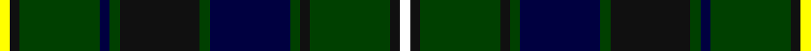

In pattern [WKGKGKGKGKGKY](/stripes/wkgkgkgkgkgky/).

This was sourced from register-of-tartans.  It is a [13 stripe tartan](/stripes/stripes13/).

Original link https://www.tartanregister.gov.uk/tartanDetails.aspx?ref=5414

## Also known as

This cloth is also recorded under:

- Robieson, Graham A.

## Attestations

This cloth appears in 2 source records; the oldest owns this page.

- 01/09/2004 — Robieson, Graham Alexander (Personal) (register-of-tartans, [record](https://www.tartanregister.gov.uk/tartanDetails.aspx?ref=5414))
- Sep. 2004 — Robieson, Graham A. (Personal) (tartans-authority, [record](http://www.tartansauthority.com/tartan-ferret/display/6724/))

## Register references

External register numbers recorded for this tartan.

- Scottish Register of Tartans: [5414](https://www.tartanregister.gov.uk/tartanDetails.aspx?ref=5414)
- Scottish Tartans Authority (ITI): 6724
- Scottish Tartans World Register: 3016

## Thread count
Y/6 K6 G48 DB6 G6 K48 G6 DB48 G6 K6 G48 K6 W/6

## Palette
Each colour and the base-6 reference it is a variant of.

| Colour | Shade | Base |
|---|---|---|
| DB | <code style="background-color:#000040;">#000040</code> `oklch(16.8% 0.116 264.1)` <small>#000040</small> | K <code style="background-color:#000000;">#000000</code> |
| G | <code style="background-color:#004000;">#004000</code> `oklch(32.2% 0.110 142.5)` <small>#004000</small> | G <code style="background-color:#006100;">#006100</code> |
| K | <code style="background-color:#101010;">#101010</code> `oklch(17.3% 0.000 89.9)` <small>#101010</small> | K <code style="background-color:#000000;">#000000</code> |
| W | <code style="background-color:#FFFFFF;">#FFFFFF</code> `oklch(100.0% 0.000 89.9)` <small>#FFFFFF</small> | W <code style="background-color:#F7F7F7;">#F7F7F7</code> |
| Y | <code style="background-color:#FFFF00;">#FFFF00</code> `oklch(96.8% 0.211 109.8)` <small>#FFFF00</small> | Y <code style="background-color:#F2BF00;">#F2BF00</code> |

## Nearest tartans

The nearest existing variants by ΔTartan distance.

1. [Skene N](/setts/s12/k4db24k4r3k4dg24k4y3k4dg24r3k4~x2/) — ΔT 0.71
1. [Skene N](/setts/s12/k4db24k4r3k4dg24k4y3k4dg24r3k4/) — ΔT 0.71
1. [Lochcarron Hunting](/setts/s14/dg3db10n3db2n2db2dg3k5dg2k5dg22r2dg3r2~x2/) — ΔT 0.81
1. [Lochcarron Hunting Corporate Tartan Tartan Number: 5464. Earliest known date: 01/01/2002 Woven sample. See products available Copyright © Blair Urquhart, Comrie, 2015](/setts/s14/dg3db10k3db2k2db2dg3k5dg2k5dg22r2dg3r2~x2/) — ΔT 0.83
1. [Scottish Tartans Authority](/setts/s11/k16k2t2k4dg16r2k15k6t2k3t4~x2/) — ΔT 0.89
1. [Dama Resort (Fashion)](/setts/s11/dp3k2n6k2n2k18g13lb2g2k6dp2~x2/) — ΔT 0.95
1. [Wilson's No.060](/setts/s11/k16db2t2db4g16r2k15db6t2k3t4~x2/) — ΔT 0.96
1. [Skene N](/setts/s12/k4db24k4r3k4dg24k4ly3k4dg24r3k4/) — ΔT 1.00
1. [Choinka Family (Inverness)](/setts/s11/k4k2ly3k2k7k9dg20k2n3k2dg4~x2/) — ΔT 1.03
1. [Survivor (Fashion)](/setts/s13/k1r1k8g1k1g8ly1dt8k1dt1k8w1k1~x3/) — ΔT 1.12

## Neighbour map

Every grey dot is one of 14299 variants placed by the first two principal components of the ΔTartan feature space (44% of its variance). Red is this tartan; blue dots are its nearest — click one to open its page.

<svg viewBox="0 0 640 380" role="img" style="max-width:100%;height:auto;border:1px solid #e0e0e0;border-radius:4px;display:block" xmlns="http://www.w3.org/2000/svg"><image href="/nn/cloud.v1.png" width="640" height="380"/><a href="/setts/s12/k4db24k4r3k4dg24k4y3k4dg24r3k4~x2/"><circle cx="221.5" cy="182.8" r="4" fill="#3465a4"><title>Skene N</title></circle></a><a href="/setts/s12/k4db24k4r3k4dg24k4y3k4dg24r3k4/"><circle cx="221.5" cy="182.8" r="4" fill="#3465a4"><title>Skene N</title></circle></a><a href="/setts/s14/dg3db10n3db2n2db2dg3k5dg2k5dg22r2dg3r2~x2/"><circle cx="250.9" cy="158.5" r="4" fill="#3465a4"><title>Lochcarron Hunting</title></circle></a><a href="/setts/s14/dg3db10k3db2k2db2dg3k5dg2k5dg22r2dg3r2~x2/"><circle cx="249.6" cy="158.6" r="4" fill="#3465a4"><title>Lochcarron Hunting Corporate Tartan Tartan Number: 5464. Earliest known date: 01/01/2002 Woven sample. See products available Copyright © Blair Urquhart, Comrie, 2015</title></circle></a><a href="/setts/s11/k16k2t2k4dg16r2k15k6t2k3t4~x2/"><circle cx="219.5" cy="195.6" r="4" fill="#3465a4"><title>Scottish Tartans Authority</title></circle></a><a href="/setts/s11/dp3k2n6k2n2k18g13lb2g2k6dp2~x2/"><circle cx="233.2" cy="176.5" r="4" fill="#3465a4"><title>Dama Resort (Fashion)</title></circle></a><a href="/setts/s11/k16db2t2db4g16r2k15db6t2k3t4~x2/"><circle cx="216.5" cy="192.7" r="4" fill="#3465a4"><title>Wilson's No.060</title></circle></a><a href="/setts/s12/k4db24k4r3k4dg24k4ly3k4dg24r3k4/"><circle cx="196.5" cy="170.0" r="4" fill="#3465a4"><title>Skene N</title></circle></a><a href="/setts/s11/k4k2ly3k2k7k9dg20k2n3k2dg4~x2/"><circle cx="195.2" cy="173.0" r="4" fill="#3465a4"><title>Choinka Family (Inverness)</title></circle></a><a href="/setts/s13/k1r1k8g1k1g8ly1dt8k1dt1k8w1k1~x3/"><circle cx="214.6" cy="155.8" r="4" fill="#3465a4"><title>Survivor (Fashion)</title></circle></a><circle cx="225.5" cy="179.6" r="5" fill="#c00000"/></svg>

ID: /setts/s13/w1k1dg8k1dg1k8dg1k8dg1k1dg8k1ly1~x6/
