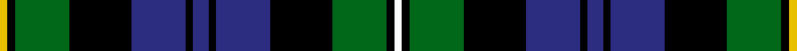

In pattern [WKGKBKBKBKGKY](/stripes/wkgkbkbkbkgky/).

This was sourced from tartans-authority.  It is a [13 stripe tartan](/stripes/stripes13/).

Original link http://www.tartansauthority.com/tartan-ferret/display/3/

## Thread count
Y/4 K4 G28 K32 DB28 K4 DB8 K4 DB28 K32 G28 K4 W/4

## Palette
Each colour and its ΔE from the base-6 reference it is a variant of.

| Colour | Shade | Base | ΔE (OKLab) |
|---|---|---|---|
| DB | <code style="background-color:#2C2C80;">#2C2C80</code> `#2C2C80` | B <code style="background-color:#2A418A;">#2A418A</code> | 0.06 |
| G | <code style="background-color:#006818;">#006818</code> `#006818` | G <code style="background-color:#006100;">#006100</code> | 0.02 |
| K | <code style="background-color:#000000;">#000000</code> `#000000` | K <code style="background-color:#000000;">#000000</code> | 0.00 |
| W | <code style="background-color:#FCFCFC;">#FCFCFC</code> `#FCFCFC` | W <code style="background-color:#F7F7F7;">#F7F7F7</code> | 0.01 |
| Y | <code style="background-color:#E8C000;">#E8C000</code> `#E8C000` | Y <code style="background-color:#F2BF00;">#F2BF00</code> | 0.02 |

## Nearest tartans

The nearest existing variants by ΔTartan distance.

1. [Urquhart](/setts/s14/g1k1g8k8db8r1db8k8g1k1g1k1g3w1~x2/) — ΔT 0.63
1. [MacKenzie](/setts/s14/db10k2db2k2db2k8g8k1w2k1g8k8db9r2~x2/) — ΔT 0.66
1. [MacClellan](/setts/s14/db18k5g3r3g6k2ly2k2g6r3g3k10db5k10/) — ΔT 0.69
1. [Farquharson](/setts/s14/r2db4k1db1k1db1k8dg8ly2dg8k8db8k1r2/) — ΔT 0.69
1. [Baillie](/setts/s15/db28k4db4k4db4k28g26k3ly5k3g26k28db26k3r5/) — ΔT 0.69
1. [Cumbernauld](/setts/s15/k17k3k3k3k3k17g17k2w3k2g17k17k17k3r3~x2/) — ΔT 0.69
1. [Scottish National](/setts/s15/db13w2db2r2db2k12g12k2g3k2g12k12db12k2r3~x2/) — ΔT 0.77
1. [Stephenson, hunting](/setts/s15/r5k3db25k25g25k3w3k6w3k3g25k25db25k3g5~x2/) — ΔT 0.78
1. [Glengoyne, Distillery](/setts/s15/db11k3db3k3db3k9dg9k1y3k1dg9k9db9k1w3~x2/) — ΔT 0.78
1. [Robertson, hunting](/setts/s10/db18k10g9k2r2k2g9k10db9w2~x2/) — ΔT 0.81

## Neighbour map

Every grey dot is one of 14299 variants placed by the first two principal components of the ΔTartan feature space (44% of its variance). Red is this tartan; blue dots are its nearest — click one to open its page.

<svg viewBox="0 0 640 380" role="img" style="max-width:100%;height:auto;border:1px solid #e0e0e0;border-radius:4px;display:block" xmlns="http://www.w3.org/2000/svg"><image href="/nn/cloud.v1.png" width="640" height="380"/><a href="/setts/s14/g1k1g8k8db8r1db8k8g1k1g1k1g3w1~x2/"><circle cx="140.3" cy="161.7" r="4" fill="#3465a4"><title>Urquhart</title></circle></a><a href="/setts/s14/db10k2db2k2db2k8g8k1w2k1g8k8db9r2~x2/"><circle cx="123.7" cy="166.5" r="4" fill="#3465a4"><title>MacKenzie</title></circle></a><a href="/setts/s14/db18k5g3r3g6k2ly2k2g6r3g3k10db5k10/"><circle cx="124.2" cy="164.3" r="4" fill="#3465a4"><title>MacClellan</title></circle></a><a href="/setts/s14/r2db4k1db1k1db1k8dg8ly2dg8k8db8k1r2/"><circle cx="121.8" cy="175.5" r="4" fill="#3465a4"><title>Farquharson</title></circle></a><a href="/setts/s15/db28k4db4k4db4k28g26k3ly5k3g26k28db26k3r5/"><circle cx="139.0" cy="155.7" r="4" fill="#3465a4"><title>Baillie</title></circle></a><a href="/setts/s15/k17k3k3k3k3k17g17k2w3k2g17k17k17k3r3~x2/"><circle cx="137.7" cy="169.3" r="4" fill="#3465a4"><title>Cumbernauld</title></circle></a><a href="/setts/s15/db13w2db2r2db2k12g12k2g3k2g12k12db12k2r3~x2/"><circle cx="98.2" cy="177.1" r="4" fill="#3465a4"><title>Scottish National</title></circle></a><a href="/setts/s15/r5k3db25k25g25k3w3k6w3k3g25k25db25k3g5~x2/"><circle cx="127.4" cy="158.8" r="4" fill="#3465a4"><title>Stephenson, hunting</title></circle></a><a href="/setts/s15/db11k3db3k3db3k9dg9k1y3k1dg9k9db9k1w3~x2/"><circle cx="124.7" cy="168.0" r="4" fill="#3465a4"><title>Glengoyne, Distillery</title></circle></a><a href="/setts/s10/db18k10g9k2r2k2g9k10db9w2~x2/"><circle cx="130.2" cy="189.3" r="4" fill="#3465a4"><title>Robertson, hunting</title></circle></a><circle cx="141.3" cy="178.1" r="5" fill="#c00000"/></svg>

ID: /setts/s13/w1k1g7k8db7k1db2k1db7k8g7k1ly1~x4/
