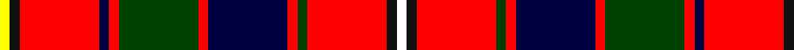

**Bands:** [YKRKRGRKRGRKW](/stripes/ykrkrgrkrgrkw/) · **Stripes:** [LY K R K R DG R K R DG R K W](/stripes/stripes13/) LY K R K R DG R K R DG R K W

This was sourced from register-of-tartans.  It is a [13 band tartan](/bands/bands13/).

Original link https://www.tartanregister.gov.uk/tartanDetails.aspx?ref=5914

## Register references

External register numbers recorded for this tartan.

- Scottish Register of Tartans: [5914](https://www.tartanregister.gov.uk/tartanDetails.aspx?ref=5914)
- Scottish Tartans Authority (ITI): 6869
- Scottish Tartans World Register: 3116

## Thread count
Y/6 K6 R48 DB6 R6 G48 R6 DB48 R6 G6 R48 K6 W/6

## Palette
Each colour and its ΔE from the base-6 reference it is a variant of.

| Colour | Shade | Base | ΔE (OKLab) |
|---|---|---|---|
| DB | <code style="background-color:#000040;">#000040</code> `#000040` | K <code style="background-color:#000000;">#000000</code> | 0.20 |
| G | <code style="background-color:#004000;">#004000</code> `#004000` | G <code style="background-color:#006100;">#006100</code> | 0.11 |
| K | <code style="background-color:#101010;">#101010</code> `#101010` | K <code style="background-color:#000000;">#000000</code> | 0.17 |
| R | <code style="background-color:#FF0000;">#FF0000</code> `#FF0000` | R <code style="background-color:#CC0000;">#CC0000</code> | 0.11 |
| W | <code style="background-color:#FFFFFF;">#FFFFFF</code> `#FFFFFF` | W <code style="background-color:#F7F7F7;">#F7F7F7</code> | 0.02 |
| Y | <code style="background-color:#FFFF00;">#FFFF00</code> `#FFFF00` | Y <code style="background-color:#F2BF00;">#F2BF00</code> | 0.16 |

## Nearest tartans

The nearest existing variants by ΔTartan distance.

1. [Christie](/setts/s13/r8db2k1db3k4ly1k1w1k1g8r6w1r6~x4/) — ΔT 0.90
1. [Robieson (Name)](/setts/s13/w1k1r8g1r1db8r1g8r1db1r8k1ly1~x6/) — ΔT 0.94
1. [Hello Kitty Red](/setts/s10/w2dy4k6dy6r2b3r21dy3r3ly2~x2/) — ΔT 0.98
1. [Peacock (Personal)](/setts/s13/w2k1b2lb1dg4r1dg4r3k3r12lb1r2k1~x4/) — ΔT 0.99
1. [Carlow County Crest (Fashion)](/setts/s10/w15g8k12g14r64k12r16k10ly8k14/) — ΔT 1.15
1. [Sabrettes](/setts/s17/r15k5w2y7k4w8k2r5r21k5y2w2k7w2r5w2g2~x2/) — ΔT 1.18
1. [Unidentified #16](/setts/s15/db6k3r4k2r27k12db10k3ly2k3dg12r10w2r3k3~x2/) — ΔT 1.20
1. [Caledonian Cameron Commando](/setts/s14/r21lt9k2lt2k2lt9k18ly3dg21r13k3r13w2r13~x2/) — ΔT 1.22
1. [McLinden, Thomas (Personal)](/setts/s11/r3db1r1db2r12b1r1k4w1dg6r1~x4/) — ΔT 1.22
1. [Hepburn](/setts/s12/r21db4k5ly2k2ly2k2r7g4r2db3ly2~x2/) — ΔT 1.22

## Neighbour map

Every grey dot is one of 14299 variants placed by the first two principal components of the ΔTartan feature space (44% of its variance). Red is this tartan; blue dots are its nearest — click one to open its page.

<svg viewBox="0 0 640 380" role="img" style="max-width:100%;height:auto;border:1px solid #e0e0e0;border-radius:4px;display:block" xmlns="http://www.w3.org/2000/svg"><image href="/nn/cloud.v1.png" width="640" height="380"/><a href="/setts/s13/r8db2k1db3k4ly1k1w1k1g8r6w1r6~x4/"><circle cx="147.1" cy="133.4" r="4" fill="#3465a4"><title>Christie</title></circle></a><a href="/setts/s13/w1k1r8g1r1db8r1g8r1db1r8k1ly1~x6/"><circle cx="190.3" cy="126.2" r="4" fill="#3465a4"><title>Robieson (Name)</title></circle></a><a href="/setts/s10/w2dy4k6dy6r2b3r21dy3r3ly2~x2/"><circle cx="216.3" cy="119.5" r="4" fill="#3465a4"><title>Hello Kitty Red</title></circle></a><a href="/setts/s13/w2k1b2lb1dg4r1dg4r3k3r12lb1r2k1~x4/"><circle cx="200.6" cy="106.1" r="4" fill="#3465a4"><title>Peacock (Personal)</title></circle></a><a href="/setts/s10/w15g8k12g14r64k12r16k10ly8k14/"><circle cx="189.9" cy="150.0" r="4" fill="#3465a4"><title>Carlow County Crest (Fashion)</title></circle></a><a href="/setts/s17/r15k5w2y7k4w8k2r5r21k5y2w2k7w2r5w2g2~x2/"><circle cx="182.3" cy="112.5" r="4" fill="#3465a4"><title>Sabrettes</title></circle></a><a href="/setts/s15/db6k3r4k2r27k12db10k3ly2k3dg12r10w2r3k3~x2/"><circle cx="178.7" cy="103.6" r="4" fill="#3465a4"><title>Unidentified #16</title></circle></a><a href="/setts/s14/r21lt9k2lt2k2lt9k18ly3dg21r13k3r13w2r13~x2/"><circle cx="134.7" cy="120.1" r="4" fill="#3465a4"><title>Caledonian Cameron Commando</title></circle></a><a href="/setts/s11/r3db1r1db2r12b1r1k4w1dg6r1~x4/"><circle cx="249.0" cy="107.5" r="4" fill="#3465a4"><title>McLinden, Thomas (Personal)</title></circle></a><a href="/setts/s12/r21db4k5ly2k2ly2k2r7g4r2db3ly2~x2/"><circle cx="243.3" cy="118.2" r="4" fill="#3465a4"><title>Hepburn</title></circle></a><circle cx="167.4" cy="111.2" r="5" fill="#c00000"/></svg>

ID: /setts/s13/w1k1r8dg1r1k8r1dg8r1k1r8k1ly1~x6/
