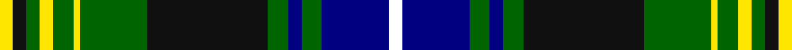

In pattern [WBGBGKGYGYGKY](/stripes/wbgbgkgygygky/).

This was sourced from register-of-tartans.  It is a [13 stripe tartan](/stripes/stripes13/).

Original link https://www.tartanregister.gov.uk/tartanDetails.aspx?ref=10566

## Register references

External register numbers recorded for this tartan.

- Scottish Register of Tartans: [10566](https://www.tartanregister.gov.uk/tartanDetails.aspx?ref=10566)

## Thread count
Y/4 K4 G4 Y4 G6 Y2 G20 K36 G6 DB4 G6 DB20 W/4

## Palette
Each colour and the base-6 reference it is a variant of.

| Colour | Shade | Base |
|---|---|---|
| DB | <code style="background-color:#000080;">#000080</code> `oklch(27.1% 0.188 264.1)` <small>#000080</small> | B <code style="background-color:#2A418A;">#2A418A</code> |
| G | <code style="background-color:#006400;">#006400</code> `oklch(43.6% 0.148 142.5)` <small>#006400</small> | G <code style="background-color:#006100;">#006100</code> |
| K | <code style="background-color:#101010;">#101010</code> `oklch(17.3% 0.000 89.9)` <small>#101010</small> | K <code style="background-color:#000000;">#000000</code> |
| W | <code style="background-color:#FFFFFF;">#FFFFFF</code> `oklch(100.0% 0.000 89.9)` <small>#FFFFFF</small> | W <code style="background-color:#F7F7F7;">#F7F7F7</code> |
| Y | <code style="background-color:#FFE600;">#FFE600</code> `oklch(91.7% 0.192 101.4)` <small>#FFE600</small> | Y <code style="background-color:#F2BF00;">#F2BF00</code> |

## Nearest tartans

The nearest existing variants by ΔTartan distance.

1. [MacDonald of Clanranald 1](/setts/s13/db16r2db2r7db31r2k32w3g31r7g2r2g16~x2/) — ΔT 0.70
1. [Robertson of Kindeace](/setts/s15/db12k2db2k2db2k12g16k1r2k1g16k12db12k1w3~x2/) — ΔT 0.72
1. [MacDonell of Glengarry](/setts/s11/db16r5db30r2k33g30r5g2r2g7w2~x2/) — ΔT 0.74
1. [O'Doherty (Name)](/setts/s13/w2dt10dg3dt2dg3k18dg10ly1dg3ly2dg2k2ly2~x2/) — ΔT 0.74
1. [Unidentified, B'gowrie](/setts/s15/g30ly2g5ly2g4k15db29r2db29k15g5ly2g4ly2g17~x2/) — ΔT 0.76
1. [Cypress Presbyterian Church](/setts/s14/g6r4g4r3g4ly2b14k4g4k28g18k2g3k2~x2/) — ΔT 0.81
1. [MacKenzie](/setts/s15/r1g11k4db2k1db1k1db14k1db1k1db2k4g11w1~x4/) — ΔT 0.82
1. [Colgan, USA, Robert James](/setts/s10/r7db2g5db2k24db2g10db28g10w3~x2/) — ΔT 0.90
1. [Dyce](/setts/s15/db16k2db2k2db2k12g12ly2k2ly2g12k16db16k1w3~x2/) — ΔT 0.91
1. [MacNeil of Colonsay](/setts/s13/g16k5g4k8g44k40g4db52r10db4r4db10w6/) — ΔT 0.92

## Neighbour map

Every grey dot is one of 14299 variants placed by the first two principal components of the ΔTartan feature space (44% of its variance). Red is this tartan; blue dots are its nearest — click one to open its page.

<svg viewBox="0 0 640 380" role="img" style="max-width:100%;height:auto;border:1px solid #e0e0e0;border-radius:4px;display:block" xmlns="http://www.w3.org/2000/svg"><image href="/nn/cloud.v1.png" width="640" height="380"/><a href="/setts/s13/db16r2db2r7db31r2k32w3g31r7g2r2g16~x2/"><circle cx="143.0" cy="126.8" r="4" fill="#3465a4"><title>MacDonald of Clanranald 1</title></circle></a><a href="/setts/s15/db12k2db2k2db2k12g16k1r2k1g16k12db12k1w3~x2/"><circle cx="144.5" cy="131.8" r="4" fill="#3465a4"><title>Robertson of Kindeace</title></circle></a><a href="/setts/s11/db16r5db30r2k33g30r5g2r2g7w2~x2/"><circle cx="158.2" cy="134.3" r="4" fill="#3465a4"><title>MacDonell of Glengarry</title></circle></a><a href="/setts/s13/w2dt10dg3dt2dg3k18dg10ly1dg3ly2dg2k2ly2~x2/"><circle cx="177.1" cy="129.5" r="4" fill="#3465a4"><title>O'Doherty (Name)</title></circle></a><a href="/setts/s15/g30ly2g5ly2g4k15db29r2db29k15g5ly2g4ly2g17~x2/"><circle cx="178.3" cy="130.9" r="4" fill="#3465a4"><title>Unidentified, B'gowrie</title></circle></a><a href="/setts/s14/g6r4g4r3g4ly2b14k4g4k28g18k2g3k2~x2/"><circle cx="184.9" cy="128.2" r="4" fill="#3465a4"><title>Cypress Presbyterian Church</title></circle></a><a href="/setts/s15/r1g11k4db2k1db1k1db14k1db1k1db2k4g11w1~x4/"><circle cx="190.3" cy="123.2" r="4" fill="#3465a4"><title>MacKenzie</title></circle></a><a href="/setts/s10/r7db2g5db2k24db2g10db28g10w3~x2/"><circle cx="149.3" cy="141.9" r="4" fill="#3465a4"><title>Colgan, USA, Robert James</title></circle></a><a href="/setts/s15/db16k2db2k2db2k12g12ly2k2ly2g12k16db16k1w3~x2/"><circle cx="146.9" cy="131.7" r="4" fill="#3465a4"><title>Dyce</title></circle></a><a href="/setts/s13/g16k5g4k8g44k40g4db52r10db4r4db10w6/"><circle cx="141.3" cy="136.1" r="4" fill="#3465a4"><title>MacNeil of Colonsay</title></circle></a><circle cx="158.6" cy="122.5" r="5" fill="#c00000"/></svg>

ID: /setts/s13/w2db10g3db2g3k18g10ly1g3ly2g2k2ly2~x2/
