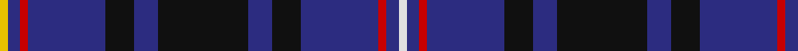

In pattern [WBRBKBKBKBRBY](/stripes/wbrbkbkbkbrby/).

This was sourced from register-of-tartans.  It is a [13 stripe tartan](/stripes/stripes13/).

Original link https://www.tartanregister.gov.uk/tartanDetails.aspx?ref=2494

## Attestations

This cloth appears in 2 source records; the oldest owns this page.

- 01/03/2003 — MacIver of Strome (Personal) (register-of-tartans, [record](https://www.tartanregister.gov.uk/tartanDetails.aspx?ref=2494))
- March 2003 — MacIver of Strome (Personal) (tartans-authority, [record](http://www.tartansauthority.com/tartan-ferret/display/5810/))

## Register references

External register numbers recorded for this tartan.

- Scottish Register of Tartans: [2494](https://www.tartanregister.gov.uk/tartanDetails.aspx?ref=2494)
- Scottish Tartans Authority (ITI): 5810

## Thread count
Y/4 DB6 R4 DB38 K14 DB12 K44 DB12 K14 DB38 R4 DB6 LN/4

## Palette
Each colour and its ΔE from the base-6 reference it is a variant of.

| Colour | Shade | Base | ΔE (OKLab) |
|---|---|---|---|
| DB | <code style="background-color:#2C2C80;">#2C2C80</code> `#2C2C80` | B <code style="background-color:#2A418A;">#2A418A</code> | 0.06 |
| K | <code style="background-color:#101010;">#101010</code> `#101010` | K <code style="background-color:#000000;">#000000</code> | 0.17 |
| LN | <code style="background-color:#E0E0E0;">#E0E0E0</code> `#E0E0E0` | W <code style="background-color:#F7F7F7;">#F7F7F7</code> | 0.07 |
| R | <code style="background-color:#C80000;">#C80000</code> `#C80000` | R <code style="background-color:#CC0000;">#CC0000</code> | 0.01 |
| Y | <code style="background-color:#E8C000;">#E8C000</code> `#E8C000` | Y <code style="background-color:#F2BF00;">#F2BF00</code> | 0.02 |

## Nearest tartans

The nearest existing variants by ΔTartan distance.

1. [Pride of Norway](/setts/s13/k7db2k6db18r3db18k4k2db2k2w2k4k4~x2/) — ΔT 0.76
1. [Pride of Norway (Fashion)](/setts/s13/k7db2k6db18r3db18k4db2db2db2w2db4k4~x2/) — ΔT 1.00
1. [Ibrox](/setts/s11/db4r2db2r4k7db10w2k13db18k2db2~x4/) — ΔT 1.04
1. [Aberdale (Fashion)](/setts/s13/lb4k1db14k8db6r2db6r3db6r2db6k2lo2~x2/) — ΔT 1.12
1. [Fleming/Frisken/Flanders](/setts/s15/db16k3db3k3db3k16db17k2ly4k2db17k16db17k2w4~x2/) — ΔT 1.13
1. [Dublin Lie-ins (Corporate)](/setts/s11/dt8k3dt26k11t3dt8r4dt8t3k2w3~x2/) — ΔT 1.17
1. [Apache](/setts/s12/k15db7o3k13o3db7k23o3db7ly2dp4ly2~x2/) — ΔT 1.18
1. [Glasgow, University of Corporate Tartan Tartan Number: 2680. Earliest known date: 2002 The official livery and promotional university tartan (STS). See products available Copyright © Blair Urquhart, Comrie, 2015](/setts/s14/k2db22g4k7lo2k2w2db2~x2/) — ΔT 1.18
1. [Ayre Robinson (Personal)](/setts/s12/db12b2dg10db16dg6db2dg2db2dg6m2db5w2~x2/) — ΔT 1.21
1. [Goodwin, Robert Richard (Personal)](/setts/s12/k5lb2b10lb2k5db15k2db15k5db10lb1ly2~x2/) — ΔT 1.31

## Neighbour map

Every grey dot is one of 14299 variants placed by the first two principal components of the ΔTartan feature space (44% of its variance). Red is this tartan; blue dots are its nearest — click one to open its page.

<svg viewBox="0 0 640 380" role="img" style="max-width:100%;height:auto;border:1px solid #e0e0e0;border-radius:4px;display:block" xmlns="http://www.w3.org/2000/svg"><image href="/nn/cloud.v1.png" width="640" height="380"/><a href="/setts/s13/k7db2k6db18r3db18k4k2db2k2w2k4k4~x2/"><circle cx="274.6" cy="175.1" r="4" fill="#3465a4"><title>Pride of Norway</title></circle></a><a href="/setts/s13/k7db2k6db18r3db18k4db2db2db2w2db4k4~x2/"><circle cx="292.5" cy="184.3" r="4" fill="#3465a4"><title>Pride of Norway (Fashion)</title></circle></a><a href="/setts/s11/db4r2db2r4k7db10w2k13db18k2db2~x4/"><circle cx="305.4" cy="203.7" r="4" fill="#3465a4"><title>Ibrox</title></circle></a><a href="/setts/s13/lb4k1db14k8db6r2db6r3db6r2db6k2lo2~x2/"><circle cx="305.4" cy="177.6" r="4" fill="#3465a4"><title>Aberdale (Fashion)</title></circle></a><a href="/setts/s15/db16k3db3k3db3k16db17k2ly4k2db17k16db17k2w4~x2/"><circle cx="316.4" cy="200.6" r="4" fill="#3465a4"><title>Fleming/Frisken/Flanders</title></circle></a><a href="/setts/s11/dt8k3dt26k11t3dt8r4dt8t3k2w3~x2/"><circle cx="350.8" cy="182.6" r="4" fill="#3465a4"><title>Dublin Lie-ins (Corporate)</title></circle></a><a href="/setts/s12/k15db7o3k13o3db7k23o3db7ly2dp4ly2~x2/"><circle cx="280.4" cy="173.1" r="4" fill="#3465a4"><title>Apache</title></circle></a><a href="/setts/s14/k2db22g4k7lo2k2w2db2~x2/"><circle cx="288.0" cy="144.8" r="4" fill="#3465a4"><title>Glasgow, University of Corporate Tartan Tartan Number: 2680. Earliest known date: 2002 The official livery and promotional university tartan (STS). See products available Copyright © Blair Urquhart, Comrie, 2015</title></circle></a><a href="/setts/s12/db12b2dg10db16dg6db2dg2db2dg6m2db5w2~x2/"><circle cx="291.5" cy="210.5" r="4" fill="#3465a4"><title>Ayre Robinson (Personal)</title></circle></a><a href="/setts/s12/k5lb2b10lb2k5db15k2db15k5db10lb1ly2~x2/"><circle cx="263.2" cy="168.0" r="4" fill="#3465a4"><title>Goodwin, Robert Richard (Personal)</title></circle></a><circle cx="314.1" cy="176.1" r="5" fill="#c00000"/></svg>

ID: /setts/s13/w2db3r2db19k7db6k22db6k7db19r2db3ly2~x2/
