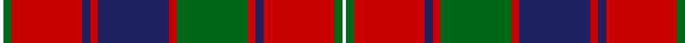

In pattern [WGRBRBRGRBRGW](/patterns/wgrbrbrgrbrgw/).

This was sourced from register-of-tartans.  It is a [13 stripes tartan](/stripes/stripes13/).

Original link https://www.tartanregister.gov.uk/tartanDetails.aspx?ref=3528

## Attestations

This cloth appears in 2 source records; the oldest owns this page.

- 01/01/1820 — Robertson 1820 - White line (register-of-tartans, [record](https://www.tartanregister.gov.uk/tartanDetails.aspx?ref=3528))
- 1820 — Robertson - 1820 (White line) (tartans-authority, [record](http://www.tartansauthority.com/tartan-ferret/display/1803/))

## Thread count
W/2 G4 R36 DB4 R4 DB36 R4 G36 R4 DB4 R36 G4 W/2

## Palette
Each colour and its ΔE from the base-6 reference it is a variant of.

| Colour | Shade | Base | ΔE (OKLab) |
|---|---|---|---|
| DB | <code style="background-color:#202060;">#202060</code> `#202060` | B <code style="background-color:#2C4084;">#2C4084</code> | 0.11 |
| G | <code style="background-color:#006818;">#006818</code> `#006818` | G <code style="background-color:#006400;">#006400</code> | 0.02 |
| R | <code style="background-color:#C80000;">#C80000</code> `#C80000` | R <code style="background-color:#C80000;">#C80000</code> | 0.00 |
| W | <code style="background-color:#FCFCFC;">#FCFCFC</code> `#FCFCFC` | W <code style="background-color:#F4F4F0;">#F4F4F0</code> | 0.03 |

## Nearest tartans

The nearest existing variants by ΔTartan distance.

1. [Robertson 7](/setts/s13/w2g4r36b4r4b36r4g36r4b4r36g4w2-b304080-g008000-rc00000-we0e0e0/) — ΔT 0.55
1. [Jenkins (Name)](/setts/s10/b4r60g16r6g16r12b8r6b24w4-b202060-g006818-rc80000-we0e0e0/) — ΔT 0.94
1. [Rourke-Frew (Name)](/setts/s11/b12k6r4k6r62k12y4k12y26k4y4-b003c64-k101010-rc8002c-ybc8c00/) — ΔT 0.94
1. [Glenaladale](/setts/s10/b56r52w4b10w4r52g56r10w4r10-b2c2c80-g006818-rc80000-we0e0e0/) — ΔT 0.94
1. [MacKillop (Clan)](/setts/s10/g24r16b16r112ba8b32r16g96r16b16-b2c2c80-ba2474e8-g006818-rc80000/) — ΔT 0.94
1. [MacIntyre (of Gatehouse)](/setts/s15/b6r48ba8r16g64r8ba8r16g8r8ba64r16g8r8b4-b2888c4-ba2c2c80-g006818-rc80000/) — ΔT 0.94
1. [MacKillop (Scottish Tartan Society)](/setts/s10/g8r4k4r40b2k14r4g20r6k4-b3c82af-g005020-k101010-rdc0000/) — ΔT 0.95
1. [MacLintock - 1880 (Clan)](/setts/s12/g72r6g6r6b18r6ba4r80b6r6b4r12-b1c0070-ba5c8ca8-g006818-rc80000/) — ΔT 0.96
1. [Harkness Family Tartan Tartan Number: 580. Earliest known date: 1982 Based on the Nithsdale District tartan. See products available Copyright © Blair Urquhart, Comrie, 2015](/setts/s10/b20r4w4r32g12r2g4r2g6r12-b2c2c80-g006818-rc80000-we0e0e0/) — ΔT 0.96
1. [MacLintock](/setts/s12/g76r6g6r6b18r6ba4r80b6r6b4r12-b1c0070-ba5c8ca8-g006818-rc80000/) — ΔT 0.96

## Neighbour map

Every grey dot is one of 15726 variants placed by the first two principal components of the ΔTartan feature space (44% of its variance). Red is this tartan; blue dots are its nearest — click one to open its page.

<svg viewBox="0 0 640 380" role="img" style="max-width:100%;height:auto;border:1px solid #e0e0e0;border-radius:4px;display:block" xmlns="http://www.w3.org/2000/svg"><image href="/nn/cloud.v1.png" width="640" height="380"/><a href="/setts/s13/w2g4r36b4r4b36r4g36r4b4r36g4w2-b304080-g008000-rc00000-we0e0e0/"><circle cx="290.7" cy="131.1" r="4" fill="#3465a4"><title>Robertson 7</title></circle></a><a href="/setts/s10/b4r60g16r6g16r12b8r6b24w4-b202060-g006818-rc80000-we0e0e0/"><circle cx="314.4" cy="150.2" r="4" fill="#3465a4"><title>Jenkins (Name)</title></circle></a><a href="/setts/s11/b12k6r4k6r62k12y4k12y26k4y4-b003c64-k101010-rc8002c-ybc8c00/"><circle cx="251.8" cy="126.4" r="4" fill="#3465a4"><title>Rourke-Frew (Name)</title></circle></a><a href="/setts/s10/b56r52w4b10w4r52g56r10w4r10-b2c2c80-g006818-rc80000-we0e0e0/"><circle cx="263.3" cy="160.1" r="4" fill="#3465a4"><title>Glenaladale</title></circle></a><a href="/setts/s10/g24r16b16r112ba8b32r16g96r16b16-b2c2c80-ba2474e8-g006818-rc80000/"><circle cx="276.5" cy="161.3" r="4" fill="#3465a4"><title>MacKillop (Clan)</title></circle></a><a href="/setts/s15/b6r48ba8r16g64r8ba8r16g8r8ba64r16g8r8b4-b2888c4-ba2c2c80-g006818-rc80000/"><circle cx="248.6" cy="135.2" r="4" fill="#3465a4"><title>MacIntyre (of Gatehouse)</title></circle></a><a href="/setts/s10/g8r4k4r40b2k14r4g20r6k4-b3c82af-g005020-k101010-rdc0000/"><circle cx="305.5" cy="136.0" r="4" fill="#3465a4"><title>MacKillop (Scottish Tartan Society)</title></circle></a><a href="/setts/s12/g72r6g6r6b18r6ba4r80b6r6b4r12-b1c0070-ba5c8ca8-g006818-rc80000/"><circle cx="338.6" cy="116.2" r="4" fill="#3465a4"><title>MacLintock - 1880 (Clan)</title></circle></a><a href="/setts/s10/b20r4w4r32g12r2g4r2g6r12-b2c2c80-g006818-rc80000-we0e0e0/"><circle cx="303.1" cy="153.4" r="4" fill="#3465a4"><title>Harkness Family Tartan Tartan Number: 580. Earliest known date: 1982 Based on the Nithsdale District tartan. See products available Copyright © Blair Urquhart, Comrie, 2015</title></circle></a><a href="/setts/s12/g76r6g6r6b18r6ba4r80b6r6b4r12-b1c0070-ba5c8ca8-g006818-rc80000/"><circle cx="335.5" cy="115.9" r="4" fill="#3465a4"><title>MacLintock</title></circle></a><circle cx="282.5" cy="127.1" r="5" fill="#c00000"/></svg>

ID: /setts/s13/w2g4r36b4r4b36r4g36r4b4r36g4w2-b202060-g006818-rc80000-wfcfcfc/
