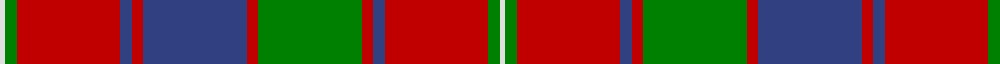

In pattern [WGRBRBRGRBRGW](/patterns/wgrbrbrgrbrgw/).

This was sourced from weddslist.  It is a [13 stripes tartan](/stripes/stripes13/).

Original link http://www.weddslist.com/cgi-bin/tartans/pg.pl?source=sts

## Thread count
LN/2 G4 R36 B4 R4 B36 R4 G36 R4 B4 R36 G4 LN/2

## Palette
Each colour and its ΔE from the base-6 reference it is a variant of.

| Colour | Shade | Base | ΔE (OKLab) |
|---|---|---|---|
| B | <code style="background-color:#304080;">#304080</code> `#304080` | B <code style="background-color:#2A418A;">#2A418A</code> | 0.02 |
| G | <code style="background-color:#008000;">#008000</code> `#008000` | G <code style="background-color:#006100;">#006100</code> | 0.10 |
| LN | <code style="background-color:#E0E0E0;">#E0E0E0</code> `#E0E0E0` | W <code style="background-color:#F7F7F7;">#F7F7F7</code> | 0.07 |
| R | <code style="background-color:#C00000;">#C00000</code> `#C00000` | R <code style="background-color:#CC0000;">#CC0000</code> | 0.03 |

## Nearest tartans

The nearest existing variants by ΔTartan distance.

1. [Robertson 1820 - White line](/setts/s13/w2g4r36b4r4b36r4g36r4b4r36g4w2-b202060-g006818-rc80000-wfcfcfc/) — ΔT 0.55
1. [MacKillop (Clan)](/setts/s10/g24r16b16r112ba8b32r16g96r16b16-b2c2c80-ba2474e8-g006818-rc80000/) — ΔT 0.78
1. [MacIntyre (of Gatehouse)](/setts/s15/b6r48ba8r16g64r8ba8r16g8r8ba64r16g8r8b4-b2888c4-ba2c2c80-g006818-rc80000/) — ΔT 0.89
1. [MacLintock](/setts/s12/g76r6g6r6b18r6ba4r80b6r6b4r12-b1c0070-ba5c8ca8-g006818-rc80000/) — ΔT 0.90
1. [MacDonald of Glenaladale](/setts/s12/r14ra4b4r4g64r12b24r82g4r10ra4g10-b304080-g008000-r900030-rad03030/) — ΔT 0.91
1. [MacLintock - 1880 (Clan)](/setts/s12/g72r6g6r6b18r6ba4r80b6r6b4r12-b1c0070-ba5c8ca8-g006818-rc80000/) — ΔT 0.91
1. [Glenaladale, Plaid](/setts/s10/b56r52w4b10w4r52g56r10w4r10-b304080-g008000-rc00000-we0e0e0/) — ΔT 0.92
1. [Unidentified Coat](/setts/s14/g12r4g4r48b2ba2r4ba24r4ba2b2r4g48r4-b3c82af-ba2c4084-g005020-rdc0000/) — ΔT 0.92
1. [MacLintock Clan Tartan Tartan Number: 881. Earliest known date: 1842 Tartan is in the MacGregor Hastie collection of the STS and also appears in the J. T. Thompson files at the STA. It also appears in Clans Originaux verified by BW in 2004. Mentioned in correspondence by D C Stewart sending this count to Life Member Andrew Pearson in October 1971. See products available Copyright © Blair Urquhart, Comrie, 2015](/setts/s12/g72r6g6r6b18r6ba4r80b6r6b4r12-b2c2c80-ba5c8ca8-g006818-rc80000/) — ΔT 0.93
1. [Glenfinnan (Clan?)](/setts/s10/b56r52w4b10w4r52y56r10w4r10-b506880-r880000-wfcfcfc-y78a064/) — ΔT 0.93

## Neighbour map

Every grey dot is one of 15726 variants placed by the first two principal components of the ΔTartan feature space (44% of its variance). Red is this tartan; blue dots are its nearest — click one to open its page.

<svg viewBox="0 0 640 380" role="img" style="max-width:100%;height:auto;border:1px solid #e0e0e0;border-radius:4px;display:block" xmlns="http://www.w3.org/2000/svg"><image href="/nn/cloud.v1.png" width="640" height="380"/><a href="/setts/s13/w2g4r36b4r4b36r4g36r4b4r36g4w2-b202060-g006818-rc80000-wfcfcfc/"><circle cx="282.5" cy="127.1" r="4" fill="#3465a4"><title>Robertson 1820 - White line</title></circle></a><a href="/setts/s10/g24r16b16r112ba8b32r16g96r16b16-b2c2c80-ba2474e8-g006818-rc80000/"><circle cx="276.5" cy="161.3" r="4" fill="#3465a4"><title>MacKillop (Clan)</title></circle></a><a href="/setts/s15/b6r48ba8r16g64r8ba8r16g8r8ba64r16g8r8b4-b2888c4-ba2c2c80-g006818-rc80000/"><circle cx="248.6" cy="135.2" r="4" fill="#3465a4"><title>MacIntyre (of Gatehouse)</title></circle></a><a href="/setts/s12/g76r6g6r6b18r6ba4r80b6r6b4r12-b1c0070-ba5c8ca8-g006818-rc80000/"><circle cx="335.5" cy="115.9" r="4" fill="#3465a4"><title>MacLintock</title></circle></a><a href="/setts/s12/r14ra4b4r4g64r12b24r82g4r10ra4g10-b304080-g008000-r900030-rad03030/"><circle cx="348.6" cy="132.2" r="4" fill="#3465a4"><title>MacDonald of Glenaladale</title></circle></a><a href="/setts/s12/g72r6g6r6b18r6ba4r80b6r6b4r12-b1c0070-ba5c8ca8-g006818-rc80000/"><circle cx="338.6" cy="116.2" r="4" fill="#3465a4"><title>MacLintock - 1880 (Clan)</title></circle></a><a href="/setts/s10/b56r52w4b10w4r52g56r10w4r10-b304080-g008000-rc00000-we0e0e0/"><circle cx="266.4" cy="162.3" r="4" fill="#3465a4"><title>Glenaladale, Plaid</title></circle></a><a href="/setts/s14/g12r4g4r48b2ba2r4ba24r4ba2b2r4g48r4-b3c82af-ba2c4084-g005020-rdc0000/"><circle cx="294.5" cy="106.8" r="4" fill="#3465a4"><title>Unidentified Coat</title></circle></a><a href="/setts/s12/g72r6g6r6b18r6ba4r80b6r6b4r12-b2c2c80-ba5c8ca8-g006818-rc80000/"><circle cx="348.3" cy="119.9" r="4" fill="#3465a4"><title>MacLintock Clan Tartan Tartan Number: 881. Earliest known date: 1842 Tartan is in the MacGregor Hastie collection of the STS and also appears in the J. T. Thompson files at the STA. It also appears in Clans Originaux verified by BW in 2004. Mentioned in correspondence by D C Stewart sending this count to Life Member Andrew Pearson in October 1971. See products available Copyright © Blair Urquhart, Comrie, 2015</title></circle></a><a href="/setts/s10/b56r52w4b10w4r52y56r10w4r10-b506880-r880000-wfcfcfc-y78a064/"><circle cx="272.0" cy="166.5" r="4" fill="#3465a4"><title>Glenfinnan (Clan?)</title></circle></a><circle cx="290.7" cy="131.1" r="5" fill="#c00000"/></svg>

ID: /setts/s13/w2g4r36b4r4b36r4g36r4b4r36g4w2-b304080-g008000-rc00000-we0e0e0/
