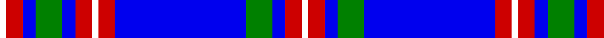

In pattern [WRBGBRWRBGBRW](/patterns/wrbgbrwrbgbrw/).

This was sourced from register-of-tartans.  It is a [13 stripes tartan](/stripes/stripes13/).

Original link https://www.tartanregister.gov.uk/tartanDetails.aspx?ref=10168

## Thread count
W/4 R10 B8 G16 B8 R10 W4 R10 B80 G16 B8 R10 W/4

## Palette
Each colour and its ΔE from the base-6 reference it is a variant of.

| Colour | Shade | Base | ΔE (OKLab) |
|---|---|---|---|
| B | <code style="background-color:#0000EE;">#0000EE</code> `#0000EE` | B <code style="background-color:#2A418A;">#2A418A</code> | 0.18 |
| G | <code style="background-color:#008000;">#008000</code> `#008000` | G <code style="background-color:#006100;">#006100</code> | 0.10 |
| K | <code style="background-color:#101010;">#101010</code> `#101010` | K <code style="background-color:#000000;">#000000</code> | 0.17 |
| R | <code style="background-color:#CD0000;">#CD0000</code> `#CD0000` | R <code style="background-color:#CC0000;">#CC0000</code> | 0.00 |
| W | <code style="background-color:#FFFFFF;">#FFFFFF</code> `#FFFFFF` | W <code style="background-color:#F7F7F7;">#F7F7F7</code> | 0.02 |

## Nearest tartans

The nearest existing variants by ΔTartan distance.

1. [Federal Memorial](/setts/s15/b3r1b1r1b15w1b1r4b1w1b1ba15b1y1b3~b00008c-ba5c8ca8-rc80000-we0e0e0-ye8c000~x4/) — ΔT 1.27
1. [Illinois, St Andrews Society](/setts/s13/b4r3ba23b16w5ba3r2ba3w5ba11b2r1b4~b000050-ba8080d0-rc00000-we0e0e0~x2/) — ΔT 1.31
1. [Commonwealth Games 1986 (Corp)](/setts/s11/b3w1b1w1b2w3b15ba2b2ba22r2~b2c2c80-ba2888c4-rc80000-wfcfcfc~x2/) — ΔT 1.37
1. [St. Andrews, Earl of](/setts/s10/b52ba28w5ba3w2ba10w2ba3w5ba28~b1870a4-ba1c0070-wf8f8f8~x2/) — ΔT 1.45
1. [Eildon (1980)](/setts/s8/b42w2wa2w2b5ba12wa32b4~b000050-ba003478-w94acfc-wac8c8c8~x2/) — ΔT 1.47
1. [Harmony Eildon (Dance)](/setts/s8/b41ba2w2ba2b5bb12w31b4~b2c2c80-ba5c8ca8-bb2888c4-we0e0e0~x2/) — ΔT 1.52
1. [Illinois St Andrews Society Corporate Tartan Tartan Number: 2051. Earliest known date: 1991 A philanthropic society founded by Scots around 1840. The tartan was designed to mark the 150th anniversary. The colours represent the State of Illinois Flag, the Chicago sports teams and the St Andrew's flag. See products available Copyright © Blair Urquhart, Comrie, 2015](/setts/s13/b4r3ba23b16w5ba3r2ba3w5ba11b2r1b4~b202060-ba2888c4-rc80000-we0e0e0~x2/) — ΔT 1.53
1. [Dunbarton Weft](/setts/s11/b30r2b2k5b3g2b3g22b3k2b3~b0596fa-g503c14-k101010-rdc0000~x2/) — ΔT 1.54
1. [Longniddry Eildon Blue Dress Fancy Tartan Tartan Number: 5486. Earliest known date: pre 1992 Dancers tartan See products available Copyright © Blair Urquhart, Comrie, 2015](/setts/s8/b42w2wa2w2b5ba12wa32b4~b202060-ba003c64-wa8ace8-wac0c0c0~x2/) — ΔT 1.61
1. [Vilaro-Thomas (Personal)](/setts/s11/w2wa1w15b6w7b3r1b3w3b26y2~b1c1c50-rc80000-wa8ace8-wae0e0e0-ye8c000~x2/) — ΔT 1.61

## Neighbour map

Every grey dot is one of 15726 variants placed by the first two principal components of the ΔTartan feature space (44% of its variance). Red is this tartan; blue dots are its nearest — click one to open its page.

<svg viewBox="0 0 640 380" role="img" style="max-width:100%;height:auto;border:1px solid #e0e0e0;border-radius:4px;display:block" xmlns="http://www.w3.org/2000/svg"><image href="/nn/cloud.v1.png" width="640" height="380"/><a href="/setts/s15/b3r1b1r1b15w1b1r4b1w1b1ba15b1y1b3~b00008c-ba5c8ca8-rc80000-we0e0e0-ye8c000~x4/"><circle cx="267.2" cy="102.9" r="4" fill="#3465a4"><title>Federal Memorial</title></circle></a><a href="/setts/s13/b4r3ba23b16w5ba3r2ba3w5ba11b2r1b4~b000050-ba8080d0-rc00000-we0e0e0~x2/"><circle cx="252.3" cy="122.7" r="4" fill="#3465a4"><title>Illinois, St Andrews Society</title></circle></a><a href="/setts/s11/b3w1b1w1b2w3b15ba2b2ba22r2~b2c2c80-ba2888c4-rc80000-wfcfcfc~x2/"><circle cx="289.5" cy="123.3" r="4" fill="#3465a4"><title>Commonwealth Games 1986 (Corp)</title></circle></a><a href="/setts/s10/b52ba28w5ba3w2ba10w2ba3w5ba28~b1870a4-ba1c0070-wf8f8f8~x2/"><circle cx="333.6" cy="151.0" r="4" fill="#3465a4"><title>St. Andrews, Earl of</title></circle></a><a href="/setts/s8/b42w2wa2w2b5ba12wa32b4~b000050-ba003478-w94acfc-wac8c8c8~x2/"><circle cx="271.5" cy="139.9" r="4" fill="#3465a4"><title>Eildon (1980)</title></circle></a><a href="/setts/s8/b41ba2w2ba2b5bb12w31b4~b2c2c80-ba5c8ca8-bb2888c4-we0e0e0~x2/"><circle cx="276.1" cy="136.5" r="4" fill="#3465a4"><title>Harmony Eildon (Dance)</title></circle></a><a href="/setts/s13/b4r3ba23b16w5ba3r2ba3w5ba11b2r1b4~b202060-ba2888c4-rc80000-we0e0e0~x2/"><circle cx="263.1" cy="131.0" r="4" fill="#3465a4"><title>Illinois St Andrews Society Corporate Tartan Tartan Number: 2051. Earliest known date: 1991 A philanthropic society founded by Scots around 1840. The tartan was designed to mark the 150th anniversary. The colours represent the State of Illinois Flag, the Chicago sports teams and the St Andrew's flag. See products available Copyright © Blair Urquhart, Comrie, 2015</title></circle></a><a href="/setts/s11/b30r2b2k5b3g2b3g22b3k2b3~b0596fa-g503c14-k101010-rdc0000~x2/"><circle cx="323.8" cy="139.9" r="4" fill="#3465a4"><title>Dunbarton Weft</title></circle></a><a href="/setts/s8/b42w2wa2w2b5ba12wa32b4~b202060-ba003c64-wa8ace8-wac0c0c0~x2/"><circle cx="286.3" cy="141.0" r="4" fill="#3465a4"><title>Longniddry Eildon Blue Dress Fancy Tartan Tartan Number: 5486. Earliest known date: pre 1992 Dancers tartan See products available Copyright © Blair Urquhart, Comrie, 2015</title></circle></a><a href="/setts/s11/w2wa1w15b6w7b3r1b3w3b26y2~b1c1c50-rc80000-wa8ace8-wae0e0e0-ye8c000~x2/"><circle cx="311.6" cy="104.3" r="4" fill="#3465a4"><title>Vilaro-Thomas (Personal)</title></circle></a><circle cx="291.7" cy="111.0" r="5" fill="#c00000"/></svg>

ID: /setts/s13/w2r5b4g8b40r5w2r5b4g8b4r5w2~b0000ee-g008000-rcd0000-wffffff~x2/
