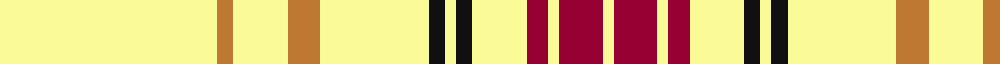

In pattern [WRWRWKWKWRWRW](/patterns/wrwrwkwkwrwrw/).

This was sourced from register-of-tartans.  It is a [13 stripes tartan](/stripes/stripes13/).

Original link https://www.tartanregister.gov.uk/tartanDetails.aspx?ref=4468

## Thread count
LY/40 DO3 LY10 DO6 LY20 K3 LY2 K3 LY10 DR4 LY2 DR8 LY/2

## Palette
Each colour and its ΔE from the base-6 reference it is a variant of.

| Colour | Shade | Base | ΔE (OKLab) |
|---|---|---|---|
| DO | <code style="background-color:#BE7832;">#BE7832</code> `#BE7832` | R <code style="background-color:#CC0000;">#CC0000</code> | 0.17 |
| DR | <code style="background-color:#960032;">#960032</code> `#960032` | R <code style="background-color:#CC0000;">#CC0000</code> | 0.12 |
| K | <code style="background-color:#101010;">#101010</code> `#101010` | K <code style="background-color:#000000;">#000000</code> | 0.17 |
| LY | <code style="background-color:#FAFA96;">#FAFA96</code> `#FAFA96` | W <code style="background-color:#F7F7F7;">#F7F7F7</code> | 0.12 |

## Nearest tartans

The nearest existing variants by ΔTartan distance.

1. [Old England House Check](/setts/s12/w46y4w9k8w9r4w9b2w2b2w2b2~b4c3428-k101010-rdc0000-wf8f4d0-ya0a0a0~x2/) — ΔT 1.63
1. [Virginia Quadricentennial (District)](/setts/s13/y40ya3y10ya6y20k3y2k3y10r4y2r8y2~k101010-r901c38-yc4bc68-yaa08858~x2/) — ΔT 1.67
1. [Dundonald (Name)](/setts/s16/y25b3y3b2y4b2y3b3y8y10r16b1y16b3y8b2~b2c2c80-rc80000-ye8c000~x2/) — ΔT 1.73
1. [Summer Spirit](/setts/s14/y2k1w9k8w28k2w2r2w2k2w28k8w9k1~k101010-rc80000-wfcfcec-ye8c000~x2/) — ΔT 1.89
1. [Guzzo Check (Personal)](/setts/s8/y20w2y20k4w3y3k3w2~k101010-we0e0e0-ye8c000/) — ΔT 1.94
1. [Guzzo Check (Personal)](/setts/s8/y20w2y20k4w3y3k3w2~k101010-wffffff-yffe600/) — ΔT 1.95
1. [Morris (Welsh Name)](/setts/s8/b6b3y3b2y3b4y48b4~b202060-ye8c000/) — ΔT 2.09
1. [Summer Spirit (Fashion)](/setts/s8/r2w2k2w28k8w9k1y2~k101010-rc80000-wfcfcec-ye8c000~x2/) — ΔT 2.11
1. [UPS No.2](/setts/s16/b2w8b4wa1b2wa2b2wa1b4w60b2w15b2w2y2w2~b391614-wfef6b4-wafcfa93-ydf982e~x2/) — ΔT 2.18
1. [UPS No.1](/setts/s15/b4y60b2y15b2y2ya2b2y8b4w1b2w2b2w1~b391614-wfcfa93-yfad183-yadf982e~x2/) — ΔT 2.19

## Neighbour map

Every grey dot is one of 15726 variants placed by the first two principal components of the ΔTartan feature space (44% of its variance). Red is this tartan; blue dots are its nearest — click one to open its page.

<svg viewBox="0 0 640 380" role="img" style="max-width:100%;height:auto;border:1px solid #e0e0e0;border-radius:4px;display:block" xmlns="http://www.w3.org/2000/svg"><image href="/nn/cloud.v1.png" width="640" height="380"/><a href="/setts/s12/w46y4w9k8w9r4w9b2w2b2w2b2~b4c3428-k101010-rdc0000-wf8f4d0-ya0a0a0~x2/"><circle cx="439.3" cy="76.8" r="4" fill="#3465a4"><title>Old England House Check</title></circle></a><a href="/setts/s13/y40ya3y10ya6y20k3y2k3y10r4y2r8y2~k101010-r901c38-yc4bc68-yaa08858~x2/"><circle cx="468.1" cy="127.4" r="4" fill="#3465a4"><title>Virginia Quadricentennial (District)</title></circle></a><a href="/setts/s16/y25b3y3b2y4b2y3b3y8y10r16b1y16b3y8b2~b2c2c80-rc80000-ye8c000~x2/"><circle cx="398.2" cy="109.0" r="4" fill="#3465a4"><title>Dundonald (Name)</title></circle></a><a href="/setts/s14/y2k1w9k8w28k2w2r2w2k2w28k8w9k1~k101010-rc80000-wfcfcec-ye8c000~x2/"><circle cx="422.4" cy="88.5" r="4" fill="#3465a4"><title>Summer Spirit</title></circle></a><a href="/setts/s8/y20w2y20k4w3y3k3w2~k101010-we0e0e0-ye8c000/"><circle cx="430.6" cy="183.4" r="4" fill="#3465a4"><title>Guzzo Check (Personal)</title></circle></a><a href="/setts/s8/y20w2y20k4w3y3k3w2~k101010-wffffff-yffe600/"><circle cx="413.9" cy="176.0" r="4" fill="#3465a4"><title>Guzzo Check (Personal)</title></circle></a><a href="/setts/s8/b6b3y3b2y3b4y48b4~b202060-ye8c000/"><circle cx="473.0" cy="122.4" r="4" fill="#3465a4"><title>Morris (Welsh Name)</title></circle></a><a href="/setts/s8/r2w2k2w28k8w9k1y2~k101010-rc80000-wfcfcec-ye8c000~x2/"><circle cx="413.5" cy="106.7" r="4" fill="#3465a4"><title>Summer Spirit (Fashion)</title></circle></a><a href="/setts/s16/b2w8b4wa1b2wa2b2wa1b4w60b2w15b2w2y2w2~b391614-wfef6b4-wafcfa93-ydf982e~x2/"><circle cx="511.4" cy="30.0" r="4" fill="#3465a4"><title>UPS No.2</title></circle></a><a href="/setts/s15/b4y60b2y15b2y2ya2b2y8b4w1b2w2b2w1~b391614-wfcfa93-yfad183-yadf982e~x2/"><circle cx="523.5" cy="37.6" r="4" fill="#3465a4"><title>UPS No.1</title></circle></a><circle cx="428.1" cy="106.4" r="5" fill="#c00000"/></svg>

ID: /setts/s13/w40r3w10r6w20k3w2k3w10ra4w2ra8w2~k101010-rbe7832-ra960032-wfafa96/
