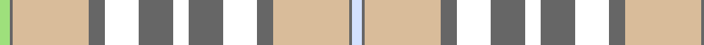

In pattern [WBYBWBWBWBYBY](/patterns/wbybwbwbwbyby/).

This was sourced from register-of-tartans.  It is a [13 stripes tartan](/stripes/stripes13/).

Original link https://www.tartanregister.gov.uk/tartanDetails.aspx?ref=10527

## Register references

External register numbers recorded for this tartan.

- Scottish Register of Tartans: [10527](https://www.tartanregister.gov.uk/tartanDetails.aspx?ref=10527)

## Thread count
LG/8 N2 LR58 N12 W26 N26 W12 N26 W26 N12 LR58 N2 LN/8

## Palette
Each colour and its ΔE from the base-6 reference it is a variant of.

| Colour | Shade | Base | ΔE (OKLab) |
|---|---|---|---|
| LG | <code style="background-color:#9EE07C;">#9EE07C</code> `#9EE07C` | Y <code style="background-color:#F2BF00;">#F2BF00</code> | 0.13 |
| LN | <code style="background-color:#D3E1FF;">#D3E1FF</code> `#D3E1FF` | W <code style="background-color:#F7F7F7;">#F7F7F7</code> | 0.08 |
| LR | <code style="background-color:#D9BC9A;">#D9BC9A</code> `#D9BC9A` | Y <code style="background-color:#F2BF00;">#F2BF00</code> | 0.12 |
| N | <code style="background-color:#666666;">#666666</code> `#666666` | B <code style="background-color:#2A418A;">#2A418A</code> | 0.17 |
| W | <code style="background-color:#FFFFFF;">#FFFFFF</code> `#FFFFFF` | W <code style="background-color:#F7F7F7;">#F7F7F7</code> | 0.02 |

## Nearest tartans

The nearest existing variants by ΔTartan distance.

1. [Delta Dental Association (Corporate)](/setts/s13/b4r1y29r6w13r13w6r13w13r6y29r1g4~b2888c4-g289c18-r888888-wfcfcfc-ya08858~x2/) — ΔT 1.21
1. [Alloway Primary School (Ayr)](/setts/s8/y18g10w4b1wa30b1w4g10~b14256b-g798a92-wffffff-wab2e5ff-yebaf01~x2/) — ΔT 1.35
1. [Isle of Skye (Fashion)](/setts/s15/g8ga1w6g8w3g4ga1w8ga1g6y20w29g3w7y7~g604000-ga289c18-we8ccb8-ya08858~x2/) — ΔT 1.57
1. [Grant - 1714 (Piper) (Portrait)](/setts/s12/r24k2g8k2r8k1g24w6k2r14w18k4~g289c18-k101010-re87878-w98c8e8/) — ΔT 1.59
1. [Tricotisse](/setts/s11/w9wa9w24wa12r2wa12w9k1b9k2wa9~b3c82af-k101010-rb07430-w98c8e8-waffffff~x2/) — ΔT 1.68
1. [Rutlin (Personal)](/setts/s9/g6b2g1w17g1b2g16y27ga2~b2c4084-g808080-ga005020-we0e0e0-ybe9650~x2/) — ΔT 1.72
1. [Grant of Auchnarrow](/setts/s13/w6r2w38g8b6w2b2w2y14r7g2r3w2~b2c2c80-g289c18-re87878-we0e0e0-ya08858~x2/) — ΔT 1.73
1. [Inverness County (Canada)](/setts/s16/w18y2w2y1r3g3r2g2r1k2w3wa7w2wa2w1wa4~g006818-k101010-rc80000-w98c8e8-wae0e0e0-ye8c000~x4/) — ΔT 1.73
1. [Beck Dress (Personal)](/setts/s17/k4b2w15r6y12r6w25b2k4b2w15b4k2b4k2b4k1~b2888c4-k101010-rc80000-we0e0e0-ye8c000~x2/) — ΔT 1.73
1. [MacNappy](/setts/s6/w36wa12w1r12g16y2~g289c18-rc80000-we0e0e0-wa5cacdc-ye8c000~x2/) — ΔT 1.74

## Neighbour map

Every grey dot is one of 15726 variants placed by the first two principal components of the ΔTartan feature space (44% of its variance). Red is this tartan; blue dots are its nearest — click one to open its page.

<svg viewBox="0 0 640 380" role="img" style="max-width:100%;height:auto;border:1px solid #e0e0e0;border-radius:4px;display:block" xmlns="http://www.w3.org/2000/svg"><image href="/nn/cloud.v1.png" width="640" height="380"/><a href="/setts/s13/b4r1y29r6w13r13w6r13w13r6y29r1g4~b2888c4-g289c18-r888888-wfcfcfc-ya08858~x2/"><circle cx="251.2" cy="122.3" r="4" fill="#3465a4"><title>Delta Dental Association (Corporate)</title></circle></a><a href="/setts/s8/y18g10w4b1wa30b1w4g10~b14256b-g798a92-wffffff-wab2e5ff-yebaf01~x2/"><circle cx="224.4" cy="120.8" r="4" fill="#3465a4"><title>Alloway Primary School (Ayr)</title></circle></a><a href="/setts/s15/g8ga1w6g8w3g4ga1w8ga1g6y20w29g3w7y7~g604000-ga289c18-we8ccb8-ya08858~x2/"><circle cx="275.0" cy="107.0" r="4" fill="#3465a4"><title>Isle of Skye (Fashion)</title></circle></a><a href="/setts/s12/r24k2g8k2r8k1g24w6k2r14w18k4~g289c18-k101010-re87878-w98c8e8/"><circle cx="213.2" cy="128.8" r="4" fill="#3465a4"><title>Grant - 1714 (Piper) (Portrait)</title></circle></a><a href="/setts/s11/w9wa9w24wa12r2wa12w9k1b9k2wa9~b3c82af-k101010-rb07430-w98c8e8-waffffff~x2/"><circle cx="225.0" cy="138.2" r="4" fill="#3465a4"><title>Tricotisse</title></circle></a><a href="/setts/s9/g6b2g1w17g1b2g16y27ga2~b2c4084-g808080-ga005020-we0e0e0-ybe9650~x2/"><circle cx="251.0" cy="122.3" r="4" fill="#3465a4"><title>Rutlin (Personal)</title></circle></a><a href="/setts/s13/w6r2w38g8b6w2b2w2y14r7g2r3w2~b2c2c80-g289c18-re87878-we0e0e0-ya08858~x2/"><circle cx="273.1" cy="88.2" r="4" fill="#3465a4"><title>Grant of Auchnarrow</title></circle></a><a href="/setts/s16/w18y2w2y1r3g3r2g2r1k2w3wa7w2wa2w1wa4~g006818-k101010-rc80000-w98c8e8-wae0e0e0-ye8c000~x4/"><circle cx="203.9" cy="73.2" r="4" fill="#3465a4"><title>Inverness County (Canada)</title></circle></a><a href="/setts/s17/k4b2w15r6y12r6w25b2k4b2w15b4k2b4k2b4k1~b2888c4-k101010-rc80000-we0e0e0-ye8c000~x2/"><circle cx="210.7" cy="77.1" r="4" fill="#3465a4"><title>Beck Dress (Personal)</title></circle></a><a href="/setts/s6/w36wa12w1r12g16y2~g289c18-rc80000-we0e0e0-wa5cacdc-ye8c000~x2/"><circle cx="249.9" cy="126.5" r="4" fill="#3465a4"><title>MacNappy</title></circle></a><circle cx="222.9" cy="106.4" r="5" fill="#c00000"/></svg>

ID: /setts/s13/w4b1y29b6wa13b13wa6b13wa13b6y29b1ya4~b666666-wd3e1ff-waffffff-yd9bc9a-ya9ee07c~x2/
