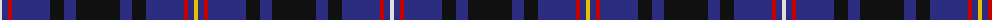

In pattern [WBRBKBKBKBRBY](/patterns/wbrbkbkbkbrby/).

This was sourced from register-of-tartans.  It is a [13 stripes tartan](/stripes/stripes13/).

Original link https://www.tartanregister.gov.uk/tartanDetails.aspx?ref=2494

## Attestations

This cloth appears in 2 source records; the oldest owns this page.

- 01/03/2003 — MacIver of Strome (Personal) (register-of-tartans, [record](https://www.tartanregister.gov.uk/tartanDetails.aspx?ref=2494))
- March 2003 — MacIver of Strome (Personal) (tartans-authority, [record](http://www.tartansauthority.com/tartan-ferret/display/5810/))

## Thread count
LN/4 DB6 R4 DB38 K14 DB12 K44 DB12 K14 DB38 R4 DB6 Y/4

## Palette
Each colour and its ΔE from the base-6 reference it is a variant of.

| Colour | Shade | Base | ΔE (OKLab) |
|---|---|---|---|
| DB | <code style="background-color:#2C2C80;">#2C2C80</code> `#2C2C80` | B <code style="background-color:#2A418A;">#2A418A</code> | 0.06 |
| K | <code style="background-color:#101010;">#101010</code> `#101010` | K <code style="background-color:#000000;">#000000</code> | 0.17 |
| LN | <code style="background-color:#E0E0E0;">#E0E0E0</code> `#E0E0E0` | W <code style="background-color:#F7F7F7;">#F7F7F7</code> | 0.07 |
| R | <code style="background-color:#C80000;">#C80000</code> `#C80000` | R <code style="background-color:#CC0000;">#CC0000</code> | 0.01 |
| Y | <code style="background-color:#E8C000;">#E8C000</code> `#E8C000` | Y <code style="background-color:#F2BF00;">#F2BF00</code> | 0.02 |

## Nearest tartans

The nearest existing variants by ΔTartan distance.

1. [Pride of Norway](/setts/s13/k14b4k12b36r6b36k8ka4b4ka4w4ka8k8-b2c2c80-k101010-ka000000-rc80000-we0e0e0/) — ΔT 0.76
1. [City of Sarnia (District)](/setts/s15/b20k4w4k6w4k20b20k2r4k2b20k20b20k2y4-b202060-k101010-rc80000-we0e0e0-yfccc00/) — ΔT 0.93
1. [Pride of Norway (Fashion)](/setts/s13/k14b4k12b36r6b36k8ba4b4ba4w4ba8k8-b2c2c80-ba2c2cbc-k101010-rc80000-we0e0e0/) — ΔT 0.99
1. [Ibrox](/setts/s11/b16r8b8r16k28b40w8k52b72k8b8-b2c2c80-k101010-rc80000-we0e0e0/) — ΔT 1.04
1. [Fitzgerald Blue Irish Family Tartan Tartan Number: 1419. Earliest known date: pre 2003 One of four Fitzgerald tartans all apparently designed by Robert P. Fitzgerald of Philadelphia. Starting with this variation of Robertson, he then designed the blue and hunting as color variations and a further "fancy dress" version. See products available Copyright © Blair Urquhart, Comrie, 2015](/setts/s9/r6b42r6b6k26b26ba6b6w4-b2c2c80-ba5c8ca8-k101010-rc80000-we0e0e0/) — ΔT 1.05
1. [Aberdale (Fashion)](/setts/s13/w8k2b28k16b12r4b12r6b12r4b12k4y4-b1c0070-k101010-r880000-wa8ace8-yd09800/) — ΔT 1.12
1. [Fleming/Frisken/Flanders](/setts/s15/b32k6b6k6b6k32b34k4y8k4b34k32b34k4w8-b2c2c80-k101010-we0e0e0-ye8c000/) — ΔT 1.12
1. [Dublin Lie-ins (Corporate)](/setts/s11/b16k6b52k22ba6b16r8b16ba6k4w6-b003c64-ba2888c4-k101010-r901c38-we0e0e0/) — ΔT 1.17
1. [Glasgow, University of Corporate Tartan Tartan Number: 2680. Earliest known date: 2002 The official livery and promotional university tartan (STS). See products available Copyright © Blair Urquhart, Comrie, 2015](/setts/s14/b4w4k4y4k14g8b44k4b44g8k14y4k4w4-b2c2c80-g006818-k101010-we0e0e0-ybc8c00/) — ΔT 1.17
1. [Apache](/setts/s12/k30b14r6k26r6b14k46r6b14y4ba8y4-b2c2c80-ba780078-k101010-r888888-ye8c000/) — ΔT 1.17

## Neighbour map

Every grey dot is one of 15726 variants placed by the first two principal components of the ΔTartan feature space (44% of its variance). Red is this tartan; blue dots are its nearest — click one to open its page.

<svg viewBox="0 0 640 380" role="img" style="max-width:100%;height:auto;border:1px solid #e0e0e0;border-radius:4px;display:block" xmlns="http://www.w3.org/2000/svg"><image href="/nn/cloud.v1.png" width="640" height="380"/><a href="/setts/s13/k14b4k12b36r6b36k8ka4b4ka4w4ka8k8-b2c2c80-k101010-ka000000-rc80000-we0e0e0/"><circle cx="270.1" cy="170.9" r="4" fill="#3465a4"><title>Pride of Norway</title></circle></a><a href="/setts/s15/b20k4w4k6w4k20b20k2r4k2b20k20b20k2y4-b202060-k101010-rc80000-we0e0e0-yfccc00/"><circle cx="258.0" cy="171.8" r="4" fill="#3465a4"><title>City of Sarnia (District)</title></circle></a><a href="/setts/s13/k14b4k12b36r6b36k8ba4b4ba4w4ba8k8-b2c2c80-ba2c2cbc-k101010-rc80000-we0e0e0/"><circle cx="287.7" cy="178.4" r="4" fill="#3465a4"><title>Pride of Norway (Fashion)</title></circle></a><a href="/setts/s11/b16r8b8r16k28b40w8k52b72k8b8-b2c2c80-k101010-rc80000-we0e0e0/"><circle cx="302.2" cy="200.1" r="4" fill="#3465a4"><title>Ibrox</title></circle></a><a href="/setts/s9/r6b42r6b6k26b26ba6b6w4-b2c2c80-ba5c8ca8-k101010-rc80000-we0e0e0/"><circle cx="329.3" cy="182.9" r="4" fill="#3465a4"><title>Fitzgerald Blue Irish Family Tartan Tartan Number: 1419. Earliest known date: pre 2003 One of four Fitzgerald tartans all apparently designed by Robert P. Fitzgerald of Philadelphia. Starting with this variation of Robertson, he then designed the blue and hunting as color variations and a further &quot;fancy dress&quot; version. See products available Copyright © Blair Urquhart, Comrie, 2015</title></circle></a><a href="/setts/s13/w8k2b28k16b12r4b12r6b12r4b12k4y4-b1c0070-k101010-r880000-wa8ace8-yd09800/"><circle cx="301.8" cy="174.0" r="4" fill="#3465a4"><title>Aberdale (Fashion)</title></circle></a><a href="/setts/s15/b32k6b6k6b6k32b34k4y8k4b34k32b34k4w8-b2c2c80-k101010-we0e0e0-ye8c000/"><circle cx="313.1" cy="196.9" r="4" fill="#3465a4"><title>Fleming/Frisken/Flanders</title></circle></a><a href="/setts/s11/b16k6b52k22ba6b16r8b16ba6k4w6-b003c64-ba2888c4-k101010-r901c38-we0e0e0/"><circle cx="346.9" cy="177.4" r="4" fill="#3465a4"><title>Dublin Lie-ins (Corporate)</title></circle></a><a href="/setts/s14/b4w4k4y4k14g8b44k4b44g8k14y4k4w4-b2c2c80-g006818-k101010-we0e0e0-ybc8c00/"><circle cx="283.1" cy="141.2" r="4" fill="#3465a4"><title>Glasgow, University of Corporate Tartan Tartan Number: 2680. Earliest known date: 2002 The official livery and promotional university tartan (STS). See products available Copyright © Blair Urquhart, Comrie, 2015</title></circle></a><a href="/setts/s12/k30b14r6k26r6b14k46r6b14y4ba8y4-b2c2c80-ba780078-k101010-r888888-ye8c000/"><circle cx="276.8" cy="170.2" r="4" fill="#3465a4"><title>Apache</title></circle></a><circle cx="310.0" cy="171.6" r="5" fill="#c00000"/></svg>

ID: /setts/s13/w4b6r4b38k14b12k44b12k14b38r4b6y4-b2c2c80-k101010-rc80000-we0e0e0-ye8c000/
