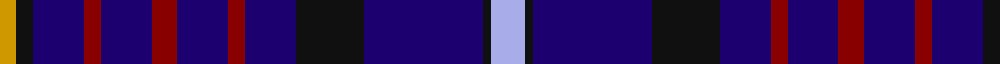

In pattern [WKBKBRBRBRBKY](/patterns/wkbkbrbrbrbky/).

This was sourced from tartans-authority.  It is a [13 stripes tartan](/stripes/stripes13/).

Original link http://www.tartansauthority.com/tartan-ferret/display/3005/

## Thread count
DY/4 K4 DB12 DR4 DB12 DR6 DB12 DR4 DB12 K16 DB28 K2 LP/8

## Palette
Each colour and its ΔE from the base-6 reference it is a variant of.

| Colour | Shade | Base | ΔE (OKLab) |
|---|---|---|---|
| DB | <code style="background-color:#1C0070;">#1C0070</code> `#1C0070` | B <code style="background-color:#2A418A;">#2A418A</code> | 0.14 |
| DR | <code style="background-color:#880000;">#880000</code> `#880000` | R <code style="background-color:#CC0000;">#CC0000</code> | 0.15 |
| DY | <code style="background-color:#D09800;">#D09800</code> `#D09800` | Y <code style="background-color:#F2BF00;">#F2BF00</code> | 0.12 |
| K | <code style="background-color:#101010;">#101010</code> `#101010` | K <code style="background-color:#000000;">#000000</code> | 0.17 |
| LP | <code style="background-color:#A8ACE8;">#A8ACE8</code> `#A8ACE8` | W <code style="background-color:#F7F7F7;">#F7F7F7</code> | 0.23 |

## Nearest tartans

The nearest existing variants by ΔTartan distance.

1. [MacIver of Strome (Personal)](/setts/s13/w2b3r2b19k7b6k22b6k7b19r2b3y2x2~b2c2c80-k101010-rc80000-we0e0e0-ye8c000/) — ΔT 1.12
1. [Fitzgerald Blue Irish Family Tartan Tartan Number: 1419. Earliest known date: pre 2003 One of four Fitzgerald tartans all apparently designed by Robert P. Fitzgerald of Philadelphia. Starting with this variation of Robertson, he then designed the blue and hunting as color variations and a further "fancy dress" version. See products available Copyright © Blair Urquhart, Comrie, 2015](/setts/s9/r3b21r3b3k13b13ba3b3w2x2~b2c2c80-ba5c8ca8-k101010-rc80000-we0e0e0/) — ΔT 1.24
1. [Goodwin, Robert Richard (Personal)](/setts/s12/k5w2b10w2k5ba15k2ba15k5ba10w1y2x2~b1870a4-ba2c2c80-k101010-w98c8e8-yfccc00/) — ΔT 1.24
1. [City of Sarnia (District)](/setts/s15/b10k2w2k3w2k10b10k1r2k1b10k10b10k1y2x2~b202060-k101010-rc80000-we0e0e0-yfccc00/) — ΔT 1.36
1. [Pride of Norway](/setts/s13/k7b2k6b18r3b18k4ka2b2ka2w2ka4k4x2~b2c2c80-k101010-ka000000-rc80000-we0e0e0/) — ΔT 1.39
1. [Fleming/Frisken/Flanders](/setts/s15/b16k3b3k3b3k16b17k2y4k2b17k16b17k2w4x2~b2c2c80-k101010-we0e0e0-ye8c000/) — ΔT 1.42
1. [Al-Fadhli (Personal)](/setts/s10/k17b24g3b3w3b3r3b24k17w1x2~b2c2c80-g006818-k101010-rc80000-we0e0e0/) — ΔT 1.47
1. [Ayrshire Tourist Board](/setts/s9/b10r3ba4r3b7ba3g7b17y2x2~b1c0070-ba2474e8-g006818-r9c68a4-ye8c000/) — ΔT 1.47
1. [Ibrox](/setts/s11/b4r2b2r4k7b10w2k13b18k2b2x4~b2c2c80-k101010-rc80000-we0e0e0/) — ΔT 1.49
1. [City of Sarnia](/setts/s15/b10k2w2k3w2k10b10k1r2k1b10k10b10k1y2x2~b000080-k101010-rff0000-wffffff-yffe600/) — ΔT 1.50

## Neighbour map

Every grey dot is one of 15726 variants placed by the first two principal components of the ΔTartan feature space (44% of its variance). Red is this tartan; blue dots are its nearest — click one to open its page.

<svg viewBox="0 0 640 380" role="img" style="max-width:100%;height:auto;border:1px solid #e0e0e0;border-radius:4px;display:block" xmlns="http://www.w3.org/2000/svg"><image href="/nn/cloud.v1.png" width="640" height="380"/><a href="/setts/s13/w2b3r2b19k7b6k22b6k7b19r2b3y2x2~b2c2c80-k101010-rc80000-we0e0e0-ye8c000/"><circle cx="311.4" cy="172.6" r="4" fill="#3465a4"><title>MacIver of Strome (Personal)</title></circle></a><a href="/setts/s9/r3b21r3b3k13b13ba3b3w2x2~b2c2c80-ba5c8ca8-k101010-rc80000-we0e0e0/"><circle cx="330.0" cy="184.8" r="4" fill="#3465a4"><title>Fitzgerald Blue Irish Family Tartan Tartan Number: 1419. Earliest known date: pre 2003 One of four Fitzgerald tartans all apparently designed by Robert P. Fitzgerald of Philadelphia. Starting with this variation of Robertson, he then designed the blue and hunting as color variations and a further &quot;fancy dress&quot; version. See products available Copyright © Blair Urquhart, Comrie, 2015</title></circle></a><a href="/setts/s12/k5w2b10w2k5ba15k2ba15k5ba10w1y2x2~b1870a4-ba2c2c80-k101010-w98c8e8-yfccc00/"><circle cx="260.0" cy="164.8" r="4" fill="#3465a4"><title>Goodwin, Robert Richard (Personal)</title></circle></a><a href="/setts/s15/b10k2w2k3w2k10b10k1r2k1b10k10b10k1y2x2~b202060-k101010-rc80000-we0e0e0-yfccc00/"><circle cx="259.2" cy="172.7" r="4" fill="#3465a4"><title>City of Sarnia (District)</title></circle></a><a href="/setts/s13/k7b2k6b18r3b18k4ka2b2ka2w2ka4k4x2~b2c2c80-k101010-ka000000-rc80000-we0e0e0/"><circle cx="271.5" cy="171.7" r="4" fill="#3465a4"><title>Pride of Norway</title></circle></a><a href="/setts/s15/b16k3b3k3b3k16b17k2y4k2b17k16b17k2w4x2~b2c2c80-k101010-we0e0e0-ye8c000/"><circle cx="313.6" cy="198.6" r="4" fill="#3465a4"><title>Fleming/Frisken/Flanders</title></circle></a><a href="/setts/s10/k17b24g3b3w3b3r3b24k17w1x2~b2c2c80-g006818-k101010-rc80000-we0e0e0/"><circle cx="332.4" cy="154.1" r="4" fill="#3465a4"><title>Al-Fadhli (Personal)</title></circle></a><a href="/setts/s9/b10r3ba4r3b7ba3g7b17y2x2~b1c0070-ba2474e8-g006818-r9c68a4-ye8c000/"><circle cx="271.6" cy="202.5" r="4" fill="#3465a4"><title>Ayrshire Tourist Board</title></circle></a><a href="/setts/s11/b4r2b2r4k7b10w2k13b18k2b2x4~b2c2c80-k101010-rc80000-we0e0e0/"><circle cx="302.8" cy="201.6" r="4" fill="#3465a4"><title>Ibrox</title></circle></a><a href="/setts/s15/b10k2w2k3w2k10b10k1r2k1b10k10b10k1y2x2~b000080-k101010-rff0000-wffffff-yffe600/"><circle cx="233.8" cy="166.5" r="4" fill="#3465a4"><title>City of Sarnia</title></circle></a><circle cx="302.7" cy="175.5" r="5" fill="#c00000"/></svg>

ID: /setts/s13/w4k1b14k8b6r2b6r3b6r2b6k2y2x2~b1c0070-k101010-r880000-wa8ace8-yd09800/
