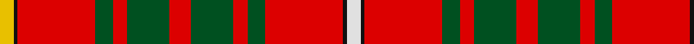

In pattern [WKRGRGRGRGRKY](/stripes/wkrgrgrgrgrky/).

This was sourced from register-of-tartans.  It is a [13 stripe tartan](/stripes/stripes13/).

Original link https://www.tartanregister.gov.uk/tartanDetails.aspx?ref=398

## Register references

External register numbers recorded for this tartan.

- Scottish Register of Tartans: [398](https://www.tartanregister.gov.uk/tartanDetails.aspx?ref=398)
- Scottish Tartans World Register: 1821

## Thread count
Y/8 K2 R44 G10 R8 G24 R12 G24 R8 G10 R44 K2 LN/8

## Palette
Each colour and the base-6 reference it is a variant of.

| Colour | Shade | Base |
|---|---|---|
| G | <code style="background-color:#005020;">#005020</code> `oklch(37.7% 0.105 149.6)` <small>#005020</small> | G <code style="background-color:#006100;">#006100</code> |
| K | <code style="background-color:#101010;">#101010</code> `oklch(17.3% 0.000 89.9)` <small>#101010</small> | K <code style="background-color:#000000;">#000000</code> |
| LN | <code style="background-color:#E0E0E0;">#E0E0E0</code> `oklch(90.7% 0.000 89.9)` <small>#E0E0E0</small> | W <code style="background-color:#F7F7F7;">#F7F7F7</code> |
| R | <code style="background-color:#DC0000;">#DC0000</code> `oklch(56.2% 0.230 29.2)` <small>#DC0000</small> | R <code style="background-color:#CC0000;">#CC0000</code> |
| Y | <code style="background-color:#E8C000;">#E8C000</code> `oklch(81.9% 0.168 93.7)` <small>#E8C000</small> | Y <code style="background-color:#F2BF00;">#F2BF00</code> |

## Nearest tartans

The nearest existing variants by ΔTartan distance, with this tartan at the top so the swatches line up against it.

ΔTartan

Tartan

Sett

—

<a href="/ttd/edit/#slug=w4k1r22dg5r4dg12r6dg12r4dg5r22k1ly4~x2">Bruce</a> <a class="nn-out" href="/setts/s13/w4k1r22dg5r4dg12r6dg12r4dg5r22k1ly4~x2/" title="open its dictionary page">↗</a>

0.66

<a href="/ttd/edit/#slug=w4k1r22g5r4g12r6g12r4g5r22k1ly4~x2">Bruce</a> <a class="nn-out" href="/setts/s13/w4k1r22g5r4g12r6g12r4g5r22k1ly4~x2/" title="open its dictionary page">↗</a>

1.01

<a href="/ttd/edit/#slug=dt8r4ly18r4r19ly4r19dt6r4g1r4g1r4g1r4g1r4~x2">Confrerie de Vouvray</a> <a class="nn-out" href="/setts/s17/dt8r4ly18r4r19ly4r19dt6r4g1r4g1r4g1r4g1r4~x2/" title="open its dictionary page">↗</a>

1.10

<a href="/ttd/edit/#slug=k3w1r20db4r4g10r4db4r20k1w3~x2">Hoben (Personal)</a> <a class="nn-out" href="/setts/s11/k3w1r20db4r4g10r4db4r20k1w3~x2/" title="open its dictionary page">↗</a>

1.11

<a href="/ttd/edit/#slug=r8dg1r8dg16r4k2t1k4r8dg1r8k1~x2">MacLeod and MacNicol</a> <a class="nn-out" href="/setts/s12/r8dg1r8dg16r4k2t1k4r8dg1r8k1~x2/" title="open its dictionary page">↗</a>

1.17

<a href="/ttd/edit/#slug=r48ly14r9g14k6r11g6r10g3~x2">Justerini &amp; Brooks</a> <a class="nn-out" href="/setts/s9/r48ly14r9g14k6r11g6r10g3~x2/" title="open its dictionary page">↗</a>

1.20

<a href="/ttd/edit/#slug=r6dg8ly2dg8r6dt8r29dg3lb2r5dt3~x2">Loch Creran (District)</a> <a class="nn-out" href="/setts/s11/r6dg8ly2dg8r6dt8r29dg3lb2r5dt3~x2/" title="open its dictionary page">↗</a>

1.23

<a href="/ttd/edit/#slug=w8r100k42dg42r5k3r5t42r100w8">Unidentified Plaid #7</a> <a class="nn-out" href="/setts/s10/w8r100k42dg42r5k3r5t42r100w8/" title="open its dictionary page">↗</a>

1.23

<a href="/ttd/edit/#slug=r4dg8w1dg8r4dg4r2dg4r24k2~x2">Cumming/Comyn</a> <a class="nn-out" href="/setts/s10/r4dg8w1dg8r4dg4r2dg4r24k2~x2/" title="open its dictionary page">↗</a>

1.25

<a href="/ttd/edit/#slug=r8g1r8g16r4k2t1k4r8g1r8k1~x2">MacLeod, and MacNicol</a> <a class="nn-out" href="/setts/s12/r8g1r8g16r4k2t1k4r8g1r8k1~x2/" title="open its dictionary page">↗</a>

1.28

<a href="/ttd/edit/#slug=r4g8k6r8r6g2r2g2r24g1r3~x2">MacDougal 3</a> <a class="nn-out" href="/setts/s11/r4g8k6r8r6g2r2g2r24g1r3~x2/" title="open its dictionary page">↗</a>

## Neighbour map

Every grey dot is one of 14299 variants placed by the first two principal components of the ΔTartan feature space (44% of its variance). Red is this tartan; blue dots are its nearest — click one to open its page.

<svg viewBox="0 0 640 380" role="img" style="max-width:100%;height:auto;border:1px solid #e0e0e0;border-radius:4px;display:block" xmlns="http://www.w3.org/2000/svg"><image href="/nn/cloud.v1.png" width="640" height="380"/><a href="/setts/s13/w4k1r22g5r4g12r6g12r4g5r22k1ly4~x2/"><circle cx="318.6" cy="119.6" r="4" fill="#3465a4"><title>Bruce</title></circle></a><a href="/setts/s17/dt8r4ly18r4r19ly4r19dt6r4g1r4g1r4g1r4g1r4~x2/"><circle cx="278.5" cy="101.2" r="4" fill="#3465a4"><title>Confrerie de Vouvray</title></circle></a><a href="/setts/s11/k3w1r20db4r4g10r4db4r20k1w3~x2/"><circle cx="361.4" cy="115.8" r="4" fill="#3465a4"><title>Hoben (Personal)</title></circle></a><a href="/setts/s12/r8dg1r8dg16r4k2t1k4r8dg1r8k1~x2/"><circle cx="333.5" cy="151.9" r="4" fill="#3465a4"><title>MacLeod and MacNicol</title></circle></a><a href="/setts/s9/r48ly14r9g14k6r11g6r10g3~x2/"><circle cx="355.8" cy="138.1" r="4" fill="#3465a4"><title>Justerini &amp; Brooks</title></circle></a><a href="/setts/s11/r6dg8ly2dg8r6dt8r29dg3lb2r5dt3~x2/"><circle cx="317.3" cy="136.1" r="4" fill="#3465a4"><title>Loch Creran (District)</title></circle></a><a href="/setts/s10/w8r100k42dg42r5k3r5t42r100w8/"><circle cx="337.6" cy="96.5" r="4" fill="#3465a4"><title>Unidentified Plaid #7</title></circle></a><a href="/setts/s10/r4dg8w1dg8r4dg4r2dg4r24k2~x2/"><circle cx="371.6" cy="133.8" r="4" fill="#3465a4"><title>Cumming/Comyn</title></circle></a><a href="/setts/s12/r8g1r8g16r4k2t1k4r8g1r8k1~x2/"><circle cx="316.6" cy="148.3" r="4" fill="#3465a4"><title>MacLeod, and MacNicol</title></circle></a><a href="/setts/s11/r4g8k6r8r6g2r2g2r24g1r3~x2/"><circle cx="359.6" cy="127.4" r="4" fill="#3465a4"><title>MacDougal 3</title></circle></a><circle cx="319.4" cy="115.9" r="5" fill="#c00000"/></svg>

ID: /setts/s13/w4k1r22dg5r4dg12r6dg12r4dg5r22k1ly4~x2/
