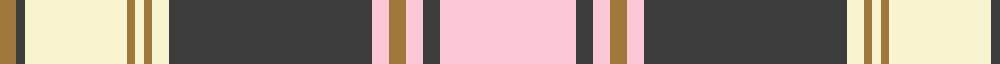

In pattern [RBWRWRWBWRWBW](/patterns/rbwrwrwbwrwbw/).

This was sourced from register-of-tartans.  It is a [13 stripes tartan](/stripes/stripes13/).

Original link https://www.tartanregister.gov.uk/tartanDetails.aspx?ref=1187

## Attestations

This cloth appears in 2 source records; the oldest owns this page.

- 01/01/2002 — Fiona (register-of-tartans, [record](https://www.tartanregister.gov.uk/tartanDetails.aspx?ref=1187))
- pre 2002 — Fiona (Fashion) (tartans-authority, [record](http://www.tartansauthority.com/tartan-ferret/display/4861/))

## Thread count
LT/8 N4 LY48 LT4 LY4 LT4 LY8 N96 W8 LT8 W8 N8 W/64

## Palette
Each colour and its ΔE from the base-6 reference it is a variant of.

| Colour | Shade | Base | ΔE (OKLab) |
|---|---|---|---|
| LT | <code style="background-color:#A0783C;">#A0783C</code> `#A0783C` | R <code style="background-color:#C80000;">#C80000</code> | 0.18 |
| LY | <code style="background-color:#F8F4D0;">#F8F4D0</code> `#F8F4D0` | W <code style="background-color:#F4F4F0;">#F4F4F0</code> | 0.04 |
| N | <code style="background-color:#3C3C3C;">#3C3C3C</code> `#3C3C3C` | B <code style="background-color:#2C4084;">#2C4084</code> | 0.12 |
| W | <code style="background-color:#FCC8D8;">#FCC8D8</code> `#FCC8D8` | W <code style="background-color:#F4F4F0;">#F4F4F0</code> | 0.11 |

## Nearest tartans

The nearest existing variants by ΔTartan distance.

1. [Largs Dress District Tartan Tartan Number: 1838. Earliest known date: 1983 The Largs tartan is a new design created for the town and officially adopted in 1981. There is also a dress version. See products available Copyright © Blair Urquhart, Comrie, 2015](/setts/s13/w4r21b4g16b4g8b4g4w3b6w49r3w4-b2c2c80-g604000-rc80000-we0e0e0/) — ΔT 0.96
1. [Largs, dress](/setts/s13/w4r21b4ra16b4ra8b4ra4w3b6w49r3w4-b304080-rc00000-ra806050-we0e0e0/) — ΔT 1.03
1. [Nike Golf Light (Corporate)](/setts/s17/r10w40ra2w4ra2w4ra4w4ra10b4ra4b4ra4b6ra4b20w6-b5c5c5c-rc80000-ra888888-wfcfcfc/) — ΔT 1.12
1. [Ben Ledi (Fashion)](/setts/s11/w60r3w3r8w3r3g24b12r3b16r4-b1c1c1c-g688038-ra07c58-wf8f4d0/) — ΔT 1.18
1. [Scott Dress Tartan Tartan Number: 1006. Earliest known date: pre 2003 Based on the 'Red' Scott from the Vestiarium Scoticum. See products available Copyright © Blair Urquhart, Comrie, 2015](/setts/s11/g8r4k2w60r20g28r8g10w4g10r8-g006818-k101010-rc80000-we0e0e0/) — ΔT 1.19
1. [Strathyre Dress (Dance)](/setts/s18/w110g24r4g6w4ga20b18g4b12w4b12g4b18ga20w4g6r4g24-b780078-g285800-ga006818-rc80000-wf8f8f8/) — ΔT 1.22
1. [Ben Vorlich](/setts/s11/w136y6w6y16w6y6g48b32r6b40y6-b1c1c1c-g858585-r70000c-we0e0e0-yb8b8b8/) — ΔT 1.24
1. [Independence](/setts/s12/k4y4b30y4k4y4w4y4w28y2k4y4-b304080-k000000-we0e0e0-yf0c000/) — ΔT 1.25
1. [Glenmore Pink](/setts/s11/w60b24r3b5w3b5ra16r8k3r6w4-b1c1c1c-k101010-r888888-ra946880-wf8e8d8/) — ΔT 1.27
1. [MacGillivray Dress, Janice (Personal](/setts/s13/w8b2ba2w44b4w4ba24r4g32r8b2r8ba4-b5c8ca8-ba003c64-g285800-rc80000-we8ccb8/) — ΔT 1.27

## Neighbour map

Every grey dot is one of 15726 variants placed by the first two principal components of the ΔTartan feature space (44% of its variance). Red is this tartan; blue dots are its nearest — click one to open its page.

<svg viewBox="0 0 640 380" role="img" style="max-width:100%;height:auto;border:1px solid #e0e0e0;border-radius:4px;display:block" xmlns="http://www.w3.org/2000/svg"><image href="/nn/cloud.v1.png" width="640" height="380"/><a href="/setts/s13/w4r21b4g16b4g8b4g4w3b6w49r3w4-b2c2c80-g604000-rc80000-we0e0e0/"><circle cx="227.2" cy="101.1" r="4" fill="#3465a4"><title>Largs Dress District Tartan Tartan Number: 1838. Earliest known date: 1983 The Largs tartan is a new design created for the town and officially adopted in 1981. There is also a dress version. See products available Copyright © Blair Urquhart, Comrie, 2015</title></circle></a><a href="/setts/s13/w4r21b4ra16b4ra8b4ra4w3b6w49r3w4-b304080-rc00000-ra806050-we0e0e0/"><circle cx="236.7" cy="104.3" r="4" fill="#3465a4"><title>Largs, dress</title></circle></a><a href="/setts/s17/r10w40ra2w4ra2w4ra4w4ra10b4ra4b4ra4b6ra4b20w6-b5c5c5c-rc80000-ra888888-wfcfcfc/"><circle cx="221.7" cy="89.7" r="4" fill="#3465a4"><title>Nike Golf Light (Corporate)</title></circle></a><a href="/setts/s11/w60r3w3r8w3r3g24b12r3b16r4-b1c1c1c-g688038-ra07c58-wf8f4d0/"><circle cx="233.4" cy="98.4" r="4" fill="#3465a4"><title>Ben Ledi (Fashion)</title></circle></a><a href="/setts/s11/g8r4k2w60r20g28r8g10w4g10r8-g006818-k101010-rc80000-we0e0e0/"><circle cx="232.5" cy="101.8" r="4" fill="#3465a4"><title>Scott Dress Tartan Tartan Number: 1006. Earliest known date: pre 2003 Based on the 'Red' Scott from the Vestiarium Scoticum. See products available Copyright © Blair Urquhart, Comrie, 2015</title></circle></a><a href="/setts/s18/w110g24r4g6w4ga20b18g4b12w4b12g4b18ga20w4g6r4g24-b780078-g285800-ga006818-rc80000-wf8f8f8/"><circle cx="187.6" cy="43.2" r="4" fill="#3465a4"><title>Strathyre Dress (Dance)</title></circle></a><a href="/setts/s11/w136y6w6y16w6y6g48b32r6b40y6-b1c1c1c-g858585-r70000c-we0e0e0-yb8b8b8/"><circle cx="229.6" cy="79.0" r="4" fill="#3465a4"><title>Ben Vorlich</title></circle></a><a href="/setts/s12/k4y4b30y4k4y4w4y4w28y2k4y4-b304080-k000000-we0e0e0-yf0c000/"><circle cx="148.5" cy="111.1" r="4" fill="#3465a4"><title>Independence</title></circle></a><a href="/setts/s11/w60b24r3b5w3b5ra16r8k3r6w4-b1c1c1c-k101010-r888888-ra946880-wf8e8d8/"><circle cx="226.0" cy="81.7" r="4" fill="#3465a4"><title>Glenmore Pink</title></circle></a><a href="/setts/s13/w8b2ba2w44b4w4ba24r4g32r8b2r8ba4-b5c8ca8-ba003c64-g285800-rc80000-we8ccb8/"><circle cx="174.0" cy="88.4" r="4" fill="#3465a4"><title>MacGillivray Dress, Janice (Personal</title></circle></a><circle cx="216.4" cy="82.7" r="5" fill="#c00000"/></svg>

ID: /setts/s13/w64b8w8r8w8b96wa8r4wa4r4wa48b4r8-b3c3c3c-ra0783c-wfcc8d8-waf8f4d0/
