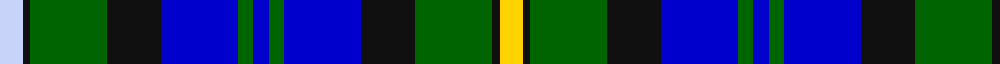

In pattern [WKGKBGBGBKGKY](/patterns/wkgkbgbgbkgky/).

This was sourced from register-of-tartans.  It is a [13 stripes tartan](/stripes/stripes13/).

Original link https://www.tartanregister.gov.uk/tartanDetails.aspx?ref=10806

## Thread count
LN/6 K2 G20 K14 B20 G4 B4 G4 B20 K14 G20 K2 Y/6

## Palette
Each colour and its ΔE from the base-6 reference it is a variant of.

| Colour | Shade | Base | ΔE (OKLab) |
|---|---|---|---|
| B | <code style="background-color:#0000CD;">#0000CD</code> `#0000CD` | B <code style="background-color:#2C4084;">#2C4084</code> | 0.15 |
| G | <code style="background-color:#006400;">#006400</code> `#006400` | G <code style="background-color:#006400;">#006400</code> | 0.00 |
| K | <code style="background-color:#101010;">#101010</code> `#101010` | K <code style="background-color:#000000;">#000000</code> | 0.17 |
| LN | <code style="background-color:#C8D3FA;">#C8D3FA</code> `#C8D3FA` | W <code style="background-color:#F4F4F0;">#F4F4F0</code> | 0.11 |
| Y | <code style="background-color:#FFD200;">#FFD200</code> `#FFD200` | Y <code style="background-color:#E8C000;">#E8C000</code> | 0.06 |

## Nearest tartans

The nearest existing variants by ΔTartan distance.

1. [Scottish Women's Rural Institutes](/setts/s12/b12ba4b40k30g40y4g12ba4g40k30b40y8-b304080-ba5480b0-g008000-k000000-yf0c000/) — ΔT 1.12
1. [Biskup (Personal)](/setts/s10/b24r8b36r4k38g36r8g6y4g16-b00008c-g007800-k000000-r8c0000-yc88c00/) — ΔT 1.13
1. [Spar (UK) Ltd](/setts/s12/g36k36b40k4b8k8b40k36g36w4g8r4-b1474b4-g006818-k101010-rc80000-we0e0e0/) — ΔT 1.14
1. [Dyce](/setts/s14/b36k4b4k4b4k32g32y4k4y4g32k32b32w4-b1474b4-g006818-k101010-wfcfcfc-ye8c000/) — ΔT 1.14
1. [Doon Valley Crafters (Corporate)](/setts/s13/y6k2g20k14b20g4b4g4b20k14g20k2ya6-b2c2c80-g006818-k101010-y48a4c0-yafccc00/) — ΔT 1.15
1. [Glengoyne Distillery Corporate Tartan Tartan Number: 1144. Earliest known date: 1993 Designed for the Glengoyne Distillery by Lochcarron of Scotland in 1993. See products available Copyright © Blair Urquhart, Comrie, 2015](/setts/s15/b22k6b6k6b6k18g18k2y6k2g18k18b18k2w6-b2c2c80-g006428-k101010-we0e0e0-ye8c000/) — ΔT 1.17
1. [Logan Rogers Hunting](/setts/s13/b22k2b2w2b2k16g16y2g16k16b16w2b2-b202060-g008b00-k101010-wffffff-ye8c000/) — ΔT 1.17
1. [Auchinachie](/setts/s12/g4k4b24k8r2k8y20w2y20k16b24k4-b003f87-g008b45-k101010-r8c1717-wfff68f-y96c8a2/) — ΔT 1.18
1. [Bowlers (Commemorative)](/setts/s11/w8b40g10k12g4w6g4k12g26ba16g4-b2c2c80-ba780078-g006818-k101010-wfcfcfc/) — ΔT 1.18
1. [MacLeod of Skye (Johnston)](/setts/s14/b36k4b4k4b4k28g32k4y8k4g32k28b32r8-b1474b4-g006818-k101010-rc80000-ye8c000/) — ΔT 1.19

## Neighbour map

Every grey dot is one of 15726 variants placed by the first two principal components of the ΔTartan feature space (44% of its variance). Red is this tartan; blue dots are its nearest — click one to open its page.

<svg viewBox="0 0 640 380" role="img" style="max-width:100%;height:auto;border:1px solid #e0e0e0;border-radius:4px;display:block" xmlns="http://www.w3.org/2000/svg"><image href="/nn/cloud.v1.png" width="640" height="380"/><a href="/setts/s12/b12ba4b40k30g40y4g12ba4g40k30b40y8-b304080-ba5480b0-g008000-k000000-yf0c000/"><circle cx="113.7" cy="174.7" r="4" fill="#3465a4"><title>Scottish Women's Rural Institutes</title></circle></a><a href="/setts/s10/b24r8b36r4k38g36r8g6y4g16-b00008c-g007800-k000000-r8c0000-yc88c00/"><circle cx="112.5" cy="181.0" r="4" fill="#3465a4"><title>Biskup (Personal)</title></circle></a><a href="/setts/s12/g36k36b40k4b8k8b40k36g36w4g8r4-b1474b4-g006818-k101010-rc80000-we0e0e0/"><circle cx="145.2" cy="182.9" r="4" fill="#3465a4"><title>Spar (UK) Ltd</title></circle></a><a href="/setts/s14/b36k4b4k4b4k32g32y4k4y4g32k32b32w4-b1474b4-g006818-k101010-wfcfcfc-ye8c000/"><circle cx="132.9" cy="161.6" r="4" fill="#3465a4"><title>Dyce</title></circle></a><a href="/setts/s13/y6k2g20k14b20g4b4g4b20k14g20k2ya6-b2c2c80-g006818-k101010-y48a4c0-yafccc00/"><circle cx="137.2" cy="180.8" r="4" fill="#3465a4"><title>Doon Valley Crafters (Corporate)</title></circle></a><a href="/setts/s15/b22k6b6k6b6k18g18k2y6k2g18k18b18k2w6-b2c2c80-g006428-k101010-we0e0e0-ye8c000/"><circle cx="137.1" cy="171.0" r="4" fill="#3465a4"><title>Glengoyne Distillery Corporate Tartan Tartan Number: 1144. Earliest known date: 1993 Designed for the Glengoyne Distillery by Lochcarron of Scotland in 1993. See products available Copyright © Blair Urquhart, Comrie, 2015</title></circle></a><a href="/setts/s13/b22k2b2w2b2k16g16y2g16k16b16w2b2-b202060-g008b00-k101010-wffffff-ye8c000/"><circle cx="154.5" cy="157.8" r="4" fill="#3465a4"><title>Logan Rogers Hunting</title></circle></a><a href="/setts/s12/g4k4b24k8r2k8y20w2y20k16b24k4-b003f87-g008b45-k101010-r8c1717-wfff68f-y96c8a2/"><circle cx="104.7" cy="141.6" r="4" fill="#3465a4"><title>Auchinachie</title></circle></a><a href="/setts/s11/w8b40g10k12g4w6g4k12g26ba16g4-b2c2c80-ba780078-g006818-k101010-wfcfcfc/"><circle cx="110.4" cy="161.7" r="4" fill="#3465a4"><title>Bowlers (Commemorative)</title></circle></a><a href="/setts/s14/b36k4b4k4b4k28g32k4y8k4g32k28b32r8-b1474b4-g006818-k101010-rc80000-ye8c000/"><circle cx="130.4" cy="167.9" r="4" fill="#3465a4"><title>MacLeod of Skye (Johnston)</title></circle></a><circle cx="110.4" cy="171.8" r="5" fill="#c00000"/></svg>

ID: /setts/s13/w6k2g20k14b20g4b4g4b20k14g20k2y6-b0000cd-g006400-k101010-wc8d3fa-yffd200/
