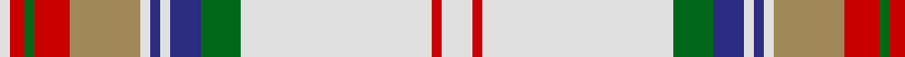

In pattern [WRGRYWBWBGWRW](/patterns/wrgrywbwbgwrw/).

This was sourced from house-of-tartan.  It is a [13 stripes tartan](/stripes/stripes13/).

Original link http://www.house-of-tartan.scotland.net/house/TartanViewjs.asp?colr=Def&tnam=1844

## Thread count
LN/4 R6 G4 R14 LT28 LN4 DB4 LN4 DB12 G16 LN76 R4 LN/12

## Palette
Each colour and its ΔE from the base-6 reference it is a variant of.

| Colour | Shade | Base | ΔE (OKLab) |
|---|---|---|---|
| DB | <code style="background-color:#2C2C80;">#2C2C80</code> `#2C2C80` | B <code style="background-color:#2A418A;">#2A418A</code> | 0.06 |
| G | <code style="background-color:#006818;">#006818</code> `#006818` | G <code style="background-color:#006100;">#006100</code> | 0.02 |
| LN | <code style="background-color:#E0E0E0;">#E0E0E0</code> `#E0E0E0` | W <code style="background-color:#F7F7F7;">#F7F7F7</code> | 0.07 |
| LT | <code style="background-color:#A08858;">#A08858</code> `#A08858` | Y <code style="background-color:#F2BF00;">#F2BF00</code> | 0.21 |
| R | <code style="background-color:#C80000;">#C80000</code> `#C80000` | R <code style="background-color:#CC0000;">#CC0000</code> | 0.01 |

## Nearest tartans

The nearest existing variants by ΔTartan distance.

1. [Grant of Acharrow](/setts/s13/w6r2w38g8b6w2b2w2ra14r7g2r3w2~b304080-g008000-rc00000-ra906030-we0e0e0~x2/) — ΔT 0.14
1. [Grant of Auchnarrow](/setts/s13/w6r2w38g8b6w2b2w2y14r7g2r3w2~b2c2c80-g289c18-re87878-we0e0e0-ya08858~x2/) — ΔT 0.76
1. [Rikaco Eve](/setts/s10/g4ga4g2w36ga14w2wa4g7r5w3~g1b6453-ga787878-rb03060-wffffe0-wa87ceeb~x2/) — ΔT 0.93
1. [Ben Vorlich](/setts/s11/w68y3w3y8w3y3r24b16ra3b20y3~b1c1c1c-r858585-ra70000c-we0e0e0-yb8b8b8~x2/) — ΔT 0.98
1. [Glenmore Pink](/setts/s11/w60b24r3b5w3b5ra16r8k3r6w4~b1c1c1c-k101010-r888888-ra946880-wf8e8d8/) — ΔT 1.00
1. [Glenmore Green Fashion Tartan Tartan Number: 5041. Earliest known date: pre 1988 A Royal Stewart colour variation produced by many weaving mills See products available Copyright © Blair Urquhart, Comrie, 2015](/setts/s11/w38g10r2g3w2g3ga8y3g2y3w2~g506c6c-ga407c40-ra00048-wf0f0d8-yc0a490~x2/) — ΔT 1.02
1. [Australian, dress](/setts/s9/w50r4y2k2y2r4y10r15b2~b5480b0-k000000-r806050-we0e0e0-yd08010~x2/) — ΔT 1.11
1. [Braveheart Dress (Fashion)](/setts/s12/w41b6w10k3w3k3w3g15r9w3r4k4~b2c2c80-g006818-k101010-rc80000-wfcfcfc~x2/) — ΔT 1.16
1. [Braveheart - Warrior (dress) Universal Tartan Tartan Number: 2236. Earliest known date: pre 2002 Designed by Michael King of Aberdeen to prevent anyone else 'cashing in' on the popularity of the Braveheart film. Never been woven as far as is known. See products available Copyright © Blair Urquhart, Comrie, 2015](/setts/s12/w42b6w10k3w3k3w3g15r9w3r4k4~b2c2c80-g006818-k101010-rc80000-wfcfcfc~x2/) — ΔT 1.16
1. [Braveheart - Warrior (dress)](/setts/s12/w41b6w10k3w3k3w3g15r9w3r4k4~b304080-g008000-k000000-rc00000-we0e0e0~x2/) — ΔT 1.16

## Neighbour map

Every grey dot is one of 15726 variants placed by the first two principal components of the ΔTartan feature space (44% of its variance). Red is this tartan; blue dots are its nearest — click one to open its page.

<svg viewBox="0 0 640 380" role="img" style="max-width:100%;height:auto;border:1px solid #e0e0e0;border-radius:4px;display:block" xmlns="http://www.w3.org/2000/svg"><image href="/nn/cloud.v1.png" width="640" height="380"/><a href="/setts/s13/w6r2w38g8b6w2b2w2ra14r7g2r3w2~b304080-g008000-rc00000-ra906030-we0e0e0~x2/"><circle cx="259.2" cy="82.4" r="4" fill="#3465a4"><title>Grant of Acharrow</title></circle></a><a href="/setts/s13/w6r2w38g8b6w2b2w2y14r7g2r3w2~b2c2c80-g289c18-re87878-we0e0e0-ya08858~x2/"><circle cx="273.1" cy="88.2" r="4" fill="#3465a4"><title>Grant of Auchnarrow</title></circle></a><a href="/setts/s10/g4ga4g2w36ga14w2wa4g7r5w3~g1b6453-ga787878-rb03060-wffffe0-wa87ceeb~x2/"><circle cx="239.0" cy="98.9" r="4" fill="#3465a4"><title>Rikaco Eve</title></circle></a><a href="/setts/s11/w68y3w3y8w3y3r24b16ra3b20y3~b1c1c1c-r858585-ra70000c-we0e0e0-yb8b8b8~x2/"><circle cx="231.3" cy="80.4" r="4" fill="#3465a4"><title>Ben Vorlich</title></circle></a><a href="/setts/s11/w60b24r3b5w3b5ra16r8k3r6w4~b1c1c1c-k101010-r888888-ra946880-wf8e8d8/"><circle cx="227.4" cy="83.4" r="4" fill="#3465a4"><title>Glenmore Pink</title></circle></a><a href="/setts/s11/w38g10r2g3w2g3ga8y3g2y3w2~g506c6c-ga407c40-ra00048-wf0f0d8-yc0a490~x2/"><circle cx="293.7" cy="87.2" r="4" fill="#3465a4"><title>Glenmore Green Fashion Tartan Tartan Number: 5041. Earliest known date: pre 1988 A Royal Stewart colour variation produced by many weaving mills See products available Copyright © Blair Urquhart, Comrie, 2015</title></circle></a><a href="/setts/s9/w50r4y2k2y2r4y10r15b2~b5480b0-k000000-r806050-we0e0e0-yd08010~x2/"><circle cx="317.9" cy="86.2" r="4" fill="#3465a4"><title>Australian, dress</title></circle></a><a href="/setts/s12/w41b6w10k3w3k3w3g15r9w3r4k4~b2c2c80-g006818-k101010-rc80000-wfcfcfc~x2/"><circle cx="246.1" cy="96.2" r="4" fill="#3465a4"><title>Braveheart Dress (Fashion)</title></circle></a><a href="/setts/s12/w42b6w10k3w3k3w3g15r9w3r4k4~b2c2c80-g006818-k101010-rc80000-wfcfcfc~x2/"><circle cx="250.7" cy="94.4" r="4" fill="#3465a4"><title>Braveheart - Warrior (dress) Universal Tartan Tartan Number: 2236. Earliest known date: pre 2002 Designed by Michael King of Aberdeen to prevent anyone else 'cashing in' on the popularity of the Braveheart film. Never been woven as far as is known. See products available Copyright © Blair Urquhart, Comrie, 2015</title></circle></a><a href="/setts/s12/w41b6w10k3w3k3w3g15r9w3r4k4~b304080-g008000-k000000-rc00000-we0e0e0~x2/"><circle cx="249.7" cy="100.6" r="4" fill="#3465a4"><title>Braveheart - Warrior (dress)</title></circle></a><circle cx="258.3" cy="82.0" r="5" fill="#c00000"/></svg>

ID: /setts/s13/w6r2w38g8b6w2b2w2y14r7g2r3w2~b2c2c80-g006818-rc80000-we0e0e0-ya08858~x2/
