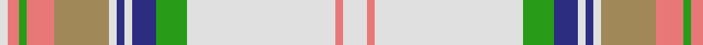

In pattern [WRGRYWBWBGWRW](/stripes/wrgrywbwbgwrw/).

This was sourced from register-of-tartans.  It is a [13 stripe tartan](/stripes/stripes13/).

Original link https://www.tartanregister.gov.uk/tartanDetails.aspx?ref=1503

## Also known as

This cloth is also recorded under:

- Grant of Auchnarrow

## Attestations

This cloth appears in 2 source records; the oldest owns this page.

- 01/01/1954 — Grant of Auchnarrow (register-of-tartans, [record](https://www.tartanregister.gov.uk/tartanDetails.aspx?ref=1503))
- undated — Grant of Acharrow Artifact Tartan Tartan Number: 1844. Earliest known date: pre 2003 This tartan can be seen in the form of an Arisaid at Kingussie museum. See products available Copyright © Blair Urquhart, Comrie, 2015 (house-of-tartan, [record](http://www.house-of-tartan.scotland.net/house/TartanViewjs.asp?colr=Def&tnam=1844))

## Register references

External register numbers recorded for this tartan.

- Scottish Register of Tartans: [1503](https://www.tartanregister.gov.uk/tartanDetails.aspx?ref=1503)
- Scottish Tartans Authority (ITI): 1844
- Scottish Tartans World Register: 1844

## Thread count
LN/12 LR4 LN76 G16 DB12 LN4 DB4 LN4 LT28 LR14 G4 LR6 LN/4

## Palette
Each colour and the base-6 reference it is a variant of.

| Colour | Shade | Base |
|---|---|---|
| DB | <code style="background-color:#2C2C80;">#2C2C80</code> `oklch(35.0% 0.138 276.6)` <small>#2C2C80</small> | B <code style="background-color:#2A418A;">#2A418A</code> |
| G | <code style="background-color:#289C18;">#289C18</code> `oklch(60.6% 0.191 141.6)` <small>#289C18</small> | G <code style="background-color:#006100;">#006100</code> |
| LN | <code style="background-color:#E0E0E0;">#E0E0E0</code> `oklch(90.7% 0.000 89.9)` <small>#E0E0E0</small> | W <code style="background-color:#F7F7F7;">#F7F7F7</code> |
| LR | <code style="background-color:#E87878;">#E87878</code> `oklch(70.0% 0.139 21.2)` <small>#E87878</small> | R <code style="background-color:#CC0000;">#CC0000</code> |
| LT | <code style="background-color:#A08858;">#A08858</code> `oklch(63.7% 0.071 84.0)` <small>#A08858</small> | Y <code style="background-color:#F2BF00;">#F2BF00</code> |

## Nearest tartans

The nearest existing variants by ΔTartan distance, with this tartan at the top so the swatches line up against it.

ΔTartan

Tartan

Sett

—

<a href="/ttd/edit/#slug=w6r2w38g8db6w2db2w2lo14r7g2r3w2~x2">Grant of Auchnarrow</a> <a class="nn-out" href="/setts/s13/w6r2w38g8db6w2db2w2lo14r7g2r3w2~x2/" title="open its dictionary page">↗</a>

0.80

<a href="/ttd/edit/#slug=w6r2w38g8db6w2db2w2o14r7g2r3w2~x2">Grant of Acharrow</a> <a class="nn-out" href="/setts/s13/w6r2w38g8db6w2db2w2o14r7g2r3w2~x2/" title="open its dictionary page">↗</a>

0.82

<a href="/ttd/edit/#slug=w38y10m2y3w2y3g8lr3y2lr3w2~x2">Glenmore Green Fashion Tartan Tartan Number: 5041. Earliest known date: pre 1988 A Royal Stewart colour variation produced by many weaving mills See products available Copyright © Blair Urquhart, Comrie, 2015</a> <a class="nn-out" href="/setts/s11/w38y10m2y3w2y3g8lr3y2lr3w2~x2/" title="open its dictionary page">↗</a>

0.99

<a href="/ttd/edit/#slug=g4y4g2w36y14w2lt4g7m5w3~x2">Rikaco Eve</a> <a class="nn-out" href="/setts/s10/g4y4g2w36y14w2lt4g7m5w3~x2/" title="open its dictionary page">↗</a>

1.13

<a href="/ttd/edit/#slug=w50o4lo2k2lo2o4lo10o15t2~x2">Australian, dress</a> <a class="nn-out" href="/setts/s9/w50o4lo2k2lo2o4lo10o15t2~x2/" title="open its dictionary page">↗</a>

1.25

<a href="/ttd/edit/#slug=db3ly1t1w15t1r4t1w1t15r1t1r1t3~x4">Federal Memorial Dress (Military)</a> <a class="nn-out" href="/setts/s13/db3ly1t1w15t1r4t1w1t15r1t1r1t3~x4/" title="open its dictionary page">↗</a>

1.26

<a href="/ttd/edit/#slug=lb18ly2lb2ly1r3g3r2g2r1k2lb3w7lb2w2lb1w4~x4">Inverness County (Canada)</a> <a class="nn-out" href="/setts/s16/lb18ly2lb2ly1r3g3r2g2r1k2lb3w7lb2w2lb1w4~x4/" title="open its dictionary page">↗</a>

1.26

<a href="/ttd/edit/#slug=o2w3k1t9k1lr6g1lr3g1lr19k2w7o1~x2">Cahaba Memorial (Commemorative)</a> <a class="nn-out" href="/setts/s13/o2w3k1t9k1lr6g1lr3g1lr19k2w7o1~x2/" title="open its dictionary page">↗</a>

1.32

<a href="/ttd/edit/#slug=w40o1w6o3lo1o7lo3n1lo8n3k1n9k2w8~x2">Snowy Owl (Fashion)</a> <a class="nn-out" href="/setts/s14/w40o1w6o3lo1o7lo3n1lo8n3k1n9k2w8~x2/" title="open its dictionary page">↗</a>

1.47

<a href="/ttd/edit/#slug=w68lr3w3lr8w3lr3o24dt16o3dt20lr3~x2">Ben Vorlich</a> <a class="nn-out" href="/setts/s11/w68lr3w3lr8w3lr3o24dt16o3dt20lr3~x2/" title="open its dictionary page">↗</a>

1.48

<a href="/ttd/edit/#slug=n1w1o2w1n1w16o6db1ly1t1~x4">Gray, Thomas (Personal)</a> <a class="nn-out" href="/setts/s10/n1w1o2w1n1w16o6db1ly1t1~x4/" title="open its dictionary page">↗</a>

## Neighbour map

Every grey dot is one of 14299 variants placed by the first two principal components of the ΔTartan feature space (44% of its variance). Red is this tartan; blue dots are its nearest — click one to open its page.

<svg viewBox="0 0 640 380" role="img" style="max-width:100%;height:auto;border:1px solid #e0e0e0;border-radius:4px;display:block" xmlns="http://www.w3.org/2000/svg"><image href="/nn/cloud.v1.png" width="640" height="380"/><a href="/setts/s13/w6r2w38g8db6w2db2w2o14r7g2r3w2~x2/"><circle cx="260.6" cy="80.1" r="4" fill="#3465a4"><title>Grant of Acharrow</title></circle></a><a href="/setts/s11/w38y10m2y3w2y3g8lr3y2lr3w2~x2/"><circle cx="295.3" cy="85.6" r="4" fill="#3465a4"><title>Glenmore Green Fashion Tartan Tartan Number: 5041. Earliest known date: pre 1988 A Royal Stewart colour variation produced by many weaving mills See products available Copyright © Blair Urquhart, Comrie, 2015</title></circle></a><a href="/setts/s10/g4y4g2w36y14w2lt4g7m5w3~x2/"><circle cx="240.8" cy="96.5" r="4" fill="#3465a4"><title>Rikaco Eve</title></circle></a><a href="/setts/s9/w50o4lo2k2lo2o4lo10o15t2~x2/"><circle cx="319.0" cy="83.9" r="4" fill="#3465a4"><title>Australian, dress</title></circle></a><a href="/setts/s13/db3ly1t1w15t1r4t1w1t15r1t1r1t3~x4/"><circle cx="240.7" cy="98.9" r="4" fill="#3465a4"><title>Federal Memorial Dress (Military)</title></circle></a><a href="/setts/s16/lb18ly2lb2ly1r3g3r2g2r1k2lb3w7lb2w2lb1w4~x4/"><circle cx="205.8" cy="75.1" r="4" fill="#3465a4"><title>Inverness County (Canada)</title></circle></a><a href="/setts/s13/o2w3k1t9k1lr6g1lr3g1lr19k2w7o1~x2/"><circle cx="232.2" cy="89.7" r="4" fill="#3465a4"><title>Cahaba Memorial (Commemorative)</title></circle></a><a href="/setts/s14/w40o1w6o3lo1o7lo3n1lo8n3k1n9k2w8~x2/"><circle cx="340.0" cy="54.6" r="4" fill="#3465a4"><title>Snowy Owl (Fashion)</title></circle></a><a href="/setts/s11/w68lr3w3lr8w3lr3o24dt16o3dt20lr3~x2/"><circle cx="233.6" cy="77.7" r="4" fill="#3465a4"><title>Ben Vorlich</title></circle></a><a href="/setts/s10/n1w1o2w1n1w16o6db1ly1t1~x4/"><circle cx="319.1" cy="92.7" r="4" fill="#3465a4"><title>Gray, Thomas (Personal)</title></circle></a><circle cx="274.4" cy="88.2" r="5" fill="#c00000"/></svg>

ID: /setts/s13/w6r2w38g8db6w2db2w2lo14r7g2r3w2~x2/
