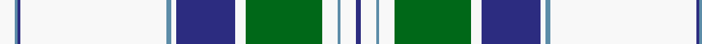

In pattern [BWBWGWBWBWBBW](/stripes/bwbwgwbwbwbbw/).

This was sourced from register-of-tartans.  It is a [13 stripe tartan](/stripes/stripes13/).

Original link https://www.tartanregister.gov.uk/tartanDetails.aspx?ref=2443

## Also known as

This cloth is also recorded under:

- McGillivray, Pauline

## Attestations

This cloth appears in 2 source records; the oldest owns this page.

- 01/01/1983 — McGillivray, Pauline (Personal) (register-of-tartans, [record](https://www.tartanregister.gov.uk/tartanDetails.aspx?ref=2443))
- 1983 — MacGillivray - 1983 (Personal) (tartans-authority, [record](http://www.tartansauthority.com/tartan-ferret/display/6367/))

## Register references

External register numbers recorded for this tartan.

- Scottish Register of Tartans: [2443](https://www.tartanregister.gov.uk/tartanDetails.aspx?ref=2443)
- Scottish Tartans Authority (ITI): 6367

## Thread count
W/12 B2 DB2 W114 B4 W4 DB46 W8 G60 W12 B2 W12 DB/4

## Palette
Each colour and its ΔE from the base-6 reference it is a variant of.

| Colour | Shade | Base | ΔE (OKLab) |
|---|---|---|---|
| B | <code style="background-color:#5C8CA8;">#5C8CA8</code> `#5C8CA8` | B <code style="background-color:#2A418A;">#2A418A</code> | 0.23 |
| DB | <code style="background-color:#2C2C80;">#2C2C80</code> `#2C2C80` | B <code style="background-color:#2A418A;">#2A418A</code> | 0.06 |
| G | <code style="background-color:#006818;">#006818</code> `#006818` | G <code style="background-color:#006100;">#006100</code> | 0.02 |
| W | <code style="background-color:#F8F8F8;">#F8F8F8</code> `#F8F8F8` | W <code style="background-color:#F7F7F7;">#F7F7F7</code> | 0.00 |

## Nearest tartans

The nearest existing variants by ΔTartan distance.

1. [Snowy Owl](/setts/s14/w40o1w6o3n1o7n3do1n8do3k1do9k2w8~x2/) — ΔT 1.16
1. [Stewart, variant](/setts/s11/w46g5w1k3w1k5g4r6g2r4w2~x2/) — ΔT 1.28
1. [Stuart/Stewart variant #2](/setts/s11/w46dg5w1k3w1k5dg4r6dg2r4w2~x2/) — ΔT 1.31
1. [Stewart dress, Blue](/setts/s11/w72db20ly2db3w2db3y16o6db2o5w2~x2/) — ΔT 1.31
1. [Stuart/Stewart Dress Blue](/setts/s11/w72db20ly2db3w2db3y16dy6db2dy5w2~x2/) — ΔT 1.33
1. [Spirit of Dunkeld](/setts/s12/lt38r1lt2r2lt2r6ly4r10db8lt11r3ly1~x2/) — ΔT 1.36
1. [Grotto Dove (Dance)](/setts/s11/w102db20w4db4w4db4dg20r18db3r10w4/) — ΔT 1.43
1. [Strathyre Dress (Dance)](/setts/s10/w55dg12r2dg3w2g10dp9dg2dp6w2~x2/) — ΔT 1.51
1. [Borderland Dress (Estimated threadcount)](/setts/s15/g2w2db1w30g1w1g5b8g4db1g1db8w1db2ly1~x2/) — ΔT 1.54
1. [Skye Dress Blue, Isle of (Dance)](/setts/s14/n7w7k3w30n20k5t1w8t1k4w4k7t1w6~x2/) — ΔT 1.62

## Neighbour map

Every grey dot is one of 14299 variants placed by the first two principal components of the ΔTartan feature space (44% of its variance). Red is this tartan; blue dots are its nearest — click one to open its page.

<svg viewBox="0 0 640 380" role="img" style="max-width:100%;height:auto;border:1px solid #e0e0e0;border-radius:4px;display:block" xmlns="http://www.w3.org/2000/svg"><image href="/nn/cloud.v1.png" width="640" height="380"/><a href="/setts/s14/w40o1w6o3n1o7n3do1n8do3k1do9k2w8~x2/"><circle cx="304.0" cy="35.5" r="4" fill="#3465a4"><title>Snowy Owl</title></circle></a><a href="/setts/s11/w46g5w1k3w1k5g4r6g2r4w2~x2/"><circle cx="380.6" cy="48.0" r="4" fill="#3465a4"><title>Stewart, variant</title></circle></a><a href="/setts/s11/w46dg5w1k3w1k5dg4r6dg2r4w2~x2/"><circle cx="386.3" cy="49.0" r="4" fill="#3465a4"><title>Stuart/Stewart variant #2</title></circle></a><a href="/setts/s11/w72db20ly2db3w2db3y16o6db2o5w2~x2/"><circle cx="313.8" cy="48.1" r="4" fill="#3465a4"><title>Stewart dress, Blue</title></circle></a><a href="/setts/s11/w72db20ly2db3w2db3y16dy6db2dy5w2~x2/"><circle cx="313.3" cy="47.7" r="4" fill="#3465a4"><title>Stuart/Stewart Dress Blue</title></circle></a><a href="/setts/s12/lt38r1lt2r2lt2r6ly4r10db8lt11r3ly1~x2/"><circle cx="363.6" cy="77.0" r="4" fill="#3465a4"><title>Spirit of Dunkeld</title></circle></a><a href="/setts/s11/w102db20w4db4w4db4dg20r18db3r10w4/"><circle cx="340.3" cy="62.9" r="4" fill="#3465a4"><title>Grotto Dove (Dance)</title></circle></a><a href="/setts/s10/w55dg12r2dg3w2g10dp9dg2dp6w2~x2/"><circle cx="295.7" cy="62.5" r="4" fill="#3465a4"><title>Strathyre Dress (Dance)</title></circle></a><a href="/setts/s15/g2w2db1w30g1w1g5b8g4db1g1db8w1db2ly1~x2/"><circle cx="246.9" cy="41.4" r="4" fill="#3465a4"><title>Borderland Dress (Estimated threadcount)</title></circle></a><a href="/setts/s14/n7w7k3w30n20k5t1w8t1k4w4k7t1w6~x2/"><circle cx="264.1" cy="91.3" r="4" fill="#3465a4"><title>Skye Dress Blue, Isle of (Dance)</title></circle></a><circle cx="334.0" cy="51.4" r="5" fill="#c00000"/></svg>

ID: /setts/s13/w6t1db1w57t2w2db23w4g30w6t1w6db2~x2/
