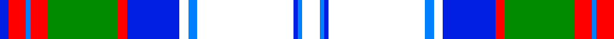

In pattern [BRBRGRBWBWBBW](/patterns/brbrgrbwbwbbw/).

This was sourced from register-of-tartans.  It is a [13 stripes tartan](/stripes/stripes13/).

Original link https://www.tartanregister.gov.uk/tartanDetails.aspx?ref=10811

## Thread count
Ba/4 R8 B2 R8 G32 R4 Ba24 W4 B4 W44 Ba2 B2 W/8

## Palette
Each colour and its ΔE from the base-6 reference it is a variant of.

| Colour | Shade | Base | ΔE (OKLab) |
|---|---|---|---|
| B | <code style="background-color:#007FFF;">#007FFF</code> `#007FFF` | B <code style="background-color:#2C4084;">#2C4084</code> | 0.24 |
| Ba | <code style="background-color:#001FE2;">#001FE2</code> `#001FE2` | B <code style="background-color:#2C4084;">#2C4084</code> | 0.16 |
| G | <code style="background-color:#008B00;">#008B00</code> `#008B00` | G <code style="background-color:#006400;">#006400</code> | 0.12 |
| R | <code style="background-color:#FF0000;">#FF0000</code> `#FF0000` | R <code style="background-color:#C80000;">#C80000</code> | 0.11 |
| W | <code style="background-color:#FFFFFF;">#FFFFFF</code> `#FFFFFF` | W <code style="background-color:#F4F4F0;">#F4F4F0</code> | 0.03 |

## Nearest tartans

The nearest existing variants by ΔTartan distance.

1. [Crieff Turquoise (Dance)](/setts/s13/k4b4w4b6w76g4ba24g6b8g60b4g12w4-b2c2c80-ba9058d8-g0098a0-k101010-wfcfcfc/) — ΔT 1.06
1. [Highlands of Haliburton Dress](/setts/s15/b8w4b2w38r4ba8b16g8w4b6ra4g4ba4r4ra4-b2683bc-ba3f1000-g006718-rbe120e-rab17d0d-wffffff/) — ΔT 1.08
1. [Payeur, Francois (Personal)](/setts/s12/w12r4w48b24ba6b4ba4b4ba24y2ba2y6-b003c64-ba343498-rc80000-we0e0e0-ybc8c00/) — ΔT 1.14
1. [Galego](/setts/s11/b32r8b4y8b16w16b4w48ba4w2ba16-b2c4084-ba0596fa-rdc0000-we0e0e0-ye8c000/) — ΔT 1.20
1. [Cornell (Fashion)](/setts/s10/w100g10y4g10r4g40r4b10y4b80-b2c2c80-g006818-rc80000-wece8cc-yfccc00/) — ΔT 1.24
1. [Lorne Dress (Dance)](/setts/s11/b6ba2g40ba40w4ba4w4ba4w64k2ba6-b202060-ba3850c8-g289c18-k101010-we0e0e0/) — ΔT 1.25
1. [Alberta Dress](/setts/s10/w8g6w38g16k2r8k2b36k2y4-b2c40a0-g006818-k101010-r880000-wf8f8f8-yd09800/) — ΔT 1.25
1. [Ross Hunting Dress](/setts/s12/g8ga6g6ga8g8b16g6b18w58r4w8r4-b2c2c80-g003820-ga006818-rc80000-we0e0e0/) — ΔT 1.26
1. [Diana Princess of Wales Memorial, The](/setts/s12/w8wa4w48b24k12wb4wa4wb16wa8k4wa4r4-b304080-k000000-rc00000-wd0f0f0-wae0e0e0-wb90d0f0/) — ΔT 1.30
1. [Lorne Dress (Dance)](/setts/s11/b6ba2g40ba40w4ba4w4ba4w64k2ba6-b202060-ba3850c8-g006818-k101010-we0e0e0/) — ΔT 1.30

## Neighbour map

Every grey dot is one of 15726 variants placed by the first two principal components of the ΔTartan feature space (44% of its variance). Red is this tartan; blue dots are its nearest — click one to open its page.

<svg viewBox="0 0 640 380" role="img" style="max-width:100%;height:auto;border:1px solid #e0e0e0;border-radius:4px;display:block" xmlns="http://www.w3.org/2000/svg"><image href="/nn/cloud.v1.png" width="640" height="380"/><a href="/setts/s13/k4b4w4b6w76g4ba24g6b8g60b4g12w4-b2c2c80-ba9058d8-g0098a0-k101010-wfcfcfc/"><circle cx="190.9" cy="80.7" r="4" fill="#3465a4"><title>Crieff Turquoise (Dance)</title></circle></a><a href="/setts/s15/b8w4b2w38r4ba8b16g8w4b6ra4g4ba4r4ra4-b2683bc-ba3f1000-g006718-rbe120e-rab17d0d-wffffff/"><circle cx="128.4" cy="66.6" r="4" fill="#3465a4"><title>Highlands of Haliburton Dress</title></circle></a><a href="/setts/s12/w12r4w48b24ba6b4ba4b4ba24y2ba2y6-b003c64-ba343498-rc80000-we0e0e0-ybc8c00/"><circle cx="197.5" cy="88.5" r="4" fill="#3465a4"><title>Payeur, Francois (Personal)</title></circle></a><a href="/setts/s11/b32r8b4y8b16w16b4w48ba4w2ba16-b2c4084-ba0596fa-rdc0000-we0e0e0-ye8c000/"><circle cx="192.7" cy="106.0" r="4" fill="#3465a4"><title>Galego</title></circle></a><a href="/setts/s10/w100g10y4g10r4g40r4b10y4b80-b2c2c80-g006818-rc80000-wece8cc-yfccc00/"><circle cx="189.2" cy="87.4" r="4" fill="#3465a4"><title>Cornell (Fashion)</title></circle></a><a href="/setts/s11/b6ba2g40ba40w4ba4w4ba4w64k2ba6-b202060-ba3850c8-g289c18-k101010-we0e0e0/"><circle cx="218.1" cy="77.8" r="4" fill="#3465a4"><title>Lorne Dress (Dance)</title></circle></a><a href="/setts/s10/w8g6w38g16k2r8k2b36k2y4-b2c40a0-g006818-k101010-r880000-wf8f8f8-yd09800/"><circle cx="132.4" cy="89.2" r="4" fill="#3465a4"><title>Alberta Dress</title></circle></a><a href="/setts/s12/g8ga6g6ga8g8b16g6b18w58r4w8r4-b2c2c80-g003820-ga006818-rc80000-we0e0e0/"><circle cx="173.8" cy="104.5" r="4" fill="#3465a4"><title>Ross Hunting Dress</title></circle></a><a href="/setts/s12/w8wa4w48b24k12wb4wa4wb16wa8k4wa4r4-b304080-k000000-rc00000-wd0f0f0-wae0e0e0-wb90d0f0/"><circle cx="103.9" cy="92.5" r="4" fill="#3465a4"><title>Diana Princess of Wales Memorial, The</title></circle></a><a href="/setts/s11/b6ba2g40ba40w4ba4w4ba4w64k2ba6-b202060-ba3850c8-g006818-k101010-we0e0e0/"><circle cx="216.9" cy="77.8" r="4" fill="#3465a4"><title>Lorne Dress (Dance)</title></circle></a><circle cx="149.6" cy="78.1" r="5" fill="#c00000"/></svg>

ID: /setts/s13/w8b2ba2w44b4w4ba24r4g32r8b2r8ba4-b007fff-ba001fe2-g008b00-rff0000-wffffff/
