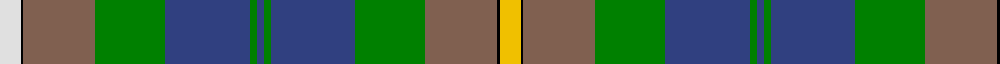

In pattern [WKRGBGBGBGRKY](/patterns/wkrgbgbgbgrky/).

This was sourced from weddslist.  It is a [13 stripes tartan](/stripes/stripes13/).

Original link http://www.weddslist.com/cgi-bin/tartans/pg.pl?source=sts

## Thread count
LN/18 K2 LT62 G60 B72 G6 B6 G6 B72 G60 LT62 K2 Y/18

## Palette
Each colour and its ΔE from the base-6 reference it is a variant of.

| Colour | Shade | Base | ΔE (OKLab) |
|---|---|---|---|
| B | <code style="background-color:#304080;">#304080</code> `#304080` | B <code style="background-color:#2A418A;">#2A418A</code> | 0.02 |
| G | <code style="background-color:#008000;">#008000</code> `#008000` | G <code style="background-color:#006100;">#006100</code> | 0.10 |
| K | <code style="background-color:#000000;">#000000</code> `#000000` | K <code style="background-color:#000000;">#000000</code> | 0.00 |
| LN | <code style="background-color:#E0E0E0;">#E0E0E0</code> `#E0E0E0` | W <code style="background-color:#F7F7F7;">#F7F7F7</code> | 0.07 |
| LT | <code style="background-color:#806050;">#806050</code> `#806050` | R <code style="background-color:#CC0000;">#CC0000</code> | 0.17 |
| Y | <code style="background-color:#F0C000;">#F0C000</code> `#F0C000` | Y <code style="background-color:#F2BF00;">#F2BF00</code> | 0.00 |

## Nearest tartans

The nearest existing variants by ΔTartan distance.

1. [California State American District Tartan Tartan Number: 2454. Earliest known date: 1998 Designed by J.Howard Standing of Tarzana, California and Thomas Ferguson of Sydney, British Columbia. Adopted as the 'official' California State tartan by the State Legislature. For general use by all those living in the State. Based on Muir, after the famous botanist and environmentalist John Muir who lived in California. Assembly Bill 2362, february 20th 1998. See products available Copyright © Blair Urquhart, Comrie, 2015](/setts/s13/w4k1b28k16g10r2g10r4g10r2g10k1y4~b5c8ca8-g006818-k101010-ra00000-wa8ace8-yd09800~x2/) — ΔT 0.97
1. [Campbell Brown](/setts/s13/w9k1g31ga30b36ga3b3ga3b36ga30g31k1y9~b2c4084-g503c14-ga005020-k101010-we0e0e0-ye8c000~x2/) — ΔT 1.07
1. [California State](/setts/s13/w4k1b28k16g10r2g10r4g10r2g10k1y4~b5c8ca8-g006818-k101010-rc8002c-wa8ace8-ye8c000~x2/) — ΔT 1.08
1. [State Seal of New Jersey (Fashion)](/setts/s12/b6k1r4k1b38k17ra12g5ra5g25k1y4~b1474b4-g604000-k101010-rc80000-ra888888-ybc8c00~x2/) — ΔT 1.23
1. [Hughes Interconnection Int.](/setts/s16/r2k1g18ga26b18y4b18k2w4k2b18y4b18ga26g18k1~b1870a4-g00643c-ga603800-k101010-rb468ac-wfcfcfc-ye8c000~x2/) — ΔT 1.28
1. [State Seal of Pennsylvania (Fashion)](/setts/s9/y4k1g28k6ga18w4b41k1w3~b1474b4-g006818-ga604000-k101010-we8ccb8-ybc8c00~x2/) — ΔT 1.33
1. [Hughes Interconnection Int. (Pers)](/setts/s9/w4k2b18y4b18g26ga18k1r2~b1870a4-g603800-ga00643c-k101010-rb468ac-wfcfcfc-ye8c000~x2/) — ΔT 1.34
1. [Campbell Brown Personal Tartan Tartan Number: 17. Earliest known date: pre 1992 Specially made for Captain Campbell of the Blythswood family. See products available Copyright © Blair Urquhart, Comrie, 2015](/setts/s13/w9k1b31g30ba36g3ba3g3ba36g30b31k1y9~b480800-ba202060-g006818-k101010-we0e0e0-ye8c000~x2/) — ΔT 1.35
1. [Campbell, Brown (Personal)](/setts/s13/w9k1r31g30b36g3b3g3b36g30r31k1y9~b202060-g006818-k101010-r640800-wfcfcfc-ye8c000/) — ΔT 1.36
1. [Groen (Personal)](/setts/s11/b12r2b3r4b15k24g18y1k3g3w3~b506878-g184c20-k101010-rc80000-wfcfcfc-ye8c000~x2/) — ΔT 1.40

## Neighbour map

Every grey dot is one of 15726 variants placed by the first two principal components of the ΔTartan feature space (44% of its variance). Red is this tartan; blue dots are its nearest — click one to open its page.

<svg viewBox="0 0 640 380" role="img" style="max-width:100%;height:auto;border:1px solid #e0e0e0;border-radius:4px;display:block" xmlns="http://www.w3.org/2000/svg"><image href="/nn/cloud.v1.png" width="640" height="380"/><a href="/setts/s13/w4k1b28k16g10r2g10r4g10r2g10k1y4~b5c8ca8-g006818-k101010-ra00000-wa8ace8-yd09800~x2/"><circle cx="184.6" cy="102.3" r="4" fill="#3465a4"><title>California State American District Tartan Tartan Number: 2454. Earliest known date: 1998 Designed by J.Howard Standing of Tarzana, California and Thomas Ferguson of Sydney, British Columbia. Adopted as the 'official' California State tartan by the State Legislature. For general use by all those living in the State. Based on Muir, after the famous botanist and environmentalist John Muir who lived in California. Assembly Bill 2362, february 20th 1998. See products available Copyright © Blair Urquhart, Comrie, 2015</title></circle></a><a href="/setts/s13/w9k1g31ga30b36ga3b3ga3b36ga30g31k1y9~b2c4084-g503c14-ga005020-k101010-we0e0e0-ye8c000~x2/"><circle cx="207.8" cy="117.6" r="4" fill="#3465a4"><title>Campbell Brown</title></circle></a><a href="/setts/s13/w4k1b28k16g10r2g10r4g10r2g10k1y4~b5c8ca8-g006818-k101010-rc8002c-wa8ace8-ye8c000~x2/"><circle cx="178.3" cy="99.0" r="4" fill="#3465a4"><title>California State</title></circle></a><a href="/setts/s12/b6k1r4k1b38k17ra12g5ra5g25k1y4~b1474b4-g604000-k101010-rc80000-ra888888-ybc8c00~x2/"><circle cx="210.2" cy="85.3" r="4" fill="#3465a4"><title>State Seal of New Jersey (Fashion)</title></circle></a><a href="/setts/s16/r2k1g18ga26b18y4b18k2w4k2b18y4b18ga26g18k1~b1870a4-g00643c-ga603800-k101010-rb468ac-wfcfcfc-ye8c000~x2/"><circle cx="185.3" cy="100.5" r="4" fill="#3465a4"><title>Hughes Interconnection Int.</title></circle></a><a href="/setts/s9/y4k1g28k6ga18w4b41k1w3~b1474b4-g006818-ga604000-k101010-we8ccb8-ybc8c00~x2/"><circle cx="223.6" cy="95.2" r="4" fill="#3465a4"><title>State Seal of Pennsylvania (Fashion)</title></circle></a><a href="/setts/s9/w4k2b18y4b18g26ga18k1r2~b1870a4-g603800-ga00643c-k101010-rb468ac-wfcfcfc-ye8c000~x2/"><circle cx="179.2" cy="113.6" r="4" fill="#3465a4"><title>Hughes Interconnection Int. (Pers)</title></circle></a><a href="/setts/s13/w9k1b31g30ba36g3ba3g3ba36g30b31k1y9~b480800-ba202060-g006818-k101010-we0e0e0-ye8c000~x2/"><circle cx="178.0" cy="103.1" r="4" fill="#3465a4"><title>Campbell Brown Personal Tartan Tartan Number: 17. Earliest known date: pre 1992 Specially made for Captain Campbell of the Blythswood family. See products available Copyright © Blair Urquhart, Comrie, 2015</title></circle></a><a href="/setts/s13/w9k1r31g30b36g3b3g3b36g30r31k1y9~b202060-g006818-k101010-r640800-wfcfcfc-ye8c000/"><circle cx="174.9" cy="99.6" r="4" fill="#3465a4"><title>Campbell, Brown (Personal)</title></circle></a><a href="/setts/s11/b12r2b3r4b15k24g18y1k3g3w3~b506878-g184c20-k101010-rc80000-wfcfcfc-ye8c000~x2/"><circle cx="173.0" cy="116.0" r="4" fill="#3465a4"><title>Groen (Personal)</title></circle></a><circle cx="187.7" cy="105.4" r="5" fill="#c00000"/></svg>

ID: /setts/s13/w9k1r31g30b36g3b3g3b36g30r31k1y9~b304080-g008000-k000000-r806050-we0e0e0-yf0c000~x2/
