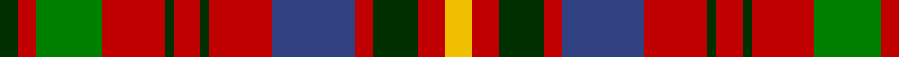

In pattern [GRGRGRGRBRGRY](/patterns/grgrgrgrbrgry/).

This was sourced from weddslist.  It is a [13 stripes tartan](/stripes/stripes13/).

Original link http://www.weddslist.com/cgi-bin/tartans/pg.pl?source=sts

## Thread count
DG/12 R12 G44 R42 DG6 R18 DG6 R42 B55 R12 DG30 R18 Y/18

## Palette
Each colour and its ΔE from the base-6 reference it is a variant of.

| Colour | Shade | Base | ΔE (OKLab) |
|---|---|---|---|
| B | <code style="background-color:#304080;">#304080</code> `#304080` | B <code style="background-color:#2A418A;">#2A418A</code> | 0.02 |
| DG | <code style="background-color:#003000;">#003000</code> `#003000` | G <code style="background-color:#006100;">#006100</code> | 0.17 |
| G | <code style="background-color:#008000;">#008000</code> `#008000` | G <code style="background-color:#006100;">#006100</code> | 0.10 |
| R | <code style="background-color:#C00000;">#C00000</code> `#C00000` | R <code style="background-color:#CC0000;">#CC0000</code> | 0.03 |
| Y | <code style="background-color:#F0C000;">#F0C000</code> `#F0C000` | Y <code style="background-color:#F2BF00;">#F2BF00</code> | 0.00 |

## Nearest tartans

The nearest existing variants by ΔTartan distance.

1. [Unidentified Plaid #4](/setts/s13/y18r18g30r12b55r42g6r18g6r42ga44r12g12-b2c4084-g002814-ga005020-rdc0000-ye8c000/) — ΔT 0.50
1. [Prince Charles Edward (Edinburgh)](/setts/s13/y6r6k10r4b18r14k2r6k2r14g14r4k4-b2c2c80-g006818-k101010-rc80000-ye8c000/) — ΔT 0.71
1. [Nicholson Clan Tartan Tartan Number: 498. Earliest known date: 1845-7 Nothing See products available Copyright © Blair Urquhart, Comrie, 2015](/setts/s13/b4r22g4r22g42r4k18ba4b22r22g4r22b4-b2c2c80-ba5c8ca8-g006818-k101010-rc80000/) — ΔT 0.73
1. [Nicolson](/setts/s13/b4r22g4r22g42r4k18ba4b22r22g4r22b4-b304080-ba5480b0-g008000-k000000-rc00000/) — ΔT 0.74
1. [Nicolson/MacNicol](/setts/s13/b4r22g4r22g42r4k18ba4b22r22g4r22b4-b2c4084-ba3c82af-g005020-k101010-rdc0000/) — ΔT 0.80
1. [Highland Spring (1985)](/setts/s12/r32k4r18g24y4g20b6k4b6k4b6r20-b64a0f0-g3c7828-k000000-rc82800-yc88c00/) — ΔT 0.85
1. [Sturrock (Blue/Black)](/setts/s12/r32y6r32g44k32b32r104b32k32g44r32y6-b1870a4-g006818-k101010-rc80000-yd09800/) — ΔT 1.00
1. [MacKinnon #5](/setts/s14/k8r6g4b4r12g30r4b8g4r30g14k4r8w4-b2c4084-g005020-k101010-rdc0000-we0e0e0/) — ΔT 1.03
1. [Bonnie Prince Charlie (Vyella)](/setts/s13/k5r7y23r23g3r11g3r23g18r2k18r5ya5-g285800-k101010-rc80000-ybc8c00-yae8c000/) — ΔT 1.03
1. [Caledonia No 155 District Tartan Tartan Number: 1356. Earliest known date: 1819 Popular in the eighteenth century and appears in a number of guises. Romantic stories are told of its origin but in reality little is known. (G.Teall). J. Scarlett asserts that Wilson's No 155 has never been named, and that Miss Margaret MacDougall was in error when she included it in Robert Bain's 'Clans and Tartans of Scotland' (1953) as Caledonia. It is included here because of its obvious family resemblance to other Caledonia setts. See products available Copyright © Blair Urquhart, Comrie, 2015](/setts/s14/r42b18k4b4k4b18k36y6g42r26k6r26w4r26-b5c8ca8-g006818-k101010-rc80000-we0e0e0-ye8c000/) — ΔT 1.04

## Neighbour map

Every grey dot is one of 15726 variants placed by the first two principal components of the ΔTartan feature space (44% of its variance). Red is this tartan; blue dots are its nearest — click one to open its page.

<svg viewBox="0 0 640 380" role="img" style="max-width:100%;height:auto;border:1px solid #e0e0e0;border-radius:4px;display:block" xmlns="http://www.w3.org/2000/svg"><image href="/nn/cloud.v1.png" width="640" height="380"/><a href="/setts/s13/y18r18g30r12b55r42g6r18g6r42ga44r12g12-b2c4084-g002814-ga005020-rdc0000-ye8c000/"><circle cx="171.2" cy="167.1" r="4" fill="#3465a4"><title>Unidentified Plaid #4</title></circle></a><a href="/setts/s13/y6r6k10r4b18r14k2r6k2r14g14r4k4-b2c2c80-g006818-k101010-rc80000-ye8c000/"><circle cx="170.8" cy="168.6" r="4" fill="#3465a4"><title>Prince Charles Edward (Edinburgh)</title></circle></a><a href="/setts/s13/b4r22g4r22g42r4k18ba4b22r22g4r22b4-b2c2c80-ba5c8ca8-g006818-k101010-rc80000/"><circle cx="216.2" cy="159.2" r="4" fill="#3465a4"><title>Nicholson Clan Tartan Tartan Number: 498. Earliest known date: 1845-7 Nothing See products available Copyright © Blair Urquhart, Comrie, 2015</title></circle></a><a href="/setts/s13/b4r22g4r22g42r4k18ba4b22r22g4r22b4-b304080-ba5480b0-g008000-k000000-rc00000/"><circle cx="199.1" cy="153.3" r="4" fill="#3465a4"><title>Nicolson</title></circle></a><a href="/setts/s13/b4r22g4r22g42r4k18ba4b22r22g4r22b4-b2c4084-ba3c82af-g005020-k101010-rdc0000/"><circle cx="213.6" cy="156.3" r="4" fill="#3465a4"><title>Nicolson/MacNicol</title></circle></a><a href="/setts/s12/r32k4r18g24y4g20b6k4b6k4b6r20-b64a0f0-g3c7828-k000000-rc82800-yc88c00/"><circle cx="192.9" cy="164.0" r="4" fill="#3465a4"><title>Highland Spring (1985)</title></circle></a><a href="/setts/s12/r32y6r32g44k32b32r104b32k32g44r32y6-b1870a4-g006818-k101010-rc80000-yd09800/"><circle cx="212.0" cy="152.4" r="4" fill="#3465a4"><title>Sturrock (Blue/Black)</title></circle></a><a href="/setts/s14/k8r6g4b4r12g30r4b8g4r30g14k4r8w4-b2c4084-g005020-k101010-rdc0000-we0e0e0/"><circle cx="190.5" cy="155.7" r="4" fill="#3465a4"><title>MacKinnon #5</title></circle></a><a href="/setts/s13/k5r7y23r23g3r11g3r23g18r2k18r5ya5-g285800-k101010-rc80000-ybc8c00-yae8c000/"><circle cx="212.9" cy="152.2" r="4" fill="#3465a4"><title>Bonnie Prince Charlie (Vyella)</title></circle></a><a href="/setts/s14/r42b18k4b4k4b18k36y6g42r26k6r26w4r26-b5c8ca8-g006818-k101010-rc80000-we0e0e0-ye8c000/"><circle cx="164.9" cy="134.0" r="4" fill="#3465a4"><title>Caledonia No 155 District Tartan Tartan Number: 1356. Earliest known date: 1819 Popular in the eighteenth century and appears in a number of guises. Romantic stories are told of its origin but in reality little is known. (G.Teall). J. Scarlett asserts that Wilson's No 155 has never been named, and that Miss Margaret MacDougall was in error when she included it in Robert Bain's 'Clans and Tartans of Scotland' (1953) as Caledonia. It is included here because of its obvious family resemblance to other Caledonia setts. See products available Copyright © Blair Urquhart, Comrie, 2015</title></circle></a><circle cx="176.1" cy="171.8" r="5" fill="#c00000"/></svg>

ID: /setts/s13/y18r18g30r12b55r42g6r18g6r42ga44r12g12-b304080-g003000-ga008000-rc00000-yf0c000/
