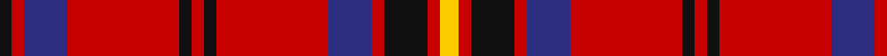

In pattern [KRBRKRKRBRKRY](/patterns/krbrkrkrbrkry/).

This was sourced from tartans-authority.  It is a [13 stripes tartan](/stripes/stripes13/).

Original link http://www.tartansauthority.com/tartan-ferret/display/10406/

## Thread count
K/4 R4 DB14 R36 K4 R4 K4 R36 DB14 R4 K14 R4 Y/6

## Palette
Each colour and its ΔE from the base-6 reference it is a variant of.

| Colour | Shade | Base | ΔE (OKLab) |
|---|---|---|---|
| DB | <code style="background-color:#2C2C80;">#2C2C80</code> `#2C2C80` | B <code style="background-color:#2A418A;">#2A418A</code> | 0.06 |
| K | <code style="background-color:#101010;">#101010</code> `#101010` | K <code style="background-color:#000000;">#000000</code> | 0.17 |
| R | <code style="background-color:#C80000;">#C80000</code> `#C80000` | R <code style="background-color:#CC0000;">#CC0000</code> | 0.01 |
| Y | <code style="background-color:#FCCC00;">#FCCC00</code> `#FCCC00` | Y <code style="background-color:#F2BF00;">#F2BF00</code> | 0.04 |

## Nearest tartans

The nearest existing variants by ΔTartan distance.

1. [Brad Majors](/setts/s13/y3r2k7r2b7r18k2r2k2r18b7r2k2~b271b86-k120a01-rdd1212-yd3cc20~x2/) — ΔT 0.43
1. [Dobrain (Personal)](/setts/s10/r24ra2r4b2k6ra2r14k3ra4b8~b646464-k000000-rc82800-ra8c8c8c~x2/) — ΔT 0.94
1. [Grant](/setts/s15/r16k6r6g46r6g5r6k12r6b6r48k6r6k6r16~b3c82af-g005020-k101010-rdc0000/) — ΔT 0.99
1. [Drummond of Megginch - Child's Kilt (c.1890)](/setts/s15/r6b2r3g12r2g2r2b4r2w2r14b2r2b1r6~b000064-g004c00-rc80000-w98c8e8~x2/) — ΔT 1.00
1. [Leslie Red (VS)](/setts/s14/r16b8r2k3y1k3r2k3y1k3r2b8r16k1~b2c2c80-k101010-rc80000-ye8c000~x4/) — ΔT 1.04
1. [MacKinnon #12](/setts/s14/w2r4g2b2r6g4r2b5g2r20g7w2r4w2~b2c4084-g005020-rdc0000-we0e0e0~x2/) — ΔT 1.08
1. [Unidentified (Scolpaig)](/setts/s18/k10b1k1r10b1k1b1r10g6r2g6r10b1k1b1r10k1b1~b5c8ca8-g006818-k101010-rc80000~x4/) — ΔT 1.16
1. [London Caledonian Commemorative Tartan Tartan Number: 1388. Earliest known date: 1953 For London Caledonian Games Association. See products available Copyright © Blair Urquhart, Comrie, 2015](/setts/s13/r9b2r21ba2r2b8r2g2r2g17r2b2r8~b2c2c80-ba5c8ca8-g006818-rc80000~x2/) — ΔT 1.19
1. [MacIver #2](/setts/s9/w3r27k5r5k32r5k5r27y3~k101010-rdc0000-we0e0e0-ye8c000~x2/) — ΔT 1.21
1. [Cameron of Locheil #3](/setts/s9/r24b8r23k4w4k4r10k32r8~b2c4084-k101010-rdc0000-we0e0e0/) — ΔT 1.23

## Neighbour map

Every grey dot is one of 15726 variants placed by the first two principal components of the ΔTartan feature space (44% of its variance). Red is this tartan; blue dots are its nearest — click one to open its page.

<svg viewBox="0 0 640 380" role="img" style="max-width:100%;height:auto;border:1px solid #e0e0e0;border-radius:4px;display:block" xmlns="http://www.w3.org/2000/svg"><image href="/nn/cloud.v1.png" width="640" height="380"/><a href="/setts/s13/y3r2k7r2b7r18k2r2k2r18b7r2k2~b271b86-k120a01-rdd1212-yd3cc20~x2/"><circle cx="305.9" cy="152.0" r="4" fill="#3465a4"><title>Brad Majors</title></circle></a><a href="/setts/s10/r24ra2r4b2k6ra2r14k3ra4b8~b646464-k000000-rc82800-ra8c8c8c~x2/"><circle cx="333.8" cy="159.7" r="4" fill="#3465a4"><title>Dobrain (Personal)</title></circle></a><a href="/setts/s15/r16k6r6g46r6g5r6k12r6b6r48k6r6k6r16~b3c82af-g005020-k101010-rdc0000/"><circle cx="301.6" cy="147.0" r="4" fill="#3465a4"><title>Grant</title></circle></a><a href="/setts/s15/r6b2r3g12r2g2r2b4r2w2r14b2r2b1r6~b000064-g004c00-rc80000-w98c8e8~x2/"><circle cx="326.5" cy="145.1" r="4" fill="#3465a4"><title>Drummond of Megginch - Child's Kilt (c.1890)</title></circle></a><a href="/setts/s14/r16b8r2k3y1k3r2k3y1k3r2b8r16k1~b2c2c80-k101010-rc80000-ye8c000~x4/"><circle cx="314.9" cy="134.3" r="4" fill="#3465a4"><title>Leslie Red (VS)</title></circle></a><a href="/setts/s14/w2r4g2b2r6g4r2b5g2r20g7w2r4w2~b2c4084-g005020-rdc0000-we0e0e0~x2/"><circle cx="292.2" cy="145.1" r="4" fill="#3465a4"><title>MacKinnon #12</title></circle></a><a href="/setts/s18/k10b1k1r10b1k1b1r10g6r2g6r10b1k1b1r10k1b1~b5c8ca8-g006818-k101010-rc80000~x4/"><circle cx="295.2" cy="145.3" r="4" fill="#3465a4"><title>Unidentified (Scolpaig)</title></circle></a><a href="/setts/s13/r9b2r21ba2r2b8r2g2r2g17r2b2r8~b2c2c80-ba5c8ca8-g006818-rc80000~x2/"><circle cx="338.2" cy="160.9" r="4" fill="#3465a4"><title>London Caledonian Commemorative Tartan Tartan Number: 1388. Earliest known date: 1953 For London Caledonian Games Association. See products available Copyright © Blair Urquhart, Comrie, 2015</title></circle></a><a href="/setts/s9/w3r27k5r5k32r5k5r27y3~k101010-rdc0000-we0e0e0-ye8c000~x2/"><circle cx="322.4" cy="167.9" r="4" fill="#3465a4"><title>MacIver #2</title></circle></a><a href="/setts/s9/r24b8r23k4w4k4r10k32r8~b2c4084-k101010-rdc0000-we0e0e0/"><circle cx="280.8" cy="192.0" r="4" fill="#3465a4"><title>Cameron of Locheil #3</title></circle></a><circle cx="316.7" cy="158.0" r="5" fill="#c00000"/></svg>

ID: /setts/s13/y3r2k7r2b7r18k2r2k2r18b7r2k2~b2c2c80-k101010-rc80000-yfccc00~x2/
