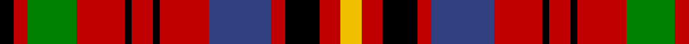

In pattern [KRGRKRKRBRKRY](/patterns/krgrkrkrbrkry/).

This was sourced from weddslist.  It is a [13 stripes tartan](/stripes/stripes13/).

Original link http://www.weddslist.com/cgi-bin/tartans/pg.pl?source=sts

## Thread count
K/4 R4 G14 R14 K2 R6 K2 R14 B18 R4 K10 R6 Y/6

## Palette
Each colour and its ΔE from the base-6 reference it is a variant of.

| Colour | Shade | Base | ΔE (OKLab) |
|---|---|---|---|
| B | <code style="background-color:#304080;">#304080</code> `#304080` | B <code style="background-color:#2A418A;">#2A418A</code> | 0.02 |
| G | <code style="background-color:#008000;">#008000</code> `#008000` | G <code style="background-color:#006100;">#006100</code> | 0.10 |
| K | <code style="background-color:#000000;">#000000</code> `#000000` | K <code style="background-color:#000000;">#000000</code> | 0.00 |
| R | <code style="background-color:#C00000;">#C00000</code> `#C00000` | R <code style="background-color:#CC0000;">#CC0000</code> | 0.03 |
| Y | <code style="background-color:#F0C000;">#F0C000</code> `#F0C000` | Y <code style="background-color:#F2BF00;">#F2BF00</code> | 0.00 |

## Nearest tartans

The nearest existing variants by ΔTartan distance.

1. [Prince Charles Edward (Edinburgh)](/setts/s13/y3r3k5r2b9r7k1r3k1r7g7r2k2~b2c2c80-g006818-k101010-rc80000-ye8c000~x2/) — ΔT 0.63
1. [Unidentified Plaid #4](/setts/s13/y18r18g30r12b55r42g6r18g6r42ga44r12g12~b2c4084-g002814-ga005020-rdc0000-ye8c000/) — ΔT 0.78
1. [Nicolson](/setts/s13/b2r11g2r11g21r2k9ba2b11r11g2r11b2~b304080-ba5480b0-g008000-k000000-rc00000~x2/) — ΔT 0.91
1. [Caledonia No 155](/setts/s14/r21b9k2b2k2b9k18y3g21r13k3r13w2r13~b5480b0-g008000-k000000-rc00000-we0e0e0-yf0c000~x2/) — ΔT 1.01
1. [Unidentified Plaid 16](/setts/s13/y18r18g30r12b55r42g6r18g6r42ga44r12g12~b304080-g003000-ga008000-rc00000-yf0c000/) — ΔT 1.06
1. [Christie](/setts/s13/r8b2k1b3k4y1k1w1k1g8r6w1r6~b304080-g008000-k000000-rc00000-we0e0e0-yf0c000~x4/) — ΔT 1.10
1. [Nicolson/MacNicol](/setts/s13/b2r11g2r11g21r2k9ba2b11r11g2r11b2~b2c4084-ba3c82af-g005020-k101010-rdc0000~x2/) — ΔT 1.17
1. [Fountain of the Strong](/setts/s11/r6k3g3k6ra2k2ra2k6g3r14rb2~g184800-k000000-rc06430-ra880000-rbb82c28~x2/) — ΔT 1.17
1. [Caledonian Cameron Commando](/setts/s14/r21w9k2w2k2w9k18y3g21r13k3r13wa2r13~g044028-k000000-rc80000-w00fcfc-wafcfcfc-ydcbc00~x2/) — ΔT 1.19
1. [Christie Family Tartan Tartan Number: 1355. Earliest known date: 1930 Two woven samples in the Society's collection, were presented by Messrs Stewart Christie of Edinburgh. Very little else is known about the origin of the design. The alternative sample replaces blue with azure, but is otherwise identical. The name Christie in Scotland is thought to derive from the Norse word 'Trusty' meaning swordsman. (c.f. thrust). Christies are traditionally associated with the Clan Farquharson. See products available Copyright © Blair Urquhart, Comrie, 2015](/setts/s13/r8b2k1b3k4y1k1w1k1g8r6w1r6~b2c2c80-g006818-k101010-rc80000-we0e0e0-ye8c000~x4/) — ΔT 1.20

## Neighbour map

Every grey dot is one of 15726 variants placed by the first two principal components of the ΔTartan feature space (44% of its variance). Red is this tartan; blue dots are its nearest — click one to open its page.

<svg viewBox="0 0 640 380" role="img" style="max-width:100%;height:auto;border:1px solid #e0e0e0;border-radius:4px;display:block" xmlns="http://www.w3.org/2000/svg"><image href="/nn/cloud.v1.png" width="640" height="380"/><a href="/setts/s13/y3r3k5r2b9r7k1r3k1r7g7r2k2~b2c2c80-g006818-k101010-rc80000-ye8c000~x2/"><circle cx="171.2" cy="168.9" r="4" fill="#3465a4"><title>Prince Charles Edward (Edinburgh)</title></circle></a><a href="/setts/s13/y18r18g30r12b55r42g6r18g6r42ga44r12g12~b2c4084-g002814-ga005020-rdc0000-ye8c000/"><circle cx="171.7" cy="167.1" r="4" fill="#3465a4"><title>Unidentified Plaid #4</title></circle></a><a href="/setts/s13/b2r11g2r11g21r2k9ba2b11r11g2r11b2~b304080-ba5480b0-g008000-k000000-rc00000~x2/"><circle cx="199.7" cy="153.9" r="4" fill="#3465a4"><title>Nicolson</title></circle></a><a href="/setts/s14/r21b9k2b2k2b9k18y3g21r13k3r13w2r13~b5480b0-g008000-k000000-rc00000-we0e0e0-yf0c000~x2/"><circle cx="146.7" cy="128.4" r="4" fill="#3465a4"><title>Caledonia No 155</title></circle></a><a href="/setts/s13/y18r18g30r12b55r42g6r18g6r42ga44r12g12~b304080-g003000-ga008000-rc00000-yf0c000/"><circle cx="176.7" cy="171.6" r="4" fill="#3465a4"><title>Unidentified Plaid 16</title></circle></a><a href="/setts/s13/r8b2k1b3k4y1k1w1k1g8r6w1r6~b304080-g008000-k000000-rc00000-we0e0e0-yf0c000~x4/"><circle cx="145.6" cy="135.3" r="4" fill="#3465a4"><title>Christie</title></circle></a><a href="/setts/s13/b2r11g2r11g21r2k9ba2b11r11g2r11b2~b2c4084-ba3c82af-g005020-k101010-rdc0000~x2/"><circle cx="214.4" cy="156.6" r="4" fill="#3465a4"><title>Nicolson/MacNicol</title></circle></a><a href="/setts/s11/r6k3g3k6ra2k2ra2k6g3r14rb2~g184800-k000000-rc06430-ra880000-rbb82c28~x2/"><circle cx="144.6" cy="173.0" r="4" fill="#3465a4"><title>Fountain of the Strong</title></circle></a><a href="/setts/s14/r21w9k2w2k2w9k18y3g21r13k3r13wa2r13~g044028-k000000-rc80000-w00fcfc-wafcfcfc-ydcbc00~x2/"><circle cx="133.0" cy="123.0" r="4" fill="#3465a4"><title>Caledonian Cameron Commando</title></circle></a><a href="/setts/s13/r8b2k1b3k4y1k1w1k1g8r6w1r6~b2c2c80-g006818-k101010-rc80000-we0e0e0-ye8c000~x4/"><circle cx="161.4" cy="139.6" r="4" fill="#3465a4"><title>Christie Family Tartan Tartan Number: 1355. Earliest known date: 1930 Two woven samples in the Society's collection, were presented by Messrs Stewart Christie of Edinburgh. Very little else is known about the origin of the design. The alternative sample replaces blue with azure, but is otherwise identical. The name Christie in Scotland is thought to derive from the Norse word 'Trusty' meaning swordsman. (c.f. thrust). Christies are traditionally associated with the Clan Farquharson. See products available Copyright © Blair Urquhart, Comrie, 2015</title></circle></a><circle cx="154.6" cy="164.2" r="5" fill="#c00000"/></svg>

ID: /setts/s13/y3r3k5r2b9r7k1r3k1r7g7r2k2~b304080-g008000-k000000-rc00000-yf0c000~x2/
