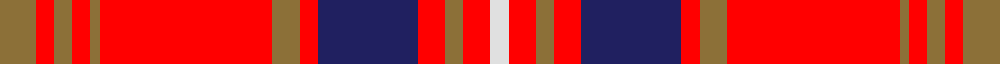

In pattern [GRGRGRGRBRGRW](/stripes/grgrgrgrbrgrw/).

This was sourced from register-of-tartans.  It is a [13 stripe tartan](/stripes/stripes13/).

Original link https://www.tartanregister.gov.uk/tartanDetails.aspx?ref=11532

## Register references

External register numbers recorded for this tartan.

- Scottish Register of Tartans: [11532](https://www.tartanregister.gov.uk/tartanDetails.aspx?ref=11532)

## Thread count
LT/8 R4 LT4 R4 LT2 R38 LT6 R4 DB22 R6 LT4 R6 LN/4

## Palette
Each colour and the base-6 reference it is a variant of.

| Colour | Shade | Base |
|---|---|---|
| DB | <code style="background-color:#202060;">#202060</code> `oklch(28.9% 0.111 276.9)` <small>#202060</small> | B <code style="background-color:#2A418A;">#2A418A</code> |
| LN | <code style="background-color:#E0E0E0;">#E0E0E0</code> `oklch(90.7% 0.000 89.9)` <small>#E0E0E0</small> | W <code style="background-color:#F7F7F7;">#F7F7F7</code> |
| LT | <code style="background-color:#8C7038;">#8C7038</code> `oklch(56.0% 0.082 83.0)` <small>#8C7038</small> | G <code style="background-color:#006100;">#006100</code> |
| R | <code style="background-color:#FF0000;">#FF0000</code> `oklch(62.8% 0.258 29.2)` <small>#FF0000</small> | R <code style="background-color:#CC0000;">#CC0000</code> |

## Nearest tartans

The nearest existing variants by ΔTartan distance.

1. [Chrysanthemum (Japanese Four Seasons)](/setts/s12/w5dr1r20dr4w2dr4w2dr24o2dr1o4dr4~x2/) — ΔT 1.06
1. [Cameron of Locheil](/setts/s13/db4r1db1r18db10r1dg1r6dg10r6w1r4db1~x2/) — ΔT 1.12
1. [O'Meehan (Name)](/setts/s9/ly27k4w4r64w4r4k4r4k12~x2/) — ΔT 1.22
1. [Virginia Tech](/setts/s10/r6lo2r32lo15r2lo3r2lo6w3db4~x2/) — ΔT 1.22
1. [MacDougall #8](/setts/s11/r4dg8k6r8r6dg2r2dg2r24dg1r3~x2/) — ΔT 1.23
1. [Lantern, The](/setts/s9/lb6k2r32lo2k6lo2r4k2lb3~x2/) — ΔT 1.26
1. [Virginia Tech (Corporate)](/setts/s10/r6lo2r36lo18r2lo4r2lo6w3db4~x2/) — ΔT 1.26
1. [MacDougall](/setts/s11/dp4dg8db6dp8r6dg2r2dg2r24dg1r3~x2/) — ΔT 1.32
1. [Winthrop University (Corporate)](/setts/s15/r2lb2db6r2db2r2db1r20lo1r2lo2r2lo6lb2lo2~x2/) — ΔT 1.33
1. [MacKinnon #12](/setts/s14/w2r4dg2db2r6dg4r2db5dg2r20dg7w2r4w2~x2/) — ΔT 1.35

## Neighbour map

Every grey dot is one of 14299 variants placed by the first two principal components of the ΔTartan feature space (44% of its variance). Red is this tartan; blue dots are its nearest — click one to open its page.

<svg viewBox="0 0 640 380" role="img" style="max-width:100%;height:auto;border:1px solid #e0e0e0;border-radius:4px;display:block" xmlns="http://www.w3.org/2000/svg"><image href="/nn/cloud.v1.png" width="640" height="380"/><a href="/setts/s12/w5dr1r20dr4w2dr4w2dr24o2dr1o4dr4~x2/"><circle cx="319.9" cy="105.1" r="4" fill="#3465a4"><title>Chrysanthemum (Japanese Four Seasons)</title></circle></a><a href="/setts/s13/db4r1db1r18db10r1dg1r6dg10r6w1r4db1~x2/"><circle cx="337.4" cy="133.8" r="4" fill="#3465a4"><title>Cameron of Locheil</title></circle></a><a href="/setts/s9/ly27k4w4r64w4r4k4r4k12~x2/"><circle cx="327.0" cy="109.6" r="4" fill="#3465a4"><title>O'Meehan (Name)</title></circle></a><a href="/setts/s10/r6lo2r32lo15r2lo3r2lo6w3db4~x2/"><circle cx="369.8" cy="138.0" r="4" fill="#3465a4"><title>Virginia Tech</title></circle></a><a href="/setts/s11/r4dg8k6r8r6dg2r2dg2r24dg1r3~x2/"><circle cx="376.7" cy="131.1" r="4" fill="#3465a4"><title>MacDougall #8</title></circle></a><a href="/setts/s9/lb6k2r32lo2k6lo2r4k2lb3~x2/"><circle cx="369.8" cy="116.8" r="4" fill="#3465a4"><title>Lantern, The</title></circle></a><a href="/setts/s10/r6lo2r36lo18r2lo4r2lo6w3db4~x2/"><circle cx="377.4" cy="132.1" r="4" fill="#3465a4"><title>Virginia Tech (Corporate)</title></circle></a><a href="/setts/s11/dp4dg8db6dp8r6dg2r2dg2r24dg1r3~x2/"><circle cx="328.5" cy="128.7" r="4" fill="#3465a4"><title>MacDougall</title></circle></a><a href="/setts/s15/r2lb2db6r2db2r2db1r20lo1r2lo2r2lo6lb2lo2~x2/"><circle cx="337.1" cy="106.1" r="4" fill="#3465a4"><title>Winthrop University (Corporate)</title></circle></a><a href="/setts/s14/w2r4dg2db2r6dg4r2db5dg2r20dg7w2r4w2~x2/"><circle cx="292.3" cy="141.4" r="4" fill="#3465a4"><title>MacKinnon #12</title></circle></a><circle cx="330.7" cy="109.3" r="5" fill="#c00000"/></svg>

ID: /setts/s13/y4r2y2r2y1r19y3r2db11r3y2r3w2~x2/
