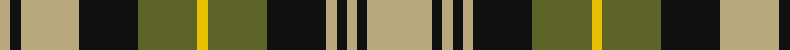

In pattern [YKYKGYGKYKYKY](/patterns/ykykgygkykyky/).

This was sourced from tartans-authority.  It is a [13 stripes tartan](/stripes/stripes13/).

Original link http://www.tartansauthority.com/tartan-ferret/display/7508/

## Attestations

This cloth appears in 3 source records; the oldest owns this page.

- pre 2008 — Poulter, Green (Corporate) (tartans-authority, [record](http://www.tartansauthority.com/tartan-ferret/display/7508/))
- undated — Poulter Green (register-of-tartans, [record](https://www.tartanregister.gov.uk/tartanDetails.aspx?ref=5546))
- undated — Poulter Green Corporate Tartan Tartan Number: 7508. Earliest known date: 2008 One of four colourways for corporate tartans for professional golfer Ian Poulter's fashion range. Woven in polyster/viscose. Count and sample from Lochcarron. See products available Copyright © Blair Urquhart, Comrie, 2015 (house-of-tartan, [record](http://www.house-of-tartan.scotland.net/house/TartanViewjs.asp?colr=Def&tnam=7508))

## Thread count
LG/8 K8 LG46 K46 G46 Y8 G46 K46 LG8 K8 LG8 K8 LG/50

## Palette
Each colour and its ΔE from the base-6 reference it is a variant of.

| Colour | Shade | Base | ΔE (OKLab) |
|---|---|---|---|
| G | <code style="background-color:#5C6428;">#5C6428</code> `#5C6428` | G <code style="background-color:#006400;">#006400</code> | 0.09 |
| K | <code style="background-color:#101010;">#101010</code> `#101010` | K <code style="background-color:#000000;">#000000</code> | 0.17 |
| LG | <code style="background-color:#B8A87C;">#B8A87C</code> `#B8A87C` | Y <code style="background-color:#E8C000;">#E8C000</code> | 0.14 |
| Y | <code style="background-color:#E8C000;">#E8C000</code> `#E8C000` | Y <code style="background-color:#E8C000;">#E8C000</code> | 0.00 |

ID: /setts/s13/y50k8y8k8y8k46g46ya8g46k46y46k8y8-g5c6428-k101010-yb8a87c-yae8c000/
