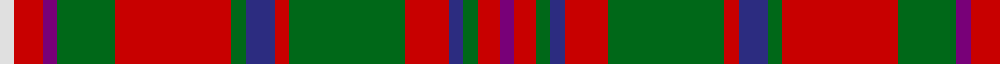

In pattern [BRGBRGRBGRGBRW](/patterns/brgbrgrbgrgbrw/).

This was sourced from register-of-tartans.  It is a [14 stripes tartan](/stripes/stripes14/).

Original link https://www.tartanregister.gov.uk/tartanDetails.aspx?ref=2542

## Attestations

This cloth appears in 3 source records; the oldest owns this page.

- 01/01/1816 — MacKinnon (register-of-tartans, [record](https://www.tartanregister.gov.uk/tartanDetails.aspx?ref=2542))
- 1959 — MacKinnon - 1959 (Clan) (tartans-authority, [record](http://www.tartansauthority.com/tartan-ferret/display/540/))
- undated — MacKinnon Clan Tartan Tartan Number: 540. Earliest known date: 1816 The MacKinnon tartan now generally available and approved by the chief, has altered its appearance over the years, and returned to the form of the earliest example. The collection of certified tartans made by the Highland Society of London (c.1816) includes a specimen signed by the Mackinnon in which the purple stripes are a light shade of azure, a minor change that is mirrored in other tartans, notably the Royal Stewart. Logan (1831) recorded these stripes in white, Smibert (1850) in pink, Smith (1850) in crimson, McIan (1847) in black and white and Grant (1886) as black. MacKinnons are associated with the Isle of Iona as early church leaders, and the name has been anglicized to 'Love'. See products available Copyright © Blair Urquhart, Comrie, 2015 (house-of-tartan, [record](http://www.house-of-tartan.scotland.net/house/TartanViewjs.asp?colr=Def&tnam=540))

## Thread count
LN/4 R8 P4 G16 R32 G4 DB8 R4 G32 R12 DB4 G4 R6 P/4

## Palette
Each colour and its ΔE from the base-6 reference it is a variant of.

| Colour | Shade | Base | ΔE (OKLab) |
|---|---|---|---|
| DB | <code style="background-color:#2C2C80;">#2C2C80</code> `#2C2C80` | B <code style="background-color:#2A418A;">#2A418A</code> | 0.06 |
| G | <code style="background-color:#006818;">#006818</code> `#006818` | G <code style="background-color:#006100;">#006100</code> | 0.02 |
| LN | <code style="background-color:#E0E0E0;">#E0E0E0</code> `#E0E0E0` | W <code style="background-color:#F7F7F7;">#F7F7F7</code> | 0.07 |
| P | <code style="background-color:#780078;">#780078</code> `#780078` | B <code style="background-color:#2A418A;">#2A418A</code> | 0.17 |
| R | <code style="background-color:#C80000;">#C80000</code> `#C80000` | R <code style="background-color:#CC0000;">#CC0000</code> | 0.01 |

## Nearest tartans

The nearest existing variants by ΔTartan distance.

1. [MacKinnon #2](/setts/s14/b2r3g2ba2r6g16r2ba4g2r16g8b2r4w2x2~b3c82af-ba2c4084-g005020-rdc0000-we0e0e0/) — ΔT 0.24
1. [MacGuire (Personal)](/setts/s14/w3k2g18r2b8r18g2r2g2r2b2r18g18k2x2~b2c2c80-g285800-k101010-rc80000-we0e0e0/) — ΔT 0.35
1. [MacKinnon 5](/setts/s14/b2r3g2ba2r6g16r2ba4g2r16g8b2r4w2x2~b800080-ba304080-g008000-rc00000-we0e0e0/) — ΔT 0.42
1. [MacKinnon #8](/setts/s14/b2r3g2ba2r6g16r2ba4g2r16g8b2r4w2x2~b5a008c-ba2c4084-g005020-rdc0000-we0e0e0/) — ΔT 0.43
1. [MacKinnon 10](/setts/s14/b3r4g3ba3r7g17r3ba5g4r21g7b3r6w3x2~b800080-ba304080-g008000-rc00000-we0e0e0/) — ΔT 0.49
1. [MacKinnon](/setts/s14/b2r3g2ba2r6g16r2ba4g2r16g8b2r4w2~b5a3094-ba000064-g004c00-rc80000-wd0d0d0/) — ΔT 0.51
1. [MacKinnon #5](/setts/s14/k4r3g2b2r6g15r2b4g2r15g7k2r4w2x2~b2c4084-g005020-k101010-rdc0000-we0e0e0/) — ΔT 0.61
1. [MacKinnon 6](/setts/s14/b2r3g2ba2r6g16r2ba4g2r16g8b2r4w2x2~b5480b0-ba304080-g008000-rc00000-we0e0e0/) — ΔT 0.64
1. [MacKinnon #3](/setts/s14/b3r4g3ba3r7g17r3ba5g4r21g7b3r6w3x2~b5a008c-ba2c4084-g005020-rdc0000-we0e0e0/) — ΔT 0.74
1. [MacKinnon](/setts/s14/b2r3g2ba2r6g16r2ba4g2r16g8b2r4y2x2~b6e5058-ba000052-g11450d-raa0000-yaaaaaa/) — ΔT 0.94

## Neighbour map

Every grey dot is one of 15726 variants placed by the first two principal components of the ΔTartan feature space (44% of its variance). Red is this tartan; blue dots are its nearest — click one to open its page.

<svg viewBox="0 0 640 380" role="img" style="max-width:100%;height:auto;border:1px solid #e0e0e0;border-radius:4px;display:block" xmlns="http://www.w3.org/2000/svg"><image href="/nn/cloud.v1.png" width="640" height="380"/><a href="/setts/s14/b2r3g2ba2r6g16r2ba4g2r16g8b2r4w2x2~b3c82af-ba2c4084-g005020-rdc0000-we0e0e0/"><circle cx="214.4" cy="150.2" r="4" fill="#3465a4"><title>MacKinnon #2</title></circle></a><a href="/setts/s14/w3k2g18r2b8r18g2r2g2r2b2r18g18k2x2~b2c2c80-g285800-k101010-rc80000-we0e0e0/"><circle cx="224.4" cy="145.7" r="4" fill="#3465a4"><title>MacGuire (Personal)</title></circle></a><a href="/setts/s14/b2r3g2ba2r6g16r2ba4g2r16g8b2r4w2x2~b800080-ba304080-g008000-rc00000-we0e0e0/"><circle cx="216.8" cy="152.0" r="4" fill="#3465a4"><title>MacKinnon 5</title></circle></a><a href="/setts/s14/b2r3g2ba2r6g16r2ba4g2r16g8b2r4w2x2~b5a008c-ba2c4084-g005020-rdc0000-we0e0e0/"><circle cx="214.4" cy="149.4" r="4" fill="#3465a4"><title>MacKinnon #8</title></circle></a><a href="/setts/s14/b3r4g3ba3r7g17r3ba5g4r21g7b3r6w3x2~b800080-ba304080-g008000-rc00000-we0e0e0/"><circle cx="209.4" cy="162.1" r="4" fill="#3465a4"><title>MacKinnon 10</title></circle></a><a href="/setts/s14/b2r3g2ba2r6g16r2ba4g2r16g8b2r4w2~b5a3094-ba000064-g004c00-rc80000-wd0d0d0/"><circle cx="213.2" cy="152.3" r="4" fill="#3465a4"><title>MacKinnon</title></circle></a><a href="/setts/s14/k4r3g2b2r6g15r2b4g2r15g7k2r4w2x2~b2c4084-g005020-k101010-rdc0000-we0e0e0/"><circle cx="191.3" cy="155.9" r="4" fill="#3465a4"><title>MacKinnon #5</title></circle></a><a href="/setts/s14/b2r3g2ba2r6g16r2ba4g2r16g8b2r4w2x2~b5480b0-ba304080-g008000-rc00000-we0e0e0/"><circle cx="217.5" cy="153.5" r="4" fill="#3465a4"><title>MacKinnon 6</title></circle></a><a href="/setts/s14/b3r4g3ba3r7g17r3ba5g4r21g7b3r6w3x2~b5a008c-ba2c4084-g005020-rdc0000-we0e0e0/"><circle cx="205.9" cy="159.1" r="4" fill="#3465a4"><title>MacKinnon #3</title></circle></a><a href="/setts/s14/b2r3g2ba2r6g16r2ba4g2r16g8b2r4y2x2~b6e5058-ba000052-g11450d-raa0000-yaaaaaa/"><circle cx="240.1" cy="165.5" r="4" fill="#3465a4"><title>MacKinnon</title></circle></a><circle cx="220.3" cy="152.9" r="5" fill="#c00000"/></svg>

ID: /setts/s14/b2r3g2ba2r6g16r2ba4g2r16g8b2r4w2x2~b780078-ba2c2c80-g006818-rc80000-we0e0e0/
