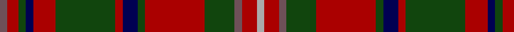

In pattern [BRGBRGRBGRGBRY](/patterns/brgbrgrbgrgbry/).

This was sourced from weddslist.  It is a [14 stripes tartan](/stripes/stripes14/).

Original link http://www.weddslist.com/cgi-bin/tartans/pg.pl?source=tinsel

## Thread count
N/4 DR6 DG4 DB4 DR12 DG32 DR4 DB8 DG4 DR32 DG16 N4 DR8 Na/4

## Palette
Each colour and its ΔE from the base-6 reference it is a variant of.

| Colour | Shade | Base | ΔE (OKLab) |
|---|---|---|---|
| DB | <code style="background-color:#000052;">#000052</code> `#000052` | B <code style="background-color:#2A418A;">#2A418A</code> | 0.20 |
| DG | <code style="background-color:#11450D;">#11450D</code> `#11450D` | G <code style="background-color:#006100;">#006100</code> | 0.09 |
| DR | <code style="background-color:#AA0000;">#AA0000</code> `#AA0000` | R <code style="background-color:#CC0000;">#CC0000</code> | 0.07 |
| N | <code style="background-color:#6E5058;">#6E5058</code> `#6E5058` | B <code style="background-color:#2A418A;">#2A418A</code> | 0.15 |
| Na | <code style="background-color:#AAAAAA;">#AAAAAA</code> `#AAAAAA` | Y <code style="background-color:#F2BF00;">#F2BF00</code> | 0.19 |

## Nearest tartans

The nearest existing variants by ΔTartan distance.

1. [MacKinnon](/setts/s14/b2r3g2ba2r6g16r2ba4g2r16g8b2r4y2~b6e5058-ba000052-g11450d-raa0000-yaaaaaa/) — ΔT 0.00
1. [MacGuire (Personal)](/setts/s14/w3k2g18r2b8r18g2r2g2r2b2r18g18k2x2~b2c2c80-g285800-k101010-rc80000-we0e0e0/) — ΔT 0.88
1. [Large (Personal)](/setts/s16/k2r17k2y2k2r8k2g2ka11g2k5g5k2g10r15k2x2~g5c6428-k101010-ka00002c-r880000-ye8c000/) — ΔT 0.90
1. [Manx Heritage](/setts/s14/b3r3b2r3g2r2g2r17ba10r2g2r2g19ga3x2~b5480b0-ba304080-g004010-ga808080-rc00020/) — ΔT 0.92
1. [MacKinnon](/setts/s14/b2r3g2ba2r6g16r2ba4g2r16g8b2r4w2x2~b780078-ba2c2c80-g006818-rc80000-we0e0e0/) — ΔT 0.94
1. [MacKinnon](/setts/s14/b2r3g2ba2r6g16r2ba4g2r16g8b2r4w2~b5a3094-ba000064-g004c00-rc80000-wd0d0d0/) — ΔT 0.97
1. [Michael from Appin (Personal)](/setts/s12/b4r24g2r3g19y2r2b8r2g2w2r2x2~b2c2c80-g285800-r880000-we0e0e0-ye8c000/) — ΔT 1.03
1. [MacIntyre and Glenorchy](/setts/s14/g2k2r3g18r3b6ga2r4g6r2b18r3g2k2x2~b440044-g006818-ga789484-k101010-rc80000/) — ΔT 1.09
1. [MacKinnon #2](/setts/s14/b2r3g2ba2r6g16r2ba4g2r16g8b2r4w2x2~b3c82af-ba2c4084-g005020-rdc0000-we0e0e0/) — ΔT 1.10
1. [MacKinnon #8](/setts/s14/b2r3g2ba2r6g16r2ba4g2r16g8b2r4w2x2~b5a008c-ba2c4084-g005020-rdc0000-we0e0e0/) — ΔT 1.13

## Neighbour map

Every grey dot is one of 15726 variants placed by the first two principal components of the ΔTartan feature space (44% of its variance). Red is this tartan; blue dots are its nearest — click one to open its page.

<svg viewBox="0 0 640 380" role="img" style="max-width:100%;height:auto;border:1px solid #e0e0e0;border-radius:4px;display:block" xmlns="http://www.w3.org/2000/svg"><image href="/nn/cloud.v1.png" width="640" height="380"/><a href="/setts/s14/b2r3g2ba2r6g16r2ba4g2r16g8b2r4y2~b6e5058-ba000052-g11450d-raa0000-yaaaaaa/"><circle cx="240.1" cy="165.5" r="4" fill="#3465a4"><title>MacKinnon</title></circle></a><a href="/setts/s14/w3k2g18r2b8r18g2r2g2r2b2r18g18k2x2~b2c2c80-g285800-k101010-rc80000-we0e0e0/"><circle cx="224.4" cy="145.7" r="4" fill="#3465a4"><title>MacGuire (Personal)</title></circle></a><a href="/setts/s16/k2r17k2y2k2r8k2g2ka11g2k5g5k2g10r15k2x2~g5c6428-k101010-ka00002c-r880000-ye8c000/"><circle cx="212.6" cy="158.6" r="4" fill="#3465a4"><title>Large (Personal)</title></circle></a><a href="/setts/s14/b3r3b2r3g2r2g2r17ba10r2g2r2g19ga3x2~b5480b0-ba304080-g004010-ga808080-rc00020/"><circle cx="220.2" cy="142.6" r="4" fill="#3465a4"><title>Manx Heritage</title></circle></a><a href="/setts/s14/b2r3g2ba2r6g16r2ba4g2r16g8b2r4w2x2~b780078-ba2c2c80-g006818-rc80000-we0e0e0/"><circle cx="220.3" cy="152.9" r="4" fill="#3465a4"><title>MacKinnon</title></circle></a><a href="/setts/s14/b2r3g2ba2r6g16r2ba4g2r16g8b2r4w2~b5a3094-ba000064-g004c00-rc80000-wd0d0d0/"><circle cx="213.2" cy="152.3" r="4" fill="#3465a4"><title>MacKinnon</title></circle></a><a href="/setts/s12/b4r24g2r3g19y2r2b8r2g2w2r2x2~b2c2c80-g285800-r880000-we0e0e0-ye8c000/"><circle cx="269.3" cy="138.4" r="4" fill="#3465a4"><title>Michael from Appin (Personal)</title></circle></a><a href="/setts/s14/g2k2r3g18r3b6ga2r4g6r2b18r3g2k2x2~b440044-g006818-ga789484-k101010-rc80000/"><circle cx="192.2" cy="147.4" r="4" fill="#3465a4"><title>MacIntyre and Glenorchy</title></circle></a><a href="/setts/s14/b2r3g2ba2r6g16r2ba4g2r16g8b2r4w2x2~b3c82af-ba2c4084-g005020-rdc0000-we0e0e0/"><circle cx="214.4" cy="150.2" r="4" fill="#3465a4"><title>MacKinnon #2</title></circle></a><a href="/setts/s14/b2r3g2ba2r6g16r2ba4g2r16g8b2r4w2x2~b5a008c-ba2c4084-g005020-rdc0000-we0e0e0/"><circle cx="214.4" cy="149.4" r="4" fill="#3465a4"><title>MacKinnon #8</title></circle></a><circle cx="240.1" cy="165.5" r="5" fill="#c00000"/></svg>

ID: /setts/s14/b2r3g2ba2r6g16r2ba4g2r16g8b2r4y2x2~b6e5058-ba000052-g11450d-raa0000-yaaaaaa/
