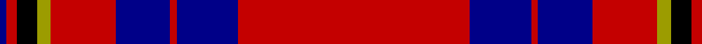

In pattern [BRKYRRBRBBRRRR](/patterns/brkyrrbrbbrrrr/).

This was sourced from tartans-authority.  It is a [14 stripes tartan](/stripes/stripes14/).

Original link http://www.tartansauthority.com/tartan-ferret/display/4488/

## Thread count
DB/4 Ra6 K12 LG8 Ra34 R4 DBa32 Ra4 DBa32 DB4 Ra30 Ra32 Ra4 Ra/4

## Palette
Each colour and its ΔE from the base-6 reference it is a variant of.

| Colour | Shade | Base | ΔE (OKLab) |
|---|---|---|---|
| DB | <code style="background-color:#000088;">#000088</code> `#000088` | B <code style="background-color:#2A418A;">#2A418A</code> | 0.14 |
| DBa | <code style="background-color:#000088;">#000088</code> `#000088` | B <code style="background-color:#2A418A;">#2A418A</code> | 0.14 |
| K | <code style="background-color:#000000;">#000000</code> `#000000` | K <code style="background-color:#000000;">#000000</code> | 0.00 |
| LG | <code style="background-color:#9C9C00;">#9C9C00</code> `#9C9C00` | Y <code style="background-color:#F2BF00;">#F2BF00</code> | 0.17 |
| R | <code style="background-color:#C40000;">#C40000</code> `#C40000` | R <code style="background-color:#CC0000;">#CC0000</code> | 0.02 |
| Ra | <code style="background-color:#C40000;">#C40000</code> `#C40000` | R <code style="background-color:#CC0000;">#CC0000</code> | 0.02 |

## Nearest tartans

The nearest existing variants by ΔTartan distance.

1. [Clifford](/setts/s13/b10k3g3k8r9g3r10ba3r28g3k3w3k3~b102040-ba8080d0-g008000-k000000-r802040-we0e0e0~x2/) — ΔT 1.24
1. [MacPherson](/setts/s15/r12b2r12g8y1k6b4k1b1k1b4r12ya1k1r1~b4367ae-g11450d-k000000-raa0000-yaaaa00-yaaaaaaa~x2/) — ΔT 1.25
1. [Ikelman No. 6](/setts/s12/r16g2r3g2r13k12w2k12r13ka13r2y2~g008000-k000030-ka000000-rc00000-we0e0e0-yf0c000~x2/) — ΔT 1.27
1. [Ikelman #6 (Personal)](/setts/s12/r16g2r3g2r13b12w2b12r13k13r2y2~b440044-g003820-k101010-rc80000-we0e0e0-yd8b000~x2/) — ΔT 1.43
1. [Wishart Dress](/setts/s12/k7b4r31ba3y2ba27w4ba27y2ba3r31b4~b2c2c80-ba202060-k000000-rc80000-wc8c8c8-ye8c000~x2/) — ΔT 1.45
1. [Life Goes On Foundation (Corporate)](/setts/s13/y8w17b5w5b5k10b5ya5b32k5b5k4b6~b780078-k101010-wb8c0c8-ye8c000-yaa0a0a0/) — ΔT 1.46
1. [Salt Lake Scots](/setts/s9/r17b2w2b2r20ra18ba3ra6k2~b788cb4-ba000064-k000000-r640000-ra8c8c8c-wfcfcfc~x2/) — ΔT 1.46
1. [Hueg Scottish Blue Thistle (Personal](/setts/s15/r2g4k2b25g4b4y2b2w2b5g3r7k2r3w2~b440044-g006818-k101010-rc80000-we8ccb8-ybc8c00~x2/) — ΔT 1.50
1. [Maynard](/setts/s13/y3r25g8r4b8w2b3w2b8r4k8r25y3~b2c2c80-g006818-k101010-rc80000-we0e0e0-ye8c000~x2/) — ΔT 1.52
1. [Lochcarron Dress](/setts/s14/r3b10ba3b2ba2b2r3k5r2k5r22g2r3g2~b000064-ba346488-g004c00-k000000-rc80000~x2/) — ΔT 1.53

## Neighbour map

Every grey dot is one of 15726 variants placed by the first two principal components of the ΔTartan feature space (44% of its variance). Red is this tartan; blue dots are its nearest — click one to open its page.

<svg viewBox="0 0 640 380" role="img" style="max-width:100%;height:auto;border:1px solid #e0e0e0;border-radius:4px;display:block" xmlns="http://www.w3.org/2000/svg"><image href="/nn/cloud.v1.png" width="640" height="380"/><a href="/setts/s13/b10k3g3k8r9g3r10ba3r28g3k3w3k3~b102040-ba8080d0-g008000-k000000-r802040-we0e0e0~x2/"><circle cx="216.6" cy="130.5" r="4" fill="#3465a4"><title>Clifford</title></circle></a><a href="/setts/s15/r12b2r12g8y1k6b4k1b1k1b4r12ya1k1r1~b4367ae-g11450d-k000000-raa0000-yaaaa00-yaaaaaaa~x2/"><circle cx="247.4" cy="114.6" r="4" fill="#3465a4"><title>MacPherson</title></circle></a><a href="/setts/s12/r16g2r3g2r13k12w2k12r13ka13r2y2~g008000-k000030-ka000000-rc00000-we0e0e0-yf0c000~x2/"><circle cx="181.5" cy="151.1" r="4" fill="#3465a4"><title>Ikelman No. 6</title></circle></a><a href="/setts/s12/r16g2r3g2r13b12w2b12r13k13r2y2~b440044-g003820-k101010-rc80000-we0e0e0-yd8b000~x2/"><circle cx="213.8" cy="155.3" r="4" fill="#3465a4"><title>Ikelman #6 (Personal)</title></circle></a><a href="/setts/s12/k7b4r31ba3y2ba27w4ba27y2ba3r31b4~b2c2c80-ba202060-k000000-rc80000-wc8c8c8-ye8c000~x2/"><circle cx="219.4" cy="110.7" r="4" fill="#3465a4"><title>Wishart Dress</title></circle></a><a href="/setts/s13/y8w17b5w5b5k10b5ya5b32k5b5k4b6~b780078-k101010-wb8c0c8-ye8c000-yaa0a0a0/"><circle cx="205.8" cy="147.6" r="4" fill="#3465a4"><title>Life Goes On Foundation (Corporate)</title></circle></a><a href="/setts/s9/r17b2w2b2r20ra18ba3ra6k2~b788cb4-ba000064-k000000-r640000-ra8c8c8c-wfcfcfc~x2/"><circle cx="237.9" cy="146.1" r="4" fill="#3465a4"><title>Salt Lake Scots</title></circle></a><a href="/setts/s15/r2g4k2b25g4b4y2b2w2b5g3r7k2r3w2~b440044-g006818-k101010-rc80000-we8ccb8-ybc8c00~x2/"><circle cx="246.1" cy="98.9" r="4" fill="#3465a4"><title>Hueg Scottish Blue Thistle (Personal</title></circle></a><a href="/setts/s13/y3r25g8r4b8w2b3w2b8r4k8r25y3~b2c2c80-g006818-k101010-rc80000-we0e0e0-ye8c000~x2/"><circle cx="256.2" cy="111.7" r="4" fill="#3465a4"><title>Maynard</title></circle></a><a href="/setts/s14/r3b10ba3b2ba2b2r3k5r2k5r22g2r3g2~b000064-ba346488-g004c00-k000000-rc80000~x2/"><circle cx="228.9" cy="121.3" r="4" fill="#3465a4"><title>Lochcarron Dress</title></circle></a><circle cx="228.1" cy="134.4" r="5" fill="#c00000"/></svg>

ID: /setts/s14/b2r3k6y4r17r2b16r2b16b2r15r16r2r2~b000088-k000000-rc40000-y9c9c00~x2/
