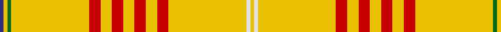

In pattern [BYGYRYRYRYRYWY](/patterns/bygyryryryrywy/).

This was sourced from house-of-tartan.  It is a [14 stripes tartan](/stripes/stripes14/).

Original link http://www.house-of-tartan.scotland.net/house/TartanViewjs.asp?colr=Def&tnam=2071

## Thread count
DB/3 Y3 G3 Y62 R9 Y9 R9 Y9 R9 Y9 R9 Y62 LN3 Y/3

## Palette
Each colour and its ΔE from the base-6 reference it is a variant of.

| Colour | Shade | Base | ΔE (OKLab) |
|---|---|---|---|
| DB | <code style="background-color:#2C2C80;">#2C2C80</code> `#2C2C80` | B <code style="background-color:#2A418A;">#2A418A</code> | 0.06 |
| G | <code style="background-color:#006818;">#006818</code> `#006818` | G <code style="background-color:#006100;">#006100</code> | 0.02 |
| LN | <code style="background-color:#E0E0E0;">#E0E0E0</code> `#E0E0E0` | W <code style="background-color:#F7F7F7;">#F7F7F7</code> | 0.07 |
| R | <code style="background-color:#C80000;">#C80000</code> `#C80000` | R <code style="background-color:#CC0000;">#CC0000</code> | 0.01 |
| Y | <code style="background-color:#E8C000;">#E8C000</code> `#E8C000` | Y <code style="background-color:#F2BF00;">#F2BF00</code> | 0.02 |

## Nearest tartans

The nearest existing variants by ΔTartan distance.

1. [Catalan](/setts/s14/b3y3g3y62r9y9r9y9r9y9r9y62w3y3-b304080-g008000-rc00000-we0e0e0-yf0c000/) — ΔT 0.14
1. [Catalan (92 Olympics)](/setts/s14/y44r6y6r6y6r6y6r6y44b3y3g3y3w3-b2474e8-g006818-r880000-wc0c0c0-yd8b000/) — ΔT 0.83
1. [Virginia Quadricentennial (District)](/setts/s13/y80ya6y20ya12y40k6y4k6y20r8y4r16y4-k101010-r901c38-yc4bc68-yaa08858/) — ΔT 1.81
1. [Houston Family Tartan Tartan Number: 2290. Earliest known date: 1994 Nothing See products available Copyright © Blair Urquhart, Comrie, 2015](/setts/s12/g4y2ya4y2g4y2ya4y64ga4y24ya4y4-g006818-ga604000-ye8c000-yaa08858/) — ΔT 1.82
1. [Dundonald (Name)](/setts/s16/y50b6y6b4y8b4y6b6y16y20r32b2y32b6y16b4-b2c2c80-rc80000-ye8c000/) — ΔT 2.24
1. [Virginia Quadricentennial](/setts/s13/w40r3w10r6w20k3w2k3w10ra4w2ra8w2-k101010-rbe7832-ra960032-wfafa96/) — ΔT 2.30
1. [Houston #2 (Personal)](/setts/s12/y64b4y24g4y2ga4y2g4y2ga4y2g4-b441800-g604000-ga006818-ybc8c00/) — ΔT 2.32
1. [Houston (Personal)](/setts/s22/g4y2ga4y2g4y2ga4y64b4y24ga4y4ga4y24b4y64ga4y2g4y2ga4y2-b441800-g006818-ga604000-ybc8c00/) — ΔT 2.49
1. [UPS No.1](/setts/s15/b8y120b4y30b4y4ya4b4y16b8w2b4w4b4w2-b391614-wfcfa93-yfad183-yadf982e/) — ΔT 2.62
1. [UPS No. 1 (Corporate)](/setts/s16/y16b4y4ya4y4b4y30b4y120b8w2b4w4b4w2b8-b381414-wfcf890-yf8d080-yadc982c/) — ΔT 2.64

## Neighbour map

Every grey dot is one of 15726 variants placed by the first two principal components of the ΔTartan feature space (44% of its variance). Red is this tartan; blue dots are its nearest — click one to open its page.

<svg viewBox="0 0 640 380" role="img" style="max-width:100%;height:auto;border:1px solid #e0e0e0;border-radius:4px;display:block" xmlns="http://www.w3.org/2000/svg"><image href="/nn/cloud.v1.png" width="640" height="380"/><a href="/setts/s14/b3y3g3y62r9y9r9y9r9y9r9y62w3y3-b304080-g008000-rc00000-we0e0e0-yf0c000/"><circle cx="494.8" cy="91.3" r="4" fill="#3465a4"><title>Catalan</title></circle></a><a href="/setts/s14/y44r6y6r6y6r6y6r6y44b3y3g3y3w3-b2474e8-g006818-r880000-wc0c0c0-yd8b000/"><circle cx="468.8" cy="107.3" r="4" fill="#3465a4"><title>Catalan (92 Olympics)</title></circle></a><a href="/setts/s13/y80ya6y20ya12y40k6y4k6y20r8y4r16y4-k101010-r901c38-yc4bc68-yaa08858/"><circle cx="468.3" cy="123.8" r="4" fill="#3465a4"><title>Virginia Quadricentennial (District)</title></circle></a><a href="/setts/s12/g4y2ya4y2g4y2ya4y64ga4y24ya4y4-g006818-ga604000-ye8c000-yaa08858/"><circle cx="585.5" cy="101.1" r="4" fill="#3465a4"><title>Houston Family Tartan Tartan Number: 2290. Earliest known date: 1994 Nothing See products available Copyright © Blair Urquhart, Comrie, 2015</title></circle></a><a href="/setts/s16/y50b6y6b4y8b4y6b6y16y20r32b2y32b6y16b4-b2c2c80-rc80000-ye8c000/"><circle cx="398.4" cy="105.3" r="4" fill="#3465a4"><title>Dundonald (Name)</title></circle></a><a href="/setts/s13/w40r3w10r6w20k3w2k3w10ra4w2ra8w2-k101010-rbe7832-ra960032-wfafa96/"><circle cx="428.9" cy="101.8" r="4" fill="#3465a4"><title>Virginia Quadricentennial</title></circle></a><a href="/setts/s12/y64b4y24g4y2ga4y2g4y2ga4y2g4-b441800-g604000-ga006818-ybc8c00/"><circle cx="604.1" cy="111.6" r="4" fill="#3465a4"><title>Houston #2 (Personal)</title></circle></a><a href="/setts/s22/g4y2ga4y2g4y2ga4y64b4y24ga4y4ga4y24b4y64ga4y2g4y2ga4y2-b441800-g006818-ga604000-ybc8c00/"><circle cx="602.9" cy="89.4" r="4" fill="#3465a4"><title>Houston (Personal)</title></circle></a><a href="/setts/s15/b8y120b4y30b4y4ya4b4y16b8w2b4w4b4w2-b391614-wfcfa93-yfad183-yadf982e/"><circle cx="522.7" cy="32.3" r="4" fill="#3465a4"><title>UPS No.1</title></circle></a><a href="/setts/s16/y16b4y4ya4y4b4y30b4y120b8w2b4w4b4w2b8-b381414-wfcf890-yf8d080-yadc982c/"><circle cx="526.0" cy="29.0" r="4" fill="#3465a4"><title>UPS No. 1 (Corporate)</title></circle></a><circle cx="494.9" cy="92.6" r="5" fill="#c00000"/></svg>

ID: /setts/s14/b3y3g3y62r9y9r9y9r9y9r9y62w3y3-b2c2c80-g006818-rc80000-we0e0e0-ye8c000/
