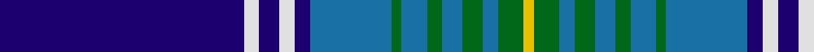

In pattern [BWBWBBGBGBGBGY](/patterns/bwbwbbgbgbgbgy/).

This was sourced from tartans-authority.  It is a [14 stripes tartan](/stripes/stripes14/).

Original link http://www.tartansauthority.com/tartan-ferret/display/5899/

## Thread count
DB/96 LN6 DB8 LN6 DB6 B32 G4 B10 G6 B8 G8 B6 G10 Y/4

## Palette
Each colour and its ΔE from the base-6 reference it is a variant of.

| Colour | Shade | Base | ΔE (OKLab) |
|---|---|---|---|
| B | <code style="background-color:#1870A4;">#1870A4</code> `#1870A4` | B <code style="background-color:#2A418A;">#2A418A</code> | 0.13 |
| DB | <code style="background-color:#1C0070;">#1C0070</code> `#1C0070` | B <code style="background-color:#2A418A;">#2A418A</code> | 0.14 |
| G | <code style="background-color:#006818;">#006818</code> `#006818` | G <code style="background-color:#006100;">#006100</code> | 0.02 |
| LN | <code style="background-color:#E0E0E0;">#E0E0E0</code> `#E0E0E0` | W <code style="background-color:#F7F7F7;">#F7F7F7</code> | 0.07 |
| Y | <code style="background-color:#E8C000;">#E8C000</code> `#E8C000` | Y <code style="background-color:#F2BF00;">#F2BF00</code> | 0.02 |

## Nearest tartans

The nearest existing variants by ΔTartan distance.

1. [Federal Memorial](/setts/s15/b3r1b1r1b15w1b1r4b1w1b1ba15b1y1b3~b00008c-ba5c8ca8-rc80000-we0e0e0-ye8c000~x4/) — ΔT 1.06
1. [Crombie, Harry (Personal)](/setts/s14/b5g1ba30y2ba4y3ba3y4ba2y5ba2bb9ba1w2~b64008c-ba141e46-bb0596fa-g146400-wf8f8f8-y48a4c0~x2/) — ΔT 1.14
1. [Riyadh Caledonian (Corporate)](/setts/s13/b23g4b1w1b3g5b1ba4b3y1g3w1g4~b2c2c80-ba780078-g006818-we0e0e0-ye8c000~x4/) — ΔT 1.30
1. [Royal Navy](/setts/s12/b4ba8b3ba2b64bb24r4bc3bb4bc3w8r4~b141e46-ba5a008c-bb3c82af-bc000064-rdc0000-we0e0e0/) — ΔT 1.31
1. [Northfield Academy](/setts/s15/r2b1ba2b2ra1ba12b2ra1rb10b28ba1b3ba2b3w1~b14283c-ba2474e8-r888888-raff0000-rb901c38-wffffff~x2/) — ΔT 1.38
1. [Summerwood (School)](/setts/s12/b76w3r4w3g4w3ga8b19ba20b3ba8w10~b2c2c80-ba2888c4-g006818-ga003820-rc80000-we0e0e0/) — ΔT 1.38
1. [Blue Brough from Orkney](/setts/s13/b4k4b2ba2k4r14k4ba4b23y6b54ba8k4~b000080-ba666666-k101010-rff0000-yffe600/) — ΔT 1.41
1. [Australia 2000](/setts/s11/k3b6k4r6b18ba53b18k8b6k3y2~b788cb4-ba00008c-k000000-r8c0000-yc88c00~x2/) — ΔT 1.41
1. [Mead (Personal)](/setts/s10/b36k3r6k3ba10r5ba3y4k1b2~b3850c8-ba003c64-k101010-rc80000-yfccc00~x2/) — ΔT 1.45
1. [Northfield Academy Corporate Tartan Tartan Number: 11490. Earliest known date: 2016, March Northfield is built on Freedom Lands gifted by Robert the Bruce to the Burgh of Aberdeen around 1313 and this Academy design is based on the complex 1782 Aberdeen tartan. The dark blue squares number 56 threads for the year 1956 when the Academy was opened; the maroon is from the original 1956 school badge; the predominantly dark blue and light blue colours represent the colours of the school tie in 2016; the four light blue lines around the white represent the four capacities of Scottish education's Curriculum for Excellence in the 21st century. Finally, the grey remembers the 19th century Cairncry Granite Quarry on part of which, Northfield Academy was built. See products available Copyright © Blair Urquhart, Comrie, 2015](/setts/s15/y2b1ba2b2k1ba12b2k1k10b28ba1b3ba2b3w1~b101448-ba0070a4-k000000-we8e8e8-ya4a8a8~x2/) — ΔT 1.45

## Neighbour map

Every grey dot is one of 15726 variants placed by the first two principal components of the ΔTartan feature space (44% of its variance). Red is this tartan; blue dots are its nearest — click one to open its page.

<svg viewBox="0 0 640 380" role="img" style="max-width:100%;height:auto;border:1px solid #e0e0e0;border-radius:4px;display:block" xmlns="http://www.w3.org/2000/svg"><image href="/nn/cloud.v1.png" width="640" height="380"/><a href="/setts/s15/b3r1b1r1b15w1b1r4b1w1b1ba15b1y1b3~b00008c-ba5c8ca8-rc80000-we0e0e0-ye8c000~x4/"><circle cx="267.2" cy="102.9" r="4" fill="#3465a4"><title>Federal Memorial</title></circle></a><a href="/setts/s14/b5g1ba30y2ba4y3ba3y4ba2y5ba2bb9ba1w2~b64008c-ba141e46-bb0596fa-g146400-wf8f8f8-y48a4c0~x2/"><circle cx="300.8" cy="72.4" r="4" fill="#3465a4"><title>Crombie, Harry (Personal)</title></circle></a><a href="/setts/s13/b23g4b1w1b3g5b1ba4b3y1g3w1g4~b2c2c80-ba780078-g006818-we0e0e0-ye8c000~x4/"><circle cx="350.2" cy="113.7" r="4" fill="#3465a4"><title>Riyadh Caledonian (Corporate)</title></circle></a><a href="/setts/s12/b4ba8b3ba2b64bb24r4bc3bb4bc3w8r4~b141e46-ba5a008c-bb3c82af-bc000064-rdc0000-we0e0e0/"><circle cx="302.5" cy="68.0" r="4" fill="#3465a4"><title>Royal Navy</title></circle></a><a href="/setts/s15/r2b1ba2b2ra1ba12b2ra1rb10b28ba1b3ba2b3w1~b14283c-ba2474e8-r888888-raff0000-rb901c38-wffffff~x2/"><circle cx="312.6" cy="70.9" r="4" fill="#3465a4"><title>Northfield Academy</title></circle></a><a href="/setts/s12/b76w3r4w3g4w3ga8b19ba20b3ba8w10~b2c2c80-ba2888c4-g006818-ga003820-rc80000-we0e0e0/"><circle cx="331.1" cy="80.8" r="4" fill="#3465a4"><title>Summerwood (School)</title></circle></a><a href="/setts/s13/b4k4b2ba2k4r14k4ba4b23y6b54ba8k4~b000080-ba666666-k101010-rff0000-yffe600/"><circle cx="345.2" cy="97.7" r="4" fill="#3465a4"><title>Blue Brough from Orkney</title></circle></a><a href="/setts/s11/k3b6k4r6b18ba53b18k8b6k3y2~b788cb4-ba00008c-k000000-r8c0000-yc88c00~x2/"><circle cx="233.2" cy="104.5" r="4" fill="#3465a4"><title>Australia 2000</title></circle></a><a href="/setts/s10/b36k3r6k3ba10r5ba3y4k1b2~b3850c8-ba003c64-k101010-rc80000-yfccc00~x2/"><circle cx="308.6" cy="93.6" r="4" fill="#3465a4"><title>Mead (Personal)</title></circle></a><a href="/setts/s15/y2b1ba2b2k1ba12b2k1k10b28ba1b3ba2b3w1~b101448-ba0070a4-k000000-we8e8e8-ya4a8a8~x2/"><circle cx="305.2" cy="77.2" r="4" fill="#3465a4"><title>Northfield Academy Corporate Tartan Tartan Number: 11490. Earliest known date: 2016, March Northfield is built on Freedom Lands gifted by Robert the Bruce to the Burgh of Aberdeen around 1313 and this Academy design is based on the complex 1782 Aberdeen tartan. The dark blue squares number 56 threads for the year 1956 when the Academy was opened; the maroon is from the original 1956 school badge; the predominantly dark blue and light blue colours represent the colours of the school tie in 2016; the four light blue lines around the white represent the four capacities of Scottish education's Curriculum for Excellence in the 21st century. Finally, the grey remembers the 19th century Cairncry Granite Quarry on part of which, Northfield Academy was built. See products available Copyright © Blair Urquhart, Comrie, 2015</title></circle></a><circle cx="300.6" cy="90.7" r="5" fill="#c00000"/></svg>

ID: /setts/s14/b48w3b4w3b3ba16g2ba5g3ba4g4ba3g5y2~b1c0070-ba1870a4-g006818-we0e0e0-ye8c000~x2/
