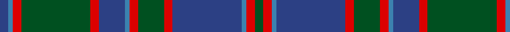

In pattern [BBRGRBBRGRBBRG](/patterns/bbrgrbbrgrbbrg/).

This was sourced from register-of-tartans.  It is a [14 stripes tartan](/stripes/stripes14/).

Original link https://www.tartanregister.gov.uk/tartanDetails.aspx?ref=1433

## Thread count
B/4 Ba2 R4 G32 R4 B12 Ba2 R4 G12 R4 B32 Ba2 R4 G/4

## Palette
Each colour and its ΔE from the base-6 reference it is a variant of.

| Colour | Shade | Base | ΔE (OKLab) |
|---|---|---|---|
| B | <code style="background-color:#2C4084;">#2C4084</code> `#2C4084` | B <code style="background-color:#2A418A;">#2A418A</code> | 0.01 |
| Ba | <code style="background-color:#3C82AF;">#3C82AF</code> `#3C82AF` | B <code style="background-color:#2A418A;">#2A418A</code> | 0.19 |
| G | <code style="background-color:#005020;">#005020</code> `#005020` | G <code style="background-color:#006100;">#006100</code> | 0.07 |
| R | <code style="background-color:#DC0000;">#DC0000</code> `#DC0000` | R <code style="background-color:#CC0000;">#CC0000</code> | 0.03 |

## Nearest tartans

The nearest existing variants by ΔTartan distance.

1. [Glen Orchy](/setts/s14/b4ba2r4g32r4b12ba2r4g12r4b32ba2r4g4-b304080-ba5480b0-g008000-rc00000/) — ΔT 0.90
1. [Markson (Personal)](/setts/s11/r32g2ga4g2r8g10b2g10ga28g2b4-b2888c4-g003820-ga007470-r780028/) — ΔT 0.90
1. [Highland Granite Weavers Tartan Tartan Number: 6499. Earliest known date: 2005 The colours reflect the imposing scenery when journeying north from Perth to Inverness or through to Royal Deeside, granite being the predominant composition of the surrounding unique hills and mountains. This tartan is for those wishing to embrace the growing popularity of the kilt who may either have no strong clan tartan connection, or who wish to wear a tartan different from their own. See products available Copyright © Blair Urquhart, Comrie, 2015](/setts/s18/r32k4r6k4r8k20b54y4b16y4b54k20r8k4r6k4r32b4-b5c5c5c-k101010-r888888-ya0a0a0/) — ΔT 0.94
1. [Hope-Vere/Weir #2](/setts/s14/g38k2g8k2g6k20b40y2k14y2b40k20y6g2-b2c4084-g005020-k101010-ye8c000/) — ΔT 1.07
1. [MacDonald #3](/setts/s12/b32r4b4r10b58r4k62g58r10g4r4g32-b2c4084-g005020-k101010-rdc0000/) — ΔT 1.07
1. [MacDonald #4](/setts/s12/b34r4b4r12b64r4k68g64r12g4r4g34-b2c4084-g005020-k101010-rdc0000/) — ΔT 1.09
1. [Riddoch Personal Tartan Tartan Number: 5856. Earliest known date: circa 1992 Designed by Tony Murray for an Albert (Bert) Riddoch of Bearsden, Glasgow as a private and personal tartan initially but it was then changed to usage by anyone of the name. Bert Riddoch (2002) is a private investgator involved in covert drugs investigations and 'highly thought of by the police'. Tartan based on Campbell of Breadalbane. See products available Copyright © Blair Urquhart, Comrie, 2015](/setts/s14/b36k4b4k4b4k30r4g56r4k30b4k4b4k4-b2c2c80-g006818-k101010-rc80000/) — ΔT 1.09
1. [Glenorchy - National Archives](/setts/s15/g6b4r2b34ra4g16ra8ba2b16ra4g34ra4r2b6ba2-b2c2c80-ba5c8ca8-g006818-re87878-rac80000/) — ΔT 1.10
1. [Black from Cumnock (Personal)](/setts/s13/b16k2b2k2b2k16y2g28y2k16b16k2b2-b2c4084-g005020-k101010-ye8c000/) — ΔT 1.11
1. [Scottish Tourist Board (1981) (Corp)](/setts/s11/b60k4b4k4b4k64g30r4g8r8g60-b2c2c80-g006818-k101010-rc80000/) — ΔT 1.15

## Neighbour map

Every grey dot is one of 15726 variants placed by the first two principal components of the ΔTartan feature space (44% of its variance). Red is this tartan; blue dots are its nearest — click one to open its page.

<svg viewBox="0 0 640 380" role="img" style="max-width:100%;height:auto;border:1px solid #e0e0e0;border-radius:4px;display:block" xmlns="http://www.w3.org/2000/svg"><image href="/nn/cloud.v1.png" width="640" height="380"/><a href="/setts/s14/b4ba2r4g32r4b12ba2r4g12r4b32ba2r4g4-b304080-ba5480b0-g008000-rc00000/"><circle cx="254.8" cy="145.2" r="4" fill="#3465a4"><title>Glen Orchy</title></circle></a><a href="/setts/s11/r32g2ga4g2r8g10b2g10ga28g2b4-b2888c4-g003820-ga007470-r780028/"><circle cx="272.8" cy="170.3" r="4" fill="#3465a4"><title>Markson (Personal)</title></circle></a><a href="/setts/s18/r32k4r6k4r8k20b54y4b16y4b54k20r8k4r6k4r32b4-b5c5c5c-k101010-r888888-ya0a0a0/"><circle cx="268.8" cy="150.2" r="4" fill="#3465a4"><title>Highland Granite Weavers Tartan Tartan Number: 6499. Earliest known date: 2005 The colours reflect the imposing scenery when journeying north from Perth to Inverness or through to Royal Deeside, granite being the predominant composition of the surrounding unique hills and mountains. This tartan is for those wishing to embrace the growing popularity of the kilt who may either have no strong clan tartan connection, or who wish to wear a tartan different from their own. See products available Copyright © Blair Urquhart, Comrie, 2015</title></circle></a><a href="/setts/s14/g38k2g8k2g6k20b40y2k14y2b40k20y6g2-b2c4084-g005020-k101010-ye8c000/"><circle cx="249.0" cy="155.9" r="4" fill="#3465a4"><title>Hope-Vere/Weir #2</title></circle></a><a href="/setts/s12/b32r4b4r10b58r4k62g58r10g4r4g32-b2c4084-g005020-k101010-rdc0000/"><circle cx="218.2" cy="171.0" r="4" fill="#3465a4"><title>MacDonald #3</title></circle></a><a href="/setts/s12/b34r4b4r12b64r4k68g64r12g4r4g34-b2c4084-g005020-k101010-rdc0000/"><circle cx="219.9" cy="166.6" r="4" fill="#3465a4"><title>MacDonald #4</title></circle></a><a href="/setts/s14/b36k4b4k4b4k30r4g56r4k30b4k4b4k4-b2c2c80-g006818-k101010-rc80000/"><circle cx="252.4" cy="155.9" r="4" fill="#3465a4"><title>Riddoch Personal Tartan Tartan Number: 5856. Earliest known date: circa 1992 Designed by Tony Murray for an Albert (Bert) Riddoch of Bearsden, Glasgow as a private and personal tartan initially but it was then changed to usage by anyone of the name. Bert Riddoch (2002) is a private investgator involved in covert drugs investigations and 'highly thought of by the police'. Tartan based on Campbell of Breadalbane. See products available Copyright © Blair Urquhart, Comrie, 2015</title></circle></a><a href="/setts/s15/g6b4r2b34ra4g16ra8ba2b16ra4g34ra4r2b6ba2-b2c2c80-ba5c8ca8-g006818-re87878-rac80000/"><circle cx="244.1" cy="127.5" r="4" fill="#3465a4"><title>Glenorchy - National Archives</title></circle></a><a href="/setts/s13/b16k2b2k2b2k16y2g28y2k16b16k2b2-b2c4084-g005020-k101010-ye8c000/"><circle cx="233.1" cy="172.9" r="4" fill="#3465a4"><title>Black from Cumnock (Personal)</title></circle></a><a href="/setts/s11/b60k4b4k4b4k64g30r4g8r8g60-b2c2c80-g006818-k101010-rc80000/"><circle cx="248.8" cy="166.0" r="4" fill="#3465a4"><title>Scottish Tourist Board (1981) (Corp)</title></circle></a><circle cx="271.3" cy="152.5" r="5" fill="#c00000"/></svg>

ID: /setts/s14/b4ba2r4g32r4b12ba2r4g12r4b32ba2r4g4-b2c4084-ba3c82af-g005020-rdc0000/
