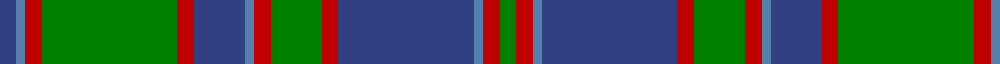

In pattern [BBRGRBBRGRBBRG](/patterns/bbrgrbbrgrbbrg/).

This was sourced from weddslist.  It is a [14 stripes tartan](/stripes/stripes14/).

Original link http://www.weddslist.com/cgi-bin/tartans/pg.pl?source=sts

## Thread count
B/4 Ba2 R4 G32 R4 B12 Ba2 R4 G12 R4 B32 Ba2 R4 G/4

## Palette
Each colour and its ΔE from the base-6 reference it is a variant of.

| Colour | Shade | Base | ΔE (OKLab) |
|---|---|---|---|
| B | <code style="background-color:#304080;">#304080</code> `#304080` | B <code style="background-color:#2A418A;">#2A418A</code> | 0.02 |
| Ba | <code style="background-color:#5480B0;">#5480B0</code> `#5480B0` | B <code style="background-color:#2A418A;">#2A418A</code> | 0.19 |
| G | <code style="background-color:#008000;">#008000</code> `#008000` | G <code style="background-color:#006100;">#006100</code> | 0.10 |
| R | <code style="background-color:#C00000;">#C00000</code> `#C00000` | R <code style="background-color:#CC0000;">#CC0000</code> | 0.03 |

## Nearest tartans

The nearest existing variants by ΔTartan distance.

1. [Glen Orchy](/setts/s15/g6r4ra2b36r4g16r8ba2b16r4g36r4ra2b6ba2-b304080-ba5480b0-g008000-rc00000-rad03030/) — ΔT 0.88
1. [Glenorchy](/setts/s14/b4ba2r4g32r4b12ba2r4g12r4b32ba2r4g4-b2c4084-ba3c82af-g005020-rdc0000/) — ΔT 0.90
1. [Durie Clan Tartan Tartan Number: 2228. Earliest known date: 1988 When the matriculation of the Durie 'Arms' was updated in June 1988, this tartan was designed for family use by Harry G Lindlay of Kinloch & Anderson of Edinburgh. The design is said to be based on the Argyle & Southern Highlanders regimental tartan - the yellow is from the mess dress (military uniform evening wear) facings (lapels) and the burgundy represents the Durie family's French connections. Andrew, son of Lt. Col. Raymond Varley Dewar Durie succeded his father as clan chieftain in 1999. See products available Copyright © Blair Urquhart, Comrie, 2015](/setts/s16/g8y4g48r16b4r4b4r4b48r4b4r4b4r16g48y4-b202060-g006818-r880000-ye8c000/) — ΔT 1.03
1. [Highland Granite Weavers Tartan Tartan Number: 6499. Earliest known date: 2005 The colours reflect the imposing scenery when journeying north from Perth to Inverness or through to Royal Deeside, granite being the predominant composition of the surrounding unique hills and mountains. This tartan is for those wishing to embrace the growing popularity of the kilt who may either have no strong clan tartan connection, or who wish to wear a tartan different from their own. See products available Copyright © Blair Urquhart, Comrie, 2015](/setts/s18/r32k4r6k4r8k20b54y4b16y4b54k20r8k4r6k4r32b4-b5c5c5c-k101010-r888888-ya0a0a0/) — ΔT 1.09
1. [Cape Breton University Chemistry Society](/setts/s10/b8r34b8g8b4g8b8g54b8y8-b000080-g546c3a-r943602-yc49d38/) — ΔT 1.13
1. [Glenorchy - National Archives](/setts/s15/g6b4r2b34ra4g16ra8ba2b16ra4g34ra4r2b6ba2-b2c2c80-ba5c8ca8-g006818-re87878-rac80000/) — ΔT 1.13
1. [Dunedin Chapter (Corporate)](/setts/s10/b78g6b6g40k6g40k6g6k40r6-b5c8ca8-g006818-k101010-rc80000/) — ΔT 1.14
1. [MacInroy Hunting](/setts/s15/b4g48r4g4b22k6b22k24g6r24g4r4g48b4k4-b2c2c80-g408060-k101010-rc80000/) — ΔT 1.15
1. [MacIntyre, and Glenorchy](/setts/s15/b2r4ba4r8g32r4ba2r8g2r4ba32r8g4r4b2-b5480b0-ba304080-g008000-rc00000/) — ΔT 1.15
1. [Chakraa (Fashion)](/setts/s11/k14b76g14k4g14k4g14y42k6g8k6-b2888c4-g006818-k101010-ya08858/) — ΔT 1.16

## Neighbour map

Every grey dot is one of 15726 variants placed by the first two principal components of the ΔTartan feature space (44% of its variance). Red is this tartan; blue dots are its nearest — click one to open its page.

<svg viewBox="0 0 640 380" role="img" style="max-width:100%;height:auto;border:1px solid #e0e0e0;border-radius:4px;display:block" xmlns="http://www.w3.org/2000/svg"><image href="/nn/cloud.v1.png" width="640" height="380"/><a href="/setts/s15/g6r4ra2b36r4g16r8ba2b16r4g36r4ra2b6ba2-b304080-ba5480b0-g008000-rc00000-rad03030/"><circle cx="236.4" cy="122.3" r="4" fill="#3465a4"><title>Glen Orchy</title></circle></a><a href="/setts/s14/b4ba2r4g32r4b12ba2r4g12r4b32ba2r4g4-b2c4084-ba3c82af-g005020-rdc0000/"><circle cx="271.3" cy="152.5" r="4" fill="#3465a4"><title>Glenorchy</title></circle></a><a href="/setts/s16/g8y4g48r16b4r4b4r4b48r4b4r4b4r16g48y4-b202060-g006818-r880000-ye8c000/"><circle cx="271.3" cy="148.5" r="4" fill="#3465a4"><title>Durie Clan Tartan Tartan Number: 2228. Earliest known date: 1988 When the matriculation of the Durie 'Arms' was updated in June 1988, this tartan was designed for family use by Harry G Lindlay of Kinloch &amp; Anderson of Edinburgh. The design is said to be based on the Argyle &amp; Southern Highlanders regimental tartan - the yellow is from the mess dress (military uniform evening wear) facings (lapels) and the burgundy represents the Durie family's French connections. Andrew, son of Lt. Col. Raymond Varley Dewar Durie succeded his father as clan chieftain in 1999. See products available Copyright © Blair Urquhart, Comrie, 2015</title></circle></a><a href="/setts/s18/r32k4r6k4r8k20b54y4b16y4b54k20r8k4r6k4r32b4-b5c5c5c-k101010-r888888-ya0a0a0/"><circle cx="268.8" cy="150.2" r="4" fill="#3465a4"><title>Highland Granite Weavers Tartan Tartan Number: 6499. Earliest known date: 2005 The colours reflect the imposing scenery when journeying north from Perth to Inverness or through to Royal Deeside, granite being the predominant composition of the surrounding unique hills and mountains. This tartan is for those wishing to embrace the growing popularity of the kilt who may either have no strong clan tartan connection, or who wish to wear a tartan different from their own. See products available Copyright © Blair Urquhart, Comrie, 2015</title></circle></a><a href="/setts/s10/b8r34b8g8b4g8b8g54b8y8-b000080-g546c3a-r943602-yc49d38/"><circle cx="277.4" cy="171.6" r="4" fill="#3465a4"><title>Cape Breton University Chemistry Society</title></circle></a><a href="/setts/s15/g6b4r2b34ra4g16ra8ba2b16ra4g34ra4r2b6ba2-b2c2c80-ba5c8ca8-g006818-re87878-rac80000/"><circle cx="244.1" cy="127.5" r="4" fill="#3465a4"><title>Glenorchy - National Archives</title></circle></a><a href="/setts/s10/b78g6b6g40k6g40k6g6k40r6-b5c8ca8-g006818-k101010-rc80000/"><circle cx="227.0" cy="173.3" r="4" fill="#3465a4"><title>Dunedin Chapter (Corporate)</title></circle></a><a href="/setts/s15/b4g48r4g4b22k6b22k24g6r24g4r4g48b4k4-b2c2c80-g408060-k101010-rc80000/"><circle cx="249.2" cy="156.7" r="4" fill="#3465a4"><title>MacInroy Hunting</title></circle></a><a href="/setts/s15/b2r4ba4r8g32r4ba2r8g2r4ba32r8g4r4b2-b5480b0-ba304080-g008000-rc00000/"><circle cx="227.6" cy="129.7" r="4" fill="#3465a4"><title>MacIntyre, and Glenorchy</title></circle></a><a href="/setts/s11/k14b76g14k4g14k4g14y42k6g8k6-b2888c4-g006818-k101010-ya08858/"><circle cx="216.1" cy="143.1" r="4" fill="#3465a4"><title>Chakraa (Fashion)</title></circle></a><circle cx="254.8" cy="145.2" r="5" fill="#c00000"/></svg>

ID: /setts/s14/b4ba2r4g32r4b12ba2r4g12r4b32ba2r4g4-b304080-ba5480b0-g008000-rc00000/
