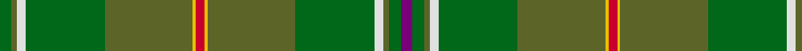

In pattern [BGGWGGYRYGGWGG](/patterns/bggwggyryggwgg/).

This was sourced from register-of-tartans.  It is a [14 stripes tartan](/stripes/stripes14/).

Original link https://www.tartanregister.gov.uk/tartanDetails.aspx?ref=1590

## Thread count
Ga/8 G4 LN6 Ga54 G60 Y2 R6 Y2 G60 Ga54 LN6 G4 Ga8 P/8

## Palette
Each colour and its ΔE from the base-6 reference it is a variant of.

| Colour | Shade | Base | ΔE (OKLab) |
|---|---|---|---|
| G | <code style="background-color:#5C6428;">#5C6428</code> `#5C6428` | G <code style="background-color:#006100;">#006100</code> | 0.10 |
| Ga | <code style="background-color:#006818;">#006818</code> `#006818` | G <code style="background-color:#006100;">#006100</code> | 0.02 |
| LG | <code style="background-color:#789484;">#789484</code> `#789484` | G <code style="background-color:#006100;">#006100</code> | 0.24 |
| LN | <code style="background-color:#E0E0E0;">#E0E0E0</code> `#E0E0E0` | W <code style="background-color:#F7F7F7;">#F7F7F7</code> | 0.07 |
| LR | <code style="background-color:#EC34C4;">#EC34C4</code> `#EC34C4` | R <code style="background-color:#CC0000;">#CC0000</code> | 0.24 |
| P | <code style="background-color:#780078;">#780078</code> `#780078` | B <code style="background-color:#2A418A;">#2A418A</code> | 0.17 |
| R | <code style="background-color:#C8002C;">#C8002C</code> `#C8002C` | R <code style="background-color:#CC0000;">#CC0000</code> | 0.03 |
| Y | <code style="background-color:#E8C000;">#E8C000</code> `#E8C000` | Y <code style="background-color:#F2BF00;">#F2BF00</code> | 0.02 |

## Nearest tartans

The nearest existing variants by ΔTartan distance.

1. [Hannigan of Dirleton (Personal)](/setts/s8/b4g4ga2w3g27ga30y1r3x2~b780078-g006818-ga5c6428-rc8002c-we0e0e0-ye8c000/) — ΔT 1.40
1. [Ensign of Ontario Canadian Tartan Tartan Number: 2032. Earliest known date: 1965 The Ensign tartan owes its inspiration to the Provincial Coat of Arms which was granted to the province by Royal Warrant of Queen Victoria in 1868. The yellow is taken from the three golden maple leaves of the lower shield and the red from the cross of St George on the upper. The black and brown come from the bear, the moose and the deer. There is also a District tartan called Northern Ontario. See products available Copyright © Blair Urquhart, Comrie, 2015](/setts/s15/g21k1r4k1ga21g3ga3g3ga21g3y4g21ga3g3ga3x2~g006818-ga604000-k101010-rc80000-ye8c000/) — ΔT 1.41
1. [Field Gun Association (Corporate)](/setts/s13/r2g12ga3g2ga2g2ga16b4g12w1ga8g14y2x2~b5c8ca8-g004c2c-ga006818-rc80000-we0e0e0-ye8c000/) — ΔT 1.65
1. [Yorkland (Personal)](/setts/s8/b36r2b4w1g14ga4y2ga18x2~b2c6074-g805400-ga006818-rc80000-we0e0e0-ye8c000/) — ΔT 1.73
1. [Broons, The (DC Thomson)](/setts/s9/r3k1g8y1ga7y1g19gb25k1x2~g556b2f-ga603311-gb8b6508-k101010-rff0000-yffd700/) — ΔT 1.79
1. [Fitzgibbon (Name)](/setts/s9/g2y6ga24r2gb2g1gb6g10ga2x2~g003820-ga007418-gb604c00-rc80000-ya08858/) — ΔT 1.82
1. [All Ireland Green (Fashion)](/setts/s13/g6ga2r2g30gb2ga4gb2gc2gb1gc20gb1ga2r4x2~g006818-ga289c18-gb808080-gc003820-r880000/) — ΔT 1.83
1. [Currie (Clan)](/setts/s13/g44k1g3y3g3w1ga21w1ga3w3ga3w1ga21x2~g408060-ga007800-k000000-wfcfcfc-ye8c000/) — ΔT 1.89
1. [Ensign of Ontario (Fashion)](/setts/s15/g21k1r4k1ga21g3ga3g3ga21g3y4g21ga3g3ga3x2~g006038-ga604000-k101010-rc80000-ybc8c00/) — ΔT 1.91
1. [Ensign of Ontario](/setts/s15/g21k1r4k1ga21g3ga3g3ga21g3y4g21ga3g3ga3x2~g003820-ga604000-k101010-rc80000-ybc8c00/) — ΔT 1.95

## Neighbour map

Every grey dot is one of 15726 variants placed by the first two principal components of the ΔTartan feature space (44% of its variance). Red is this tartan; blue dots are its nearest — click one to open its page.

<svg viewBox="0 0 640 380" role="img" style="max-width:100%;height:auto;border:1px solid #e0e0e0;border-radius:4px;display:block" xmlns="http://www.w3.org/2000/svg"><image href="/nn/cloud.v1.png" width="640" height="380"/><a href="/setts/s8/b4g4ga2w3g27ga30y1r3x2~b780078-g006818-ga5c6428-rc8002c-we0e0e0-ye8c000/"><circle cx="331.6" cy="135.0" r="4" fill="#3465a4"><title>Hannigan of Dirleton (Personal)</title></circle></a><a href="/setts/s15/g21k1r4k1ga21g3ga3g3ga21g3y4g21ga3g3ga3x2~g006818-ga604000-k101010-rc80000-ye8c000/"><circle cx="365.1" cy="155.9" r="4" fill="#3465a4"><title>Ensign of Ontario Canadian Tartan Tartan Number: 2032. Earliest known date: 1965 The Ensign tartan owes its inspiration to the Provincial Coat of Arms which was granted to the province by Royal Warrant of Queen Victoria in 1868. The yellow is taken from the three golden maple leaves of the lower shield and the red from the cross of St George on the upper. The black and brown come from the bear, the moose and the deer. There is also a District tartan called Northern Ontario. See products available Copyright © Blair Urquhart, Comrie, 2015</title></circle></a><a href="/setts/s13/r2g12ga3g2ga2g2ga16b4g12w1ga8g14y2x2~b5c8ca8-g004c2c-ga006818-rc80000-we0e0e0-ye8c000/"><circle cx="334.2" cy="177.3" r="4" fill="#3465a4"><title>Field Gun Association (Corporate)</title></circle></a><a href="/setts/s8/b36r2b4w1g14ga4y2ga18x2~b2c6074-g805400-ga006818-rc80000-we0e0e0-ye8c000/"><circle cx="362.8" cy="141.1" r="4" fill="#3465a4"><title>Yorkland (Personal)</title></circle></a><a href="/setts/s9/r3k1g8y1ga7y1g19gb25k1x2~g556b2f-ga603311-gb8b6508-k101010-rff0000-yffd700/"><circle cx="321.0" cy="140.5" r="4" fill="#3465a4"><title>Broons, The (DC Thomson)</title></circle></a><a href="/setts/s9/g2y6ga24r2gb2g1gb6g10ga2x2~g003820-ga007418-gb604c00-rc80000-ya08858/"><circle cx="327.2" cy="159.9" r="4" fill="#3465a4"><title>Fitzgibbon (Name)</title></circle></a><a href="/setts/s13/g6ga2r2g30gb2ga4gb2gc2gb1gc20gb1ga2r4x2~g006818-ga289c18-gb808080-gc003820-r880000/"><circle cx="332.4" cy="120.6" r="4" fill="#3465a4"><title>All Ireland Green (Fashion)</title></circle></a><a href="/setts/s13/g44k1g3y3g3w1ga21w1ga3w3ga3w1ga21x2~g408060-ga007800-k000000-wfcfcfc-ye8c000/"><circle cx="374.8" cy="101.8" r="4" fill="#3465a4"><title>Currie (Clan)</title></circle></a><a href="/setts/s15/g21k1r4k1ga21g3ga3g3ga21g3y4g21ga3g3ga3x2~g006038-ga604000-k101010-rc80000-ybc8c00/"><circle cx="405.7" cy="172.9" r="4" fill="#3465a4"><title>Ensign of Ontario (Fashion)</title></circle></a><a href="/setts/s15/g21k1r4k1ga21g3ga3g3ga21g3y4g21ga3g3ga3x2~g003820-ga604000-k101010-rc80000-ybc8c00/"><circle cx="389.2" cy="166.4" r="4" fill="#3465a4"><title>Ensign of Ontario</title></circle></a><circle cx="352.9" cy="123.8" r="5" fill="#c00000"/></svg>

ID: /setts/s14/b4g4ga2w3g27ga30y1r3y1ga30g27w3ga2g4x2~b780078-g006818-ga5c6428-rc8002c-we0e0e0-ye8c000/
