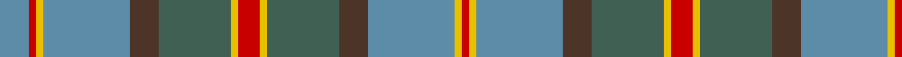

In pattern [BRYBBGYRYGBBYR](/patterns/brybbgyrygbbyr/).

This was sourced from register-of-tartans.  It is a [14 stripes tartan](/stripes/stripes14/).

Original link https://www.tartanregister.gov.uk/tartanDetails.aspx?ref=1626

## Register references

External register numbers recorded for this tartan.

- Scottish Register of Tartans: [1626](https://www.tartanregister.gov.uk/tartanDetails.aspx?ref=1626)
- Scottish Tartans Authority (ITI): 5163

## Thread count
Ba/16 R4 Y4 Ba48 T16 N40 Y4 R12 Y4 N40 T16 Ba48 Y4 R/4

## Palette
Each colour and its ΔE from the base-6 reference it is a variant of.

| Colour | Shade | Base | ΔE (OKLab) |
|---|---|---|---|
| B | <code style="background-color:#1474B4;">#1474B4</code> `#1474B4` | B <code style="background-color:#2A418A;">#2A418A</code> | 0.15 |
| Ba | <code style="background-color:#5C8CA8;">#5C8CA8</code> `#5C8CA8` | B <code style="background-color:#2A418A;">#2A418A</code> | 0.23 |
| DR | <code style="background-color:#880000;">#880000</code> `#880000` | R <code style="background-color:#CC0000;">#CC0000</code> | 0.15 |
| DY | <code style="background-color:#D09800;">#D09800</code> `#D09800` | Y <code style="background-color:#F2BF00;">#F2BF00</code> | 0.12 |
| N | <code style="background-color:#406054;">#406054</code> `#406054` | G <code style="background-color:#006100;">#006100</code> | 0.11 |
| R | <code style="background-color:#C80000;">#C80000</code> `#C80000` | R <code style="background-color:#CC0000;">#CC0000</code> | 0.01 |
| T | <code style="background-color:#4C3428;">#4C3428</code> `#4C3428` | B <code style="background-color:#2A418A;">#2A418A</code> | 0.17 |
| Y | <code style="background-color:#E8C000;">#E8C000</code> `#E8C000` | Y <code style="background-color:#F2BF00;">#F2BF00</code> | 0.02 |

## Nearest tartans

The nearest existing variants by ΔTartan distance.

1. [Tasmanian](/setts/s11/r2y1g12ga1g1ga1g3ga4r3ga4ya2~g405040-ga808080-r802040-ye0a0a0-yaffe000~x4/) — ΔT 1.00
1. [Aceo](/setts/s12/k2g10b5g20b5y3b7k3b7k4b4w2~b646464-g789484-k101010-wffffff-ybc8c00~x2/) — ΔT 1.04
1. [Pitcairn Hunting Corporate Tartan Tartan Number: 6727. Earliest known date: Not Specified A hunting version of #2199 (original Scottish Tartans Authority reference) Pitcarin Heritage. It is presumed it was designed by the same Diene Duncan and it was woven by D C Dalgliesh of Selkirk. See #2199 (original Scottish Tartans Authority reference) for background and mention of the Pitcairn Heritage Trust which does not seem to exist any longer (Aug 2005)./Threadcount and colours aren't 100% original. Generated manually./ See products available Copyright © Blair Urquhart, Comrie, 2015](/setts/s13/b3ba3b3ba3b3g23ba2y2ba23r6b8y2ba2~ba468c4-ba20608c-g006818-rc80000-ye8c000~x2/) — ΔT 1.07
1. [Hebridean Granite](/setts/s14/y4r4k4r18k3b36w3b36k3r18k4r4y4r3~b5c5c5c-k101010-r888888-wf8f8f8-ya0a0a0~x2/) — ΔT 1.08
1. [Dorcas (Fashion)](/setts/s12/r4g20b2g2b2g3b6ra26w3ra2w2ra4~b003c64-g408060-r880000-raa07c58-we8ccb8~x2/) — ΔT 1.12
1. [Scottish Power Corporate Tartan Tartan Number: 2435. Earliest known date: pre 1996 Designed by Lochcarron for Scottish Power using the main corporate colours and taking care to produce a sett that could be seen as pipe band kilts at a distance. Scottish Power say (9.12.02) that Kinloch Anderson deal with this tartan and that permission to order/wear it is required from Scottish Power, Corporate Communications, 0141 566 4856. . See products available Copyright © Blair Urquhart, Comrie, 2015](/setts/s14/g8r3g8k10b5ga32g5ga32b5k10g8r3g8b3~b6c0070-g005448-ga408060-k101010-r880000~x2/) — ΔT 1.13
1. [Morneau (Quebec), Richard (Personal)](/setts/s10/b29ba8g21r3g8b16w3ba3w3g8~b5f749c-ba3d3134-g649848-rca2625-wf9f5ef~x2/) — ΔT 1.14
1. [Fraser hunting](/setts/s11/r3ra18g10ra2b10ra2b10ra2g10ra18w3~b304080-g008000-rc00000-ra806050-we0e0e0~x2/) — ΔT 1.14
1. [Fraser, hunting](/setts/s16/w2r14g7r1b7r1b7r1g7r14ra2r14g7r1b7r1~b304080-g008000-r806050-rac00000-we0e0e0~x4/) — ΔT 1.16
1. [Hawaii (District)](/setts/s8/b4r1y1b12ba4g10y1r3~b5c8ca8-ba4c3428-g406054-rc80000-ye8c000~x4/) — ΔT 1.16

## Neighbour map

Every grey dot is one of 15726 variants placed by the first two principal components of the ΔTartan feature space (44% of its variance). Red is this tartan; blue dots are its nearest — click one to open its page.

<svg viewBox="0 0 640 380" role="img" style="max-width:100%;height:auto;border:1px solid #e0e0e0;border-radius:4px;display:block" xmlns="http://www.w3.org/2000/svg"><image href="/nn/cloud.v1.png" width="640" height="380"/><a href="/setts/s11/r2y1g12ga1g1ga1g3ga4r3ga4ya2~g405040-ga808080-r802040-ye0a0a0-yaffe000~x4/"><circle cx="266.8" cy="162.4" r="4" fill="#3465a4"><title>Tasmanian</title></circle></a><a href="/setts/s12/k2g10b5g20b5y3b7k3b7k4b4w2~b646464-g789484-k101010-wffffff-ybc8c00~x2/"><circle cx="212.4" cy="175.2" r="4" fill="#3465a4"><title>Aceo</title></circle></a><a href="/setts/s13/b3ba3b3ba3b3g23ba2y2ba23r6b8y2ba2~ba468c4-ba20608c-g006818-rc80000-ye8c000~x2/"><circle cx="216.5" cy="142.5" r="4" fill="#3465a4"><title>Pitcairn Hunting Corporate Tartan Tartan Number: 6727. Earliest known date: Not Specified A hunting version of #2199 (original Scottish Tartans Authority reference) Pitcarin Heritage. It is presumed it was designed by the same Diene Duncan and it was woven by D C Dalgliesh of Selkirk. See #2199 (original Scottish Tartans Authority reference) for background and mention of the Pitcairn Heritage Trust which does not seem to exist any longer (Aug 2005)./Threadcount and colours aren't 100% original. Generated manually./ See products available Copyright © Blair Urquhart, Comrie, 2015</title></circle></a><a href="/setts/s14/y4r4k4r18k3b36w3b36k3r18k4r4y4r3~b5c5c5c-k101010-r888888-wf8f8f8-ya0a0a0~x2/"><circle cx="298.3" cy="147.1" r="4" fill="#3465a4"><title>Hebridean Granite</title></circle></a><a href="/setts/s12/r4g20b2g2b2g3b6ra26w3ra2w2ra4~b003c64-g408060-r880000-raa07c58-we8ccb8~x2/"><circle cx="267.8" cy="144.5" r="4" fill="#3465a4"><title>Dorcas (Fashion)</title></circle></a><a href="/setts/s14/g8r3g8k10b5ga32g5ga32b5k10g8r3g8b3~b6c0070-g005448-ga408060-k101010-r880000~x2/"><circle cx="237.1" cy="167.9" r="4" fill="#3465a4"><title>Scottish Power Corporate Tartan Tartan Number: 2435. Earliest known date: pre 1996 Designed by Lochcarron for Scottish Power using the main corporate colours and taking care to produce a sett that could be seen as pipe band kilts at a distance. Scottish Power say (9.12.02) that Kinloch Anderson deal with this tartan and that permission to order/wear it is required from Scottish Power, Corporate Communications, 0141 566 4856. . See products available Copyright © Blair Urquhart, Comrie, 2015</title></circle></a><a href="/setts/s10/b29ba8g21r3g8b16w3ba3w3g8~b5f749c-ba3d3134-g649848-rca2625-wf9f5ef~x2/"><circle cx="230.1" cy="182.9" r="4" fill="#3465a4"><title>Morneau (Quebec), Richard (Personal)</title></circle></a><a href="/setts/s11/r3ra18g10ra2b10ra2b10ra2g10ra18w3~b304080-g008000-rc00000-ra806050-we0e0e0~x2/"><circle cx="248.0" cy="200.0" r="4" fill="#3465a4"><title>Fraser hunting</title></circle></a><a href="/setts/s16/w2r14g7r1b7r1b7r1g7r14ra2r14g7r1b7r1~b304080-g008000-r806050-rac00000-we0e0e0~x4/"><circle cx="293.0" cy="167.2" r="4" fill="#3465a4"><title>Fraser, hunting</title></circle></a><a href="/setts/s8/b4r1y1b12ba4g10y1r3~b5c8ca8-ba4c3428-g406054-rc80000-ye8c000~x4/"><circle cx="248.0" cy="183.9" r="4" fill="#3465a4"><title>Hawaii (District)</title></circle></a><circle cx="236.8" cy="159.8" r="5" fill="#c00000"/></svg>

ID: /setts/s14/b4r1y1b12ba4g10y1r3y1g10ba4b12y1r1~b5c8ca8-ba4c3428-g406054-rc80000-ye8c000~x4/
