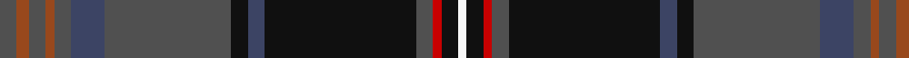

In pattern [BRBRBBBKBKBRKW](/patterns/brbrbbbkbkbrkw/).

This was sourced from house-of-tartan.  It is a [14 stripes tartan](/stripes/stripes14/).

Original link http://www.house-of-tartan.scotland.net/house/TartanViewjs.asp?colr=Def&tnam=6857

## Thread count
N/4 T3 N4 T2 N4 Nb8 N30 K4 Nb4 K36 N4 R2 K4 W/2

## Palette
Each colour and its ΔE from the base-6 reference it is a variant of.

| Colour | Shade | Base | ΔE (OKLab) |
|---|---|---|---|
| DB | <code style="background-color:#2C2C80;">#2C2C80</code> `#2C2C80` | B <code style="background-color:#2A418A;">#2A418A</code> | 0.06 |
| DR | <code style="background-color:#A00000;">#A00000</code> `#A00000` | R <code style="background-color:#CC0000;">#CC0000</code> | 0.09 |
| K | <code style="background-color:#101010;">#101010</code> `#101010` | K <code style="background-color:#000000;">#000000</code> | 0.17 |
| N | <code style="background-color:#505050;">#505050</code> `#505050` | B <code style="background-color:#2A418A;">#2A418A</code> | 0.13 |
| Na | <code style="background-color:#344054;">#344054</code> `#344054` | B <code style="background-color:#2A418A;">#2A418A</code> | 0.09 |
| Nb | <code style="background-color:#3C4464;">#3C4464</code> `#3C4464` | B <code style="background-color:#2A418A;">#2A418A</code> | 0.07 |
| R | <code style="background-color:#C80000;">#C80000</code> `#C80000` | R <code style="background-color:#CC0000;">#CC0000</code> | 0.01 |
| T | <code style="background-color:#98481C;">#98481C</code> `#98481C` | R <code style="background-color:#CC0000;">#CC0000</code> | 0.11 |
| Ta | <code style="background-color:#4C3428;">#4C3428</code> `#4C3428` | B <code style="background-color:#2A418A;">#2A418A</code> | 0.17 |
| W | <code style="background-color:#F8F8F8;">#F8F8F8</code> `#F8F8F8` | W <code style="background-color:#F7F7F7;">#F7F7F7</code> | 0.00 |

## Nearest tartans

The nearest existing variants by ΔTartan distance.

1. [Capercaillie](/setts/s14/b4r3b4r2b4ba8b30k4ba4k36b4ra2k4w2~b4c3428-ba2c2c80-k101010-r98481c-rac80000-wf8f8f8/) — ΔT 0.65
1. [Scottish Spirit Fashion Tartan Tartan Number: 10970. Earliest known date: 2013 ACS Clothing. Designed by Lochcarron. Wanted 'Highland Spirit' but that was taken by Ian McLure of T J Matthews. See products available Copyright © Blair Urquhart, Comrie, 2015](/setts/s12/b10r3b32g12k5g2k4g2k17ra4k2y2~b484848-g747474-k101010-r88243c-ra8c708c-ya0a0a0~x2/) — ΔT 0.84
1. [Six Frigates (US)](/setts/s10/b3k1y2k1ba10k17ba2b1g1r1~b5f749c-ba141e46-g603800-k1c1714-rc82828-ye0a126~x2/) — ΔT 1.02
1. [Causeway, The (District)](/setts/s15/b38ba8bb3b20ba42k2g6k2ba2bc3ba2w2bb10ba2k6~b1c1c1c-ba5c5c5c-bb2c2c80-bc780078-g006818-k101010-wfcfcfc/) — ΔT 1.05
1. [Knox (Personal)](/setts/s13/g55ga20w2ga3k2ga3w2ga3b18k2ga4y2ga3~b2c2c80-g003820-ga744c34-k101010-we0e0e0-ye8c000~x2/) — ΔT 1.12
1. [McGuirk (2013)](/setts/s12/g4r1g1r3g16k12r1b27w2b3w1y2~b202060-g003820-k101010-ra00000-wa8ace8-ye8c000~x2/) — ΔT 1.13
1. [Glen Orchy (Fashion)](/setts/s15/g5r4ra1b36r4g15r8ga1b15r4g36r4rb1b5ga1~b202060-g003820-ga789484-rc80000-ra981c70-rbe87878~x2/) — ΔT 1.14
1. [Scragg Moran (Personal)](/setts/s10/g1b28k11r5w1r5k11y1k2g1~b14465c-g509721-k120a01-r89051b-wddd5af-yc1ae8c~x2/) — ΔT 1.14
1. [Unidentified #7](/setts/s11/b2r2b2r2b20k24g12y1k2g2ba2~b2c4084-ba3c82af-g005020-k101010-rdc0000-ye8c000~x2/) — ΔT 1.17
1. [San Diego, The](/setts/s11/r2y2b3g30ba8b3ba2b3ba2b16w2~b141e46-ba5f749c-g003c14-ra00000-wc4c7ca-yfccc00~x2/) — ΔT 1.17

## Neighbour map

Every grey dot is one of 15726 variants placed by the first two principal components of the ΔTartan feature space (44% of its variance). Red is this tartan; blue dots are its nearest — click one to open its page.

<svg viewBox="0 0 640 380" role="img" style="max-width:100%;height:auto;border:1px solid #e0e0e0;border-radius:4px;display:block" xmlns="http://www.w3.org/2000/svg"><image href="/nn/cloud.v1.png" width="640" height="380"/><a href="/setts/s14/b4r3b4r2b4ba8b30k4ba4k36b4ra2k4w2~b4c3428-ba2c2c80-k101010-r98481c-rac80000-wf8f8f8/"><circle cx="283.8" cy="117.2" r="4" fill="#3465a4"><title>Capercaillie</title></circle></a><a href="/setts/s12/b10r3b32g12k5g2k4g2k17ra4k2y2~b484848-g747474-k101010-r88243c-ra8c708c-ya0a0a0~x2/"><circle cx="257.5" cy="134.6" r="4" fill="#3465a4"><title>Scottish Spirit Fashion Tartan Tartan Number: 10970. Earliest known date: 2013 ACS Clothing. Designed by Lochcarron. Wanted 'Highland Spirit' but that was taken by Ian McLure of T J Matthews. See products available Copyright © Blair Urquhart, Comrie, 2015</title></circle></a><a href="/setts/s10/b3k1y2k1ba10k17ba2b1g1r1~b5f749c-ba141e46-g603800-k1c1714-rc82828-ye0a126~x2/"><circle cx="294.7" cy="130.0" r="4" fill="#3465a4"><title>Six Frigates (US)</title></circle></a><a href="/setts/s15/b38ba8bb3b20ba42k2g6k2ba2bc3ba2w2bb10ba2k6~b1c1c1c-ba5c5c5c-bb2c2c80-bc780078-g006818-k101010-wfcfcfc/"><circle cx="241.4" cy="90.3" r="4" fill="#3465a4"><title>Causeway, The (District)</title></circle></a><a href="/setts/s13/g55ga20w2ga3k2ga3w2ga3b18k2ga4y2ga3~b2c2c80-g003820-ga744c34-k101010-we0e0e0-ye8c000~x2/"><circle cx="304.4" cy="86.3" r="4" fill="#3465a4"><title>Knox (Personal)</title></circle></a><a href="/setts/s12/g4r1g1r3g16k12r1b27w2b3w1y2~b202060-g003820-k101010-ra00000-wa8ace8-ye8c000~x2/"><circle cx="254.3" cy="103.5" r="4" fill="#3465a4"><title>McGuirk (2013)</title></circle></a><a href="/setts/s15/g5r4ra1b36r4g15r8ga1b15r4g36r4rb1b5ga1~b202060-g003820-ga789484-rc80000-ra981c70-rbe87878~x2/"><circle cx="285.3" cy="88.9" r="4" fill="#3465a4"><title>Glen Orchy (Fashion)</title></circle></a><a href="/setts/s10/g1b28k11r5w1r5k11y1k2g1~b14465c-g509721-k120a01-r89051b-wddd5af-yc1ae8c~x2/"><circle cx="273.9" cy="110.3" r="4" fill="#3465a4"><title>Scragg Moran (Personal)</title></circle></a><a href="/setts/s11/b2r2b2r2b20k24g12y1k2g2ba2~b2c4084-ba3c82af-g005020-k101010-rdc0000-ye8c000~x2/"><circle cx="229.3" cy="110.8" r="4" fill="#3465a4"><title>Unidentified #7</title></circle></a><a href="/setts/s11/r2y2b3g30ba8b3ba2b3ba2b16w2~b141e46-ba5f749c-g003c14-ra00000-wc4c7ca-yfccc00~x2/"><circle cx="229.7" cy="124.4" r="4" fill="#3465a4"><title>San Diego, The</title></circle></a><circle cx="267.6" cy="110.8" r="5" fill="#c00000"/></svg>

ID: /setts/s14/b4r3b4r2b4ba8b30k4ba4k36b4ra2k4w2~b505050-ba3c4464-k101010-r98481c-rac80000-wf8f8f8/
