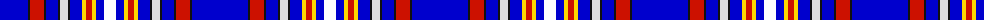

In pattern [BKRKBKWKBYRYBW](/patterns/bkrkbkwkbyrybw/).

This was sourced from register-of-tartans.  It is a [14 stripes tartan](/stripes/stripes14/).

Original link https://www.tartanregister.gov.uk/tartanDetails.aspx?ref=10100

## Thread count
B/56 K2 R14 K2 B12 K2 LN8 K2 B12 Y4 R6 Y4 B8 W/12

## Palette
Each colour and its ΔE from the base-6 reference it is a variant of.

| Colour | Shade | Base | ΔE (OKLab) |
|---|---|---|---|
| B | <code style="background-color:#0000CD;">#0000CD</code> `#0000CD` | B <code style="background-color:#2A418A;">#2A418A</code> | 0.14 |
| G | <code style="background-color:#008000;">#008000</code> `#008000` | G <code style="background-color:#006100;">#006100</code> | 0.10 |
| K | <code style="background-color:#101010;">#101010</code> `#101010` | K <code style="background-color:#000000;">#000000</code> | 0.17 |
| LN | <code style="background-color:#DCDCDC;">#DCDCDC</code> `#DCDCDC` | W <code style="background-color:#F7F7F7;">#F7F7F7</code> | 0.08 |
| R | <code style="background-color:#CC1100;">#CC1100</code> `#CC1100` | R <code style="background-color:#CC0000;">#CC0000</code> | 0.01 |
| W | <code style="background-color:#FFFFFF;">#FFFFFF</code> `#FFFFFF` | W <code style="background-color:#F7F7F7;">#F7F7F7</code> | 0.02 |
| Y | <code style="background-color:#FFD700;">#FFD700</code> `#FFD700` | Y <code style="background-color:#F2BF00;">#F2BF00</code> | 0.06 |

## Nearest tartans

The nearest existing variants by ΔTartan distance.

1. [Murison (2014)](/setts/s12/r8b22ba8w6ba8y12b6k6b8k2b60w6-b0000cd-ba788cb4-k101010-rdc0000-wffffff-ye0a126/) — ΔT 0.76
1. [Rabbinical (Corporate)](/setts/s14/b56k2r14k2b12k2ra8k2b12y4r6y4b8w12-b3850c8-k101010-rc80000-ra888888-we0e0e0-ye8c000/) — ΔT 1.35
1. [Summerwood (School)](/setts/s12/b76w3r4w3g4w3ga8b19ba20b3ba8w10-b2c2c80-ba2888c4-g006818-ga003820-rc80000-we0e0e0/) — ΔT 1.46
1. [Crombie, Harry (Personal)](/setts/s14/b10g2ba60y4ba8y6ba6y8ba4y10ba4bb18ba2w4-b64008c-ba141e46-bb0596fa-g146400-wf8f8f8-y48a4c0/) — ΔT 1.62
1. [Gemmell Blue (2001) (Personal)](/setts/s10/k10w4k4b10ba96w14bb12w4r4w4-b2474e8-ba1c0070-bb3850c8-k101010-r880000-wc0c0c0/) — ΔT 1.63
1. [Summerwood](/setts/s12/b76w3r4w3g4w3ga8b20wa20b3wa8w10-b2e4b95-g09401f-ga024f21-rdc0000-wffffff-wa66e7e9/) — ΔT 1.70
1. [Dress Blue](/setts/s7/r8w32k6b88r2wa6y4-b000080-k101010-re3170d-w82cffd-waffffff-yffe700/) — ΔT 1.72
1. [Spirit of India (Fashion)](/setts/s13/b64w4ba2w4b8ba2g16w16y16ba2b32ba2w8-b2c2c80-ba202060-g006818-wfcfcfc-ybc8c00/) — ΔT 1.73
1. [Akashi](/setts/s12/w8b8w4b64ba6wa6b4wa6ba10b30y2w5-b3850c8-ba1c1c50-wffffff-wa98c8e8-yec8048/) — ΔT 1.75
1. [Vilaro-Thomas (Personal)](/setts/s11/w4wa2w30b12w14b6r2b6w6b52y4-b1c1c50-rc80000-wa8ace8-wae0e0e0-ye8c000/) — ΔT 1.76

## Neighbour map

Every grey dot is one of 15726 variants placed by the first two principal components of the ΔTartan feature space (44% of its variance). Red is this tartan; blue dots are its nearest — click one to open its page.

<svg viewBox="0 0 640 380" role="img" style="max-width:100%;height:auto;border:1px solid #e0e0e0;border-radius:4px;display:block" xmlns="http://www.w3.org/2000/svg"><image href="/nn/cloud.v1.png" width="640" height="380"/><a href="/setts/s12/r8b22ba8w6ba8y12b6k6b8k2b60w6-b0000cd-ba788cb4-k101010-rdc0000-wffffff-ye0a126/"><circle cx="306.2" cy="79.8" r="4" fill="#3465a4"><title>Murison (2014)</title></circle></a><a href="/setts/s14/b56k2r14k2b12k2ra8k2b12y4r6y4b8w12-b3850c8-k101010-rc80000-ra888888-we0e0e0-ye8c000/"><circle cx="314.1" cy="67.9" r="4" fill="#3465a4"><title>Rabbinical (Corporate)</title></circle></a><a href="/setts/s12/b76w3r4w3g4w3ga8b19ba20b3ba8w10-b2c2c80-ba2888c4-g006818-ga003820-rc80000-we0e0e0/"><circle cx="328.4" cy="79.2" r="4" fill="#3465a4"><title>Summerwood (School)</title></circle></a><a href="/setts/s14/b10g2ba60y4ba8y6ba6y8ba4y10ba4bb18ba2w4-b64008c-ba141e46-bb0596fa-g146400-wf8f8f8-y48a4c0/"><circle cx="297.8" cy="71.0" r="4" fill="#3465a4"><title>Crombie, Harry (Personal)</title></circle></a><a href="/setts/s10/k10w4k4b10ba96w14bb12w4r4w4-b2474e8-ba1c0070-bb3850c8-k101010-r880000-wc0c0c0/"><circle cx="318.9" cy="79.5" r="4" fill="#3465a4"><title>Gemmell Blue (2001) (Personal)</title></circle></a><a href="/setts/s12/b76w3r4w3g4w3ga8b20wa20b3wa8w10-b2e4b95-g09401f-ga024f21-rdc0000-wffffff-wa66e7e9/"><circle cx="306.4" cy="68.3" r="4" fill="#3465a4"><title>Summerwood</title></circle></a><a href="/setts/s7/r8w32k6b88r2wa6y4-b000080-k101010-re3170d-w82cffd-waffffff-yffe700/"><circle cx="322.4" cy="75.3" r="4" fill="#3465a4"><title>Dress Blue</title></circle></a><a href="/setts/s13/b64w4ba2w4b8ba2g16w16y16ba2b32ba2w8-b2c2c80-ba202060-g006818-wfcfcfc-ybc8c00/"><circle cx="304.6" cy="80.1" r="4" fill="#3465a4"><title>Spirit of India (Fashion)</title></circle></a><a href="/setts/s12/w8b8w4b64ba6wa6b4wa6ba10b30y2w5-b3850c8-ba1c1c50-wffffff-wa98c8e8-yec8048/"><circle cx="399.3" cy="90.5" r="4" fill="#3465a4"><title>Akashi</title></circle></a><a href="/setts/s11/w4wa2w30b12w14b6r2b6w6b52y4-b1c1c50-rc80000-wa8ace8-wae0e0e0-ye8c000/"><circle cx="310.2" cy="101.4" r="4" fill="#3465a4"><title>Vilaro-Thomas (Personal)</title></circle></a><circle cx="286.1" cy="62.4" r="5" fill="#c00000"/></svg>

ID: /setts/s14/b56k2r14k2b12k2w8k2b12y4r6y4b8wa12-b0000cd-k101010-rcc1100-wdcdcdc-waffffff-yffd700/
