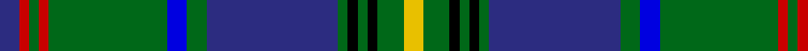

In pattern [BRGRGBGBGKGKGY](/patterns/brgrgbgbgkgkgy/).

This was sourced from register-of-tartans.  It is a [14 stripes tartan](/stripes/stripes14/).

Original link https://www.tartanregister.gov.uk/tartanDetails.aspx?ref=3400

## Attestations

This cloth appears in 2 source records; the oldest owns this page.

- 01/01/1930 — Princess Beatrice Hunting (MacKinlay strip) (register-of-tartans, [record](https://www.tartanregister.gov.uk/tartanDetails.aspx?ref=3400))
- 1930s — Princess Beatrice Htg (Fashion) (tartans-authority, [record](http://www.tartansauthority.com/tartan-ferret/display/5467/))

## Thread count
DB/12 R6 G6 R6 G72 B12 G12 DB80 G6 K6 G6 K6 G16 Y/12

## Palette
Each colour and its ΔE from the base-6 reference it is a variant of.

| Colour | Shade | Base | ΔE (OKLab) |
|---|---|---|---|
| B | <code style="background-color:#0000E0;">#0000E0</code> `#0000E0` | B <code style="background-color:#2A418A;">#2A418A</code> | 0.16 |
| DB | <code style="background-color:#2C2C80;">#2C2C80</code> `#2C2C80` | B <code style="background-color:#2A418A;">#2A418A</code> | 0.06 |
| G | <code style="background-color:#006818;">#006818</code> `#006818` | G <code style="background-color:#006100;">#006100</code> | 0.02 |
| K | <code style="background-color:#000000;">#000000</code> `#000000` | K <code style="background-color:#000000;">#000000</code> | 0.00 |
| R | <code style="background-color:#C80000;">#C80000</code> `#C80000` | R <code style="background-color:#CC0000;">#CC0000</code> | 0.01 |
| Y | <code style="background-color:#E8C000;">#E8C000</code> `#E8C000` | Y <code style="background-color:#F2BF00;">#F2BF00</code> | 0.02 |

## Nearest tartans

The nearest existing variants by ΔTartan distance.

1. [Beatrice Princess.. (Hunting) Royal Family Tartan Tartan Number: 545. Earliest known date: pre 2003 Reduced by 1/6th to display. See products available Copyright © Blair Urquhart, Comrie, 2015](/setts/s14/b10r5g5r5g60b13g10ba67g5k5g5k5g13y10~b1c0070-ba202060-g006818-k101010-rc80000-ye8c000/) — ΔT 0.57
1. [Stuart/Stewart Blue](/setts/s12/b29ba3k10y2k2b2k2g10r5k3r2b2~b2888c4-ba2c2c80-g006818-k101010-r880000-yd09800~x2/) — ΔT 0.84
1. [Aberfeldy District Tartan Tartan Number: 7748. Earliest known date: 2008 Designed by Heather Yellowley of Strathmore Woollen Company, Forfar, for the Aberfeldy & District Gaelic Choir. Originally designed for use by the choir in the 2008 MOD in Falkirk but intended for wider use afterwards as the Aberfeldy district tartan. See products available Copyright © Blair Urquhart, Comrie, 2015](/setts/s14/w2b2k2ba2b32r2b2r2k13b2g16r2g2w2~b506878-ba5c8ca8-g007460-k000000-r901c38-we0e0e0~x2/) — ΔT 0.87
1. [Loch Tay](/setts/s11/y3g3r2g16k2b24k2g16r2g3ya3~b000080-g004f00-k101010-re32636-yb8b8b8-yafcd116~x2/) — ΔT 0.91
1. [San Diego Tartan Day (Corporate)](/setts/s11/b2ba16bb2ba3bb2ba3bb8g30ba3y2r2~b5c5c5c-ba202060-bb2888c4-g006818-rc80000-ye8c000~x2/) — ΔT 0.95
1. [Stewart Blue Trade Tartan Tartan Number: 54. Earliest known date: 1956 Weft is slightly different. Commenting on the design, Mr Portch said, "The sett should be exactly the same as Royal Stewart with light Scottish blue replacing the red ground and white over checking." It is not entirely clear if Mr Portch has developed a 'trade variant' or is explaining his view of the 'correct form' of the Blue Stewart. See products available Copyright © Blair Urquhart, Comrie, 2015](/setts/s12/b29ba3k10y2k2b2k2g10r5k3r2b2~b5c8ca8-ba2c2c80-g006818-k101010-rc80000-ye8c000~x2/) — ΔT 0.99
1. [Roach (2015)](/setts/s13/b18w1b1w1b4r4k1g12ga1g1ga1g1ga1~b2c2c80-g006818-ga603800-k101010-ra00000-wfcfcfc~x4/) — ΔT 1.00
1. [Cats Winter (Fashion)](/setts/s12/r8g2k2y2k2ya2k2g18b2g2b29k3~b2c2c80-g006818-k101010-rc80000-ybc8c00-yae8c000~x2/) — ΔT 1.02
1. [MacKellar Clan Tartan Tartan Number: 939. Earliest known date: pre 2003 As worn by Kenneth? - D.C.S. See products available Copyright © Blair Urquhart, Comrie, 2015](/setts/s11/g32w2g2y3g2w2g2k16b2ba16w3~b5c8ca8-ba2c2c80-g006818-k101010-we0e0e0-ye8c000~x2/) — ΔT 1.06
1. [Princess Beatrice Hunting](/setts/s13/b10g5b5g60b13g10ba67g5k5g5k5g13y10~b1c0070-ba202060-g006818-k101010-ye8c000/) — ΔT 1.07

## Neighbour map

Every grey dot is one of 15726 variants placed by the first two principal components of the ΔTartan feature space (44% of its variance). Red is this tartan; blue dots are its nearest — click one to open its page.

<svg viewBox="0 0 640 380" role="img" style="max-width:100%;height:auto;border:1px solid #e0e0e0;border-radius:4px;display:block" xmlns="http://www.w3.org/2000/svg"><image href="/nn/cloud.v1.png" width="640" height="380"/><a href="/setts/s14/b10r5g5r5g60b13g10ba67g5k5g5k5g13y10~b1c0070-ba202060-g006818-k101010-rc80000-ye8c000/"><circle cx="219.8" cy="112.5" r="4" fill="#3465a4"><title>Beatrice Princess.. (Hunting) Royal Family Tartan Tartan Number: 545. Earliest known date: pre 2003 Reduced by 1/6th to display. See products available Copyright © Blair Urquhart, Comrie, 2015</title></circle></a><a href="/setts/s12/b29ba3k10y2k2b2k2g10r5k3r2b2~b2888c4-ba2c2c80-g006818-k101010-r880000-yd09800~x2/"><circle cx="204.6" cy="107.0" r="4" fill="#3465a4"><title>Stuart/Stewart Blue</title></circle></a><a href="/setts/s14/w2b2k2ba2b32r2b2r2k13b2g16r2g2w2~b506878-ba5c8ca8-g007460-k000000-r901c38-we0e0e0~x2/"><circle cx="210.5" cy="86.0" r="4" fill="#3465a4"><title>Aberfeldy District Tartan Tartan Number: 7748. Earliest known date: 2008 Designed by Heather Yellowley of Strathmore Woollen Company, Forfar, for the Aberfeldy &amp; District Gaelic Choir. Originally designed for use by the choir in the 2008 MOD in Falkirk but intended for wider use afterwards as the Aberfeldy district tartan. See products available Copyright © Blair Urquhart, Comrie, 2015</title></circle></a><a href="/setts/s11/y3g3r2g16k2b24k2g16r2g3ya3~b000080-g004f00-k101010-re32636-yb8b8b8-yafcd116~x2/"><circle cx="224.6" cy="135.0" r="4" fill="#3465a4"><title>Loch Tay</title></circle></a><a href="/setts/s11/b2ba16bb2ba3bb2ba3bb8g30ba3y2r2~b5c5c5c-ba202060-bb2888c4-g006818-rc80000-ye8c000~x2/"><circle cx="221.1" cy="120.6" r="4" fill="#3465a4"><title>San Diego Tartan Day (Corporate)</title></circle></a><a href="/setts/s12/b29ba3k10y2k2b2k2g10r5k3r2b2~b5c8ca8-ba2c2c80-g006818-k101010-rc80000-ye8c000~x2/"><circle cx="203.8" cy="102.4" r="4" fill="#3465a4"><title>Stewart Blue Trade Tartan Tartan Number: 54. Earliest known date: 1956 Weft is slightly different. Commenting on the design, Mr Portch said, &quot;The sett should be exactly the same as Royal Stewart with light Scottish blue replacing the red ground and white over checking.&quot; It is not entirely clear if Mr Portch has developed a 'trade variant' or is explaining his view of the 'correct form' of the Blue Stewart. See products available Copyright © Blair Urquhart, Comrie, 2015</title></circle></a><a href="/setts/s13/b18w1b1w1b4r4k1g12ga1g1ga1g1ga1~b2c2c80-g006818-ga603800-k101010-ra00000-wfcfcfc~x4/"><circle cx="263.9" cy="96.0" r="4" fill="#3465a4"><title>Roach (2015)</title></circle></a><a href="/setts/s12/r8g2k2y2k2ya2k2g18b2g2b29k3~b2c2c80-g006818-k101010-rc80000-ybc8c00-yae8c000~x2/"><circle cx="211.7" cy="107.2" r="4" fill="#3465a4"><title>Cats Winter (Fashion)</title></circle></a><a href="/setts/s11/g32w2g2y3g2w2g2k16b2ba16w3~b5c8ca8-ba2c2c80-g006818-k101010-we0e0e0-ye8c000~x2/"><circle cx="203.7" cy="106.0" r="4" fill="#3465a4"><title>MacKellar Clan Tartan Tartan Number: 939. Earliest known date: pre 2003 As worn by Kenneth? - D.C.S. See products available Copyright © Blair Urquhart, Comrie, 2015</title></circle></a><a href="/setts/s13/b10g5b5g60b13g10ba67g5k5g5k5g13y10~b1c0070-ba202060-g006818-k101010-ye8c000/"><circle cx="250.2" cy="137.8" r="4" fill="#3465a4"><title>Princess Beatrice Hunting</title></circle></a><circle cx="223.9" cy="108.3" r="5" fill="#c00000"/></svg>

ID: /setts/s14/b6r3g3r3g36ba6g6b40g3k3g3k3g8y6~b2c2c80-ba0000e0-g006818-k000000-rc80000-ye8c000~x2/
