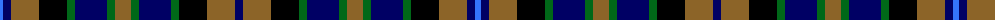

In pattern [BBRKGBGRGBGKRB](/patterns/bbrkgbgrgbgkrb/).

This was sourced from register-of-tartans.  It is a [14 stripes tartan](/stripes/stripes14/).

Original link https://www.tartanregister.gov.uk/tartanDetails.aspx?ref=1734

## Thread count
B/6 DB8 LT28 K28 Ga8 DB32 Ga8 LT16 Ga8 DB32 Ga8 K28 LT28 DB/8

## Palette
Each colour and its ΔE from the base-6 reference it is a variant of.

| Colour | Shade | Base | ΔE (OKLab) |
|---|---|---|---|
| B | <code style="background-color:#3474FC;">#3474FC</code> `#3474FC` | B <code style="background-color:#2C4084;">#2C4084</code> | 0.23 |
| DB | <code style="background-color:#000064;">#000064</code> `#000064` | B <code style="background-color:#2C4084;">#2C4084</code> | 0.17 |
| G | <code style="background-color:#003800;">#003800</code> `#003800` | G <code style="background-color:#006400;">#006400</code> | 0.15 |
| Ga | <code style="background-color:#006818;">#006818</code> `#006818` | G <code style="background-color:#006400;">#006400</code> | 0.02 |
| K | <code style="background-color:#000000;">#000000</code> `#000000` | K <code style="background-color:#000000;">#000000</code> | 0.00 |
| LT | <code style="background-color:#8C6428;">#8C6428</code> `#8C6428` | R <code style="background-color:#C80000;">#C80000</code> | 0.16 |

ID: /setts/s14/b8r28k28g8b32g8r16g8b32g8k28r28b8ba6-b000064-ba3474fc-g006818-k000000-r8c6428/
