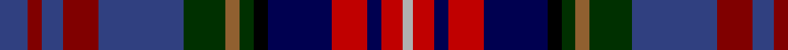

In pattern [BRBRBGRGKBRBRY](/patterns/brbrbgrgkbrbry/).

This was sourced from weddslist.  It is a [14 stripes tartan](/stripes/stripes14/).

Original link http://www.weddslist.com/cgi-bin/tartans/pg.pl?source=sts

## Thread count
B/8 DR4 B6 DR10 B24 DG12 LT4 DG4 K4 DB18 R10 DB4 R6 N/3

## Palette
Each colour and its ΔE from the base-6 reference it is a variant of.

| Colour | Shade | Base | ΔE (OKLab) |
|---|---|---|---|
| B | <code style="background-color:#304080;">#304080</code> `#304080` | B <code style="background-color:#2A418A;">#2A418A</code> | 0.02 |
| DB | <code style="background-color:#000050;">#000050</code> `#000050` | B <code style="background-color:#2A418A;">#2A418A</code> | 0.21 |
| DG | <code style="background-color:#003000;">#003000</code> `#003000` | G <code style="background-color:#006100;">#006100</code> | 0.17 |
| DR | <code style="background-color:#800000;">#800000</code> `#800000` | R <code style="background-color:#CC0000;">#CC0000</code> | 0.17 |
| K | <code style="background-color:#000000;">#000000</code> `#000000` | K <code style="background-color:#000000;">#000000</code> | 0.00 |
| LT | <code style="background-color:#906030;">#906030</code> `#906030` | R <code style="background-color:#CC0000;">#CC0000</code> | 0.15 |
| N | <code style="background-color:#B0B0B0;">#B0B0B0</code> `#B0B0B0` | Y <code style="background-color:#F2BF00;">#F2BF00</code> | 0.18 |
| R | <code style="background-color:#C00000;">#C00000</code> `#C00000` | R <code style="background-color:#CC0000;">#CC0000</code> | 0.03 |

## Nearest tartans

The nearest existing variants by ΔTartan distance.

1. [Hyndman Family Tartan Tartan Number: 2133. Earliest known date: 1992 The tartan was designed for Mr C.P.Hyndman, the first Hyndman to record arms in the Lyon Register since 1672. The colours reflect the armorial bearings and a long family connection with the Royal Inneskillin Fusiliers. The pattern is based on the teritorial origins of the name - Paisley and later Ulster. Mr Hyndman stated in his petition for accreditation that he wished the tartan to be available to "all Hyndmans irrespective of family connections who were born in Northern Ireland." See products available Copyright © Blair Urquhart, Comrie, 2015](/setts/s14/b8r4b6r10b24g12y4g4k4ba18ra10ba4ra6ya3~b2c2c80-ba202060-g003820-k101010-r880000-rac80000-ya08858-yab8b8b8/) — ΔT 0.75
1. [Chattahoochee Commemorative Tartan Tartan Number: 2203. Earliest known date: 1993 The Chatahoochie tartan was conceived by Scottish Borders Enterprize and developed with Lochcarron of Scotland, to signify the spirit of co-operation between Fulton County in Atlanta, Georgia and the Scottish Borders. The red, white and black are the colours of the Atlanta Falcons. See products available Copyright © Blair Urquhart, Comrie, 2015](/setts/s12/w4r4k4r15b12ba12g6ba4g4ba4g19y4~b2c2c80-ba202060-g003820-k101010-rc8002c-we0e0e0-ye8c000/) — ΔT 1.44
1. [Highfield Hunting (Name)](/setts/s11/b10k2g2r2g2k2ba2k2ga4k1gb2~b1c0070-ba441800-g006818-ga603800-gb8c7038-k101010-r880000~x4/) — ΔT 1.47
1. [Iowa](/setts/s14/r4y3g12k16ga5b20k4w2k4b20ga5k16g12y3~b2c2c80-g006818-ga604000-k101010-rc80000-wf8f8f8-ye8c000~x2/) — ΔT 1.48
1. [Iowa American District Tartan Tartan Number: 6051. Earliest known date: 2004 Iowa has a rich history of Scottish influence in the towns and cities. The Iowa Scottish Heritage Society desired to give to the people of Iowa a tartan that symbolizes the state. Blue for the sky, rivers & lakes, Green for the fields our farmers plant. Black for the rich soil for which we are blessed. White for the snow. Red for the barns and the wild rose. Brown for the earth. Yellow for corn and the Goldfinch. Adopted by the State of Iowa General Assembly, resolution No 149 by Heaton & Whitaker. See products available Copyright © Blair Urquhart, Comrie, 2015](/setts/s14/g12k16ga5b20k4w2k4b20ga5k16g12y3r4y3~b2c2c80-g006818-ga604000-k101010-rc80000-wf8f8f8-ye8c000~x2/) — ΔT 1.48
1. [Allison Family Tartan Tartan Number: 314. Earliest known date: 1880 This sample comes from the MacGregor-Hastie collection which forms the basis of the cloth archive of the Scottish Tartans Society. First recorded in the Clans Originaux in 1880. See products available Copyright © Blair Urquhart, Comrie, 2015](/setts/s14/b3k3b15k15y3g15k3g15w3k15ba4r6k3y2~b202060-ba2c2c80-g003820-k101010-rc80000-we0e0e0-ye8c000~x2/) — ΔT 1.50
1. [MacWatts (Personal)](/setts/s16/y4g7b2g2b12g2k2g1k12ba2bb12ba2bb2ba7k2r3~b780078-ba2c2c80-bb1c0070-g006818-k101010-rc80000-ye8c000~x2/) — ΔT 1.55
1. [Huntly Old](/setts/s16/b16y2ba7y2k14bb6y2b15y2g17bb6g6r8k6r8k2~b6e5058-ba59110d-bb4367ae-g11450d-k000000-raa0000-yaaaaaa~x2/) — ΔT 1.56
1. [Huntly Old](/setts/s16/b16y2ba7y2k14bb6y2b15y2g17bb6g6r8k6r8k2~b6e5058-ba59110d-bb4367ae-g11450d-k000000-raa0000-yaaaaaa/) — ΔT 1.56
1. [Boxell of West Niddry, Baron (Personal)](/setts/s11/b27y2b2k12g6r2g12k12ba12ra2ba2~b440044-ba2c2c80-g006818-k101010-r9c68a4-rac80000-ye8c000~x2/) — ΔT 1.56

## Neighbour map

Every grey dot is one of 15726 variants placed by the first two principal components of the ΔTartan feature space (44% of its variance). Red is this tartan; blue dots are its nearest — click one to open its page.

<svg viewBox="0 0 640 380" role="img" style="max-width:100%;height:auto;border:1px solid #e0e0e0;border-radius:4px;display:block" xmlns="http://www.w3.org/2000/svg"><image href="/nn/cloud.v1.png" width="640" height="380"/><a href="/setts/s14/b8r4b6r10b24g12y4g4k4ba18ra10ba4ra6ya3~b2c2c80-ba202060-g003820-k101010-r880000-rac80000-ya08858-yab8b8b8/"><circle cx="73.4" cy="136.5" r="4" fill="#3465a4"><title>Hyndman Family Tartan Tartan Number: 2133. Earliest known date: 1992 The tartan was designed for Mr C.P.Hyndman, the first Hyndman to record arms in the Lyon Register since 1672. The colours reflect the armorial bearings and a long family connection with the Royal Inneskillin Fusiliers. The pattern is based on the teritorial origins of the name - Paisley and later Ulster. Mr Hyndman stated in his petition for accreditation that he wished the tartan to be available to &quot;all Hyndmans irrespective of family connections who were born in Northern Ireland.&quot; See products available Copyright © Blair Urquhart, Comrie, 2015</title></circle></a><a href="/setts/s12/w4r4k4r15b12ba12g6ba4g4ba4g19y4~b2c2c80-ba202060-g003820-k101010-rc8002c-we0e0e0-ye8c000/"><circle cx="37.6" cy="167.5" r="4" fill="#3465a4"><title>Chattahoochee Commemorative Tartan Tartan Number: 2203. Earliest known date: 1993 The Chatahoochie tartan was conceived by Scottish Borders Enterprize and developed with Lochcarron of Scotland, to signify the spirit of co-operation between Fulton County in Atlanta, Georgia and the Scottish Borders. The red, white and black are the colours of the Atlanta Falcons. See products available Copyright © Blair Urquhart, Comrie, 2015</title></circle></a><a href="/setts/s11/b10k2g2r2g2k2ba2k2ga4k1gb2~b1c0070-ba441800-g006818-ga603800-gb8c7038-k101010-r880000~x4/"><circle cx="118.0" cy="150.9" r="4" fill="#3465a4"><title>Highfield Hunting (Name)</title></circle></a><a href="/setts/s14/r4y3g12k16ga5b20k4w2k4b20ga5k16g12y3~b2c2c80-g006818-ga604000-k101010-rc80000-wf8f8f8-ye8c000~x2/"><circle cx="81.0" cy="138.8" r="4" fill="#3465a4"><title>Iowa</title></circle></a><a href="/setts/s14/g12k16ga5b20k4w2k4b20ga5k16g12y3r4y3~b2c2c80-g006818-ga604000-k101010-rc80000-wf8f8f8-ye8c000~x2/"><circle cx="81.0" cy="138.8" r="4" fill="#3465a4"><title>Iowa American District Tartan Tartan Number: 6051. Earliest known date: 2004 Iowa has a rich history of Scottish influence in the towns and cities. The Iowa Scottish Heritage Society desired to give to the people of Iowa a tartan that symbolizes the state. Blue for the sky, rivers &amp; lakes, Green for the fields our farmers plant. Black for the rich soil for which we are blessed. White for the snow. Red for the barns and the wild rose. Brown for the earth. Yellow for corn and the Goldfinch. Adopted by the State of Iowa General Assembly, resolution No 149 by Heaton &amp; Whitaker. See products available Copyright © Blair Urquhart, Comrie, 2015</title></circle></a><a href="/setts/s14/b3k3b15k15y3g15k3g15w3k15ba4r6k3y2~b202060-ba2c2c80-g003820-k101010-rc80000-we0e0e0-ye8c000~x2/"><circle cx="105.7" cy="152.7" r="4" fill="#3465a4"><title>Allison Family Tartan Tartan Number: 314. Earliest known date: 1880 This sample comes from the MacGregor-Hastie collection which forms the basis of the cloth archive of the Scottish Tartans Society. First recorded in the Clans Originaux in 1880. See products available Copyright © Blair Urquhart, Comrie, 2015</title></circle></a><a href="/setts/s16/y4g7b2g2b12g2k2g1k12ba2bb12ba2bb2ba7k2r3~b780078-ba2c2c80-bb1c0070-g006818-k101010-rc80000-ye8c000~x2/"><circle cx="42.1" cy="110.4" r="4" fill="#3465a4"><title>MacWatts (Personal)</title></circle></a><a href="/setts/s16/b16y2ba7y2k14bb6y2b15y2g17bb6g6r8k6r8k2~b6e5058-ba59110d-bb4367ae-g11450d-k000000-raa0000-yaaaaaa~x2/"><circle cx="22.2" cy="130.4" r="4" fill="#3465a4"><title>Huntly Old</title></circle></a><a href="/setts/s16/b16y2ba7y2k14bb6y2b15y2g17bb6g6r8k6r8k2~b6e5058-ba59110d-bb4367ae-g11450d-k000000-raa0000-yaaaaaa/"><circle cx="22.2" cy="130.4" r="4" fill="#3465a4"><title>Huntly Old</title></circle></a><a href="/setts/s11/b27y2b2k12g6r2g12k12ba12ra2ba2~b440044-ba2c2c80-g006818-k101010-r9c68a4-rac80000-ye8c000~x2/"><circle cx="136.4" cy="131.8" r="4" fill="#3465a4"><title>Boxell of West Niddry, Baron (Personal)</title></circle></a><circle cx="56.4" cy="131.5" r="5" fill="#c00000"/></svg>

ID: /setts/s14/b8r4b6r10b24g12ra4g4k4ba18rb10ba4rb6y3~b304080-ba000050-g003000-k000000-r800000-ra906030-rbc00000-yb0b0b0/
