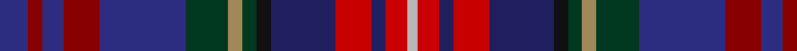

In pattern [BRBRBGYGKBRBRY](/patterns/brbrbgygkbrbry/).

This was sourced from house-of-tartan.  It is a [14 stripes tartan](/stripes/stripes14/).

Original link http://www.house-of-tartan.scotland.net/house/TartanViewjs.asp?colr=Def&tnam=2133

## Thread count
DB/8 DR4 DB6 DR10 DB24 DG12 LT4 DG4 K4 DBa18 R10 DBa4 R6 N/3

## Palette
Each colour and its ΔE from the base-6 reference it is a variant of.

| Colour | Shade | Base | ΔE (OKLab) |
|---|---|---|---|
| DB | <code style="background-color:#2C2C80;">#2C2C80</code> `#2C2C80` | B <code style="background-color:#2A418A;">#2A418A</code> | 0.06 |
| DBa | <code style="background-color:#202060;">#202060</code> `#202060` | B <code style="background-color:#2A418A;">#2A418A</code> | 0.11 |
| DG | <code style="background-color:#003820;">#003820</code> `#003820` | G <code style="background-color:#006100;">#006100</code> | 0.15 |
| DR | <code style="background-color:#880000;">#880000</code> `#880000` | R <code style="background-color:#CC0000;">#CC0000</code> | 0.15 |
| K | <code style="background-color:#101010;">#101010</code> `#101010` | K <code style="background-color:#000000;">#000000</code> | 0.17 |
| LT | <code style="background-color:#A08858;">#A08858</code> `#A08858` | Y <code style="background-color:#F2BF00;">#F2BF00</code> | 0.21 |
| N | <code style="background-color:#B8B8B8;">#B8B8B8</code> `#B8B8B8` | Y <code style="background-color:#F2BF00;">#F2BF00</code> | 0.17 |
| R | <code style="background-color:#C80000;">#C80000</code> `#C80000` | R <code style="background-color:#CC0000;">#CC0000</code> | 0.01 |

## Nearest tartans

The nearest existing variants by ΔTartan distance.

1. [Hyndman (Omagh)](/setts/s14/b8r4b6r10b24g12ra4g4k4ba18rb10ba4rb6y3~b304080-ba000050-g003000-k000000-r800000-ra906030-rbc00000-yb0b0b0/) — ΔT 0.75
1. [Highfield Hunting (Name)](/setts/s11/b10k2g2r2g2k2ba2k2ga4k1gb2~b1c0070-ba441800-g006818-ga603800-gb8c7038-k101010-r880000~x4/) — ΔT 1.50
1. [Boxell of West Niddry, Baron (Personal)](/setts/s11/b27y2b2k12g6r2g12k12ba12ra2ba2~b440044-ba2c2c80-g006818-k101010-r9c68a4-rac80000-ye8c000~x2/) — ΔT 1.68
1. [Churchill (Personal)](/setts/s11/b12k1ba2k1bb9k7bc2k2bc2y1r2~b202060-ba5c8ca8-bb2c2c80-bc780078-k101010-rc80000-ye8c000~x4/) — ΔT 1.71
1. [Fabric of Scotland (Prickly Thistle), The](/setts/s11/b23ba8bb2g24ga19gb29gc4bc5gc11bc19bc23~b780078-ba6c0070-bb5a008c-bcaa00ff-g5c6428-ga004028-gb003c14-gc767e52~x2/) — ΔT 1.75
1. [Scottish Lion (Corporate)](/setts/s10/b4ba16w2ba16r4bb7g21r3g4bc3~b680028-ba1c0070-bb780078-bc441800-g003820-r880000-wc0c0c0~x2/) — ΔT 1.80
1. [Highfield Hunting](/setts/s20/b10k2g2r2g2k2ba2k2ga4k1gb2k1ga4k2ba2k2g2r2g2k2~b1c0070-ba441800-g006818-ga603800-gb8c7038-k101010-r880000~x4/) — ΔT 1.80
1. [MacWatts (Personal)](/setts/s16/y4g7b2g2b12g2k2g1k12ba2bb12ba2bb2ba7k2r3~b780078-ba2c2c80-bb1c0070-g006818-k101010-rc80000-ye8c000~x2/) — ΔT 1.82
1. [Chattahoochee Commemorative Tartan Tartan Number: 2203. Earliest known date: 1993 The Chatahoochie tartan was conceived by Scottish Borders Enterprize and developed with Lochcarron of Scotland, to signify the spirit of co-operation between Fulton County in Atlanta, Georgia and the Scottish Borders. The red, white and black are the colours of the Atlanta Falcons. See products available Copyright © Blair Urquhart, Comrie, 2015](/setts/s12/w4r4k4r15b12ba12g6ba4g4ba4g19y4~b2c2c80-ba202060-g003820-k101010-rc8002c-we0e0e0-ye8c000/) — ΔT 1.85
1. [Scottish Lion Name Tartan Tartan Number: 3184. Earliest known date: Not Specified Designed by Arthur Mackie of Strathmore Woollen Co. to celebrate the long working relationship with the Scottish Lion Import Shop and Mail Order Catalogue. Personal to the Scottish Lion Shop. See products available Copyright © Blair Urquhart, Comrie, 2015](/setts/s10/k4b16w2b16r4ba7g21r3g4bb3~b1c0070-ba780078-bb441800-g003820-k000000-r880000-wc0c0c0~x2/) — ΔT 1.85

## Neighbour map

Every grey dot is one of 15726 variants placed by the first two principal components of the ΔTartan feature space (44% of its variance). Red is this tartan; blue dots are its nearest — click one to open its page.

<svg viewBox="0 0 640 380" role="img" style="max-width:100%;height:auto;border:1px solid #e0e0e0;border-radius:4px;display:block" xmlns="http://www.w3.org/2000/svg"><image href="/nn/cloud.v1.png" width="640" height="380"/><a href="/setts/s14/b8r4b6r10b24g12ra4g4k4ba18rb10ba4rb6y3~b304080-ba000050-g003000-k000000-r800000-ra906030-rbc00000-yb0b0b0/"><circle cx="56.4" cy="131.5" r="4" fill="#3465a4"><title>Hyndman (Omagh)</title></circle></a><a href="/setts/s11/b10k2g2r2g2k2ba2k2ga4k1gb2~b1c0070-ba441800-g006818-ga603800-gb8c7038-k101010-r880000~x4/"><circle cx="118.0" cy="150.9" r="4" fill="#3465a4"><title>Highfield Hunting (Name)</title></circle></a><a href="/setts/s11/b27y2b2k12g6r2g12k12ba12ra2ba2~b440044-ba2c2c80-g006818-k101010-r9c68a4-rac80000-ye8c000~x2/"><circle cx="136.4" cy="131.8" r="4" fill="#3465a4"><title>Boxell of West Niddry, Baron (Personal)</title></circle></a><a href="/setts/s11/b12k1ba2k1bb9k7bc2k2bc2y1r2~b202060-ba5c8ca8-bb2c2c80-bc780078-k101010-rc80000-ye8c000~x4/"><circle cx="134.5" cy="134.8" r="4" fill="#3465a4"><title>Churchill (Personal)</title></circle></a><a href="/setts/s11/b23ba8bb2g24ga19gb29gc4bc5gc11bc19bc23~b780078-ba6c0070-bb5a008c-bcaa00ff-g5c6428-ga004028-gb003c14-gc767e52~x2/"><circle cx="37.9" cy="120.8" r="4" fill="#3465a4"><title>Fabric of Scotland (Prickly Thistle), The</title></circle></a><a href="/setts/s10/b4ba16w2ba16r4bb7g21r3g4bc3~b680028-ba1c0070-bb780078-bc441800-g003820-r880000-wc0c0c0~x2/"><circle cx="184.2" cy="162.1" r="4" fill="#3465a4"><title>Scottish Lion (Corporate)</title></circle></a><a href="/setts/s20/b10k2g2r2g2k2ba2k2ga4k1gb2k1ga4k2ba2k2g2r2g2k2~b1c0070-ba441800-g006818-ga603800-gb8c7038-k101010-r880000~x4/"><circle cx="84.3" cy="135.1" r="4" fill="#3465a4"><title>Highfield Hunting</title></circle></a><a href="/setts/s16/y4g7b2g2b12g2k2g1k12ba2bb12ba2bb2ba7k2r3~b780078-ba2c2c80-bb1c0070-g006818-k101010-rc80000-ye8c000~x2/"><circle cx="42.1" cy="110.4" r="4" fill="#3465a4"><title>MacWatts (Personal)</title></circle></a><a href="/setts/s12/w4r4k4r15b12ba12g6ba4g4ba4g19y4~b2c2c80-ba202060-g003820-k101010-rc8002c-we0e0e0-ye8c000/"><circle cx="37.6" cy="167.5" r="4" fill="#3465a4"><title>Chattahoochee Commemorative Tartan Tartan Number: 2203. Earliest known date: 1993 The Chatahoochie tartan was conceived by Scottish Borders Enterprize and developed with Lochcarron of Scotland, to signify the spirit of co-operation between Fulton County in Atlanta, Georgia and the Scottish Borders. The red, white and black are the colours of the Atlanta Falcons. See products available Copyright © Blair Urquhart, Comrie, 2015</title></circle></a><a href="/setts/s10/k4b16w2b16r4ba7g21r3g4bb3~b1c0070-ba780078-bb441800-g003820-k000000-r880000-wc0c0c0~x2/"><circle cx="170.8" cy="158.2" r="4" fill="#3465a4"><title>Scottish Lion Name Tartan Tartan Number: 3184. Earliest known date: Not Specified Designed by Arthur Mackie of Strathmore Woollen Co. to celebrate the long working relationship with the Scottish Lion Import Shop and Mail Order Catalogue. Personal to the Scottish Lion Shop. See products available Copyright © Blair Urquhart, Comrie, 2015</title></circle></a><circle cx="73.4" cy="136.5" r="5" fill="#c00000"/></svg>

ID: /setts/s14/b8r4b6r10b24g12y4g4k4ba18ra10ba4ra6ya3~b2c2c80-ba202060-g003820-k101010-r880000-rac80000-ya08858-yab8b8b8/
