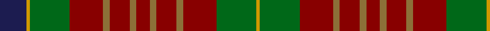

In pattern [BYGRGRGRGRGRGY](/patterns/bygrgrgrgrgrgy/).

This was sourced from register-of-tartans.  It is a [14 stripes tartan](/stripes/stripes14/).

Original link https://www.tartanregister.gov.uk/tartanDetails.aspx?ref=5393

## Thread count
DB/32 DY4 G48 DR40 LT8 DR24 LT8 DR16 LT8 DR24 LT8 DR40 G48 DY/4

## Palette
Each colour and its ΔE from the base-6 reference it is a variant of.

| Colour | Shade | Base | ΔE (OKLab) |
|---|---|---|---|
| DB | <code style="background-color:#1C1C50;">#1C1C50</code> `#1C1C50` | B <code style="background-color:#2A418A;">#2A418A</code> | 0.14 |
| DG | <code style="background-color:#003820;">#003820</code> `#003820` | G <code style="background-color:#006100;">#006100</code> | 0.15 |
| DR | <code style="background-color:#880000;">#880000</code> `#880000` | R <code style="background-color:#CC0000;">#CC0000</code> | 0.15 |
| DY | <code style="background-color:#D09800;">#D09800</code> `#D09800` | Y <code style="background-color:#F2BF00;">#F2BF00</code> | 0.12 |
| G | <code style="background-color:#006818;">#006818</code> `#006818` | G <code style="background-color:#006100;">#006100</code> | 0.02 |
| LR | <code style="background-color:#EC34C4;">#EC34C4</code> `#EC34C4` | R <code style="background-color:#CC0000;">#CC0000</code> | 0.24 |
| LT | <code style="background-color:#8C7038;">#8C7038</code> `#8C7038` | G <code style="background-color:#006100;">#006100</code> | 0.18 |

## Nearest tartans

The nearest existing variants by ΔTartan distance.

1. [McCall (Name)](/setts/s15/r8k5r8g27r8w2r3g3r3w2r8ra27r8ra3r3x2~g408060-k101010-r880000-ra906000-we0e0e0/) — ΔT 1.21
1. [MacKinnon](/setts/s14/b2r3g2ba2r6g16r2ba4g2r16g8b2r4y2x2~b6e5058-ba000052-g11450d-raa0000-yaaaaaa/) — ΔT 1.22
1. [MacKinnon](/setts/s14/b2r3g2ba2r6g16r2ba4g2r16g8b2r4y2~b6e5058-ba000052-g11450d-raa0000-yaaaaaa/) — ΔT 1.22
1. [Indiana "Cardinal" (District)](/setts/s8/b8y1g12r10ga2r6ga2r4x4~b1c1c50-g006818-ga8c7038-r880000-yd09800/) — ΔT 1.22
1. [Hynde (Sir John) (Artefact)](/setts/s11/g14r1g14r7w1r7w1r7k5b3w1x4~b6c0070-g006818-k101010-r880000-wc0c0c0/) — ΔT 1.23
1. [MacCall Family Tartan Tartan Number: 2238. Earliest known date: 2000 Originally designed for a wedding in the McCall family in Aberdeen, and permission was given for anyone of the name to wear it. It was designed by John C McCall & M McCall who are related to Nancy McCall the former owner of McCall's of Aberdeen (01224 405300). MacCall Chieftain is a Peter J.D. MacCall of Birkenshaw who is believed to be elderly and living with a daughter in Lockerbie (October 2002). See products available Copyright © Blair Urquhart, Comrie, 2015](/setts/s15/r6k4r8g16r6w2r2g2r2w2r6g18b6g2b1x2~b6c0070-g006818-k101010-r880000-wc0c0c0/) — ΔT 1.26
1. [Fraser Hunting Clan Tartan Tartan Number: 1659. Earliest known date: 1906 (1855) In the Hunting Fraser, brown replaces the red of the Clan sett. The late Charles Ian Fraser of Reeling said, in his publication, "Clan Fraser", that this sett was designed by the Sobieski Stuart brothers at the request of Lord Lovat for use by the Inverness and Nairn militia. A letter to Lord Lovat from the War Office, c.1855, authorised the use of the Fraser tartan for the corps. The tartan is worn by the Boghall & Bathgate pipe bands. (Strathallan 1994) See products available Copyright © Blair Urquhart, Comrie, 2015](/setts/s11/r3g18ga10g2b10g2b10g2ga10g18w3x2~b2c2c80-g604000-ga006818-rc80000-we0e0e0/) — ΔT 1.33
1. [Hutcheson](/setts/s10/g30y3g4y3g30r30ga4b8ga4r30x2~b003c64-g00643c-ga789484-rcc4438-ydc943c/) — ΔT 1.34
1. [Prince Edward Island District Tartan Tartan Number: 918. Earliest known date: 1964 The warmth and glow of the fertile soil, The green field and tree, The yellow and the brown of Autumn, The white of surf or a summer snow, Rust, green, yellow and white, Yes! That's our Island Tartan. See products available Copyright © Blair Urquhart, Comrie, 2015](/setts/s15/g16ga1g2ga1g2ga12r12ga1y2ga1r12ga12g12ga1w2x2~g006818-ga604000-ra00048-we0e0e0-ye8c000/) — ΔT 1.35
1. [Glen Nevis #2 (Personal)](/setts/s12/g14y1g1y1g2k3g3k3b3ba1b9y1x4~b4c3428-ba441800-g8c7038-k101010-ydc943c/) — ΔT 1.39

## Neighbour map

Every grey dot is one of 15726 variants placed by the first two principal components of the ΔTartan feature space (44% of its variance). Red is this tartan; blue dots are its nearest — click one to open its page.

<svg viewBox="0 0 640 380" role="img" style="max-width:100%;height:auto;border:1px solid #e0e0e0;border-radius:4px;display:block" xmlns="http://www.w3.org/2000/svg"><image href="/nn/cloud.v1.png" width="640" height="380"/><a href="/setts/s15/r8k5r8g27r8w2r3g3r3w2r8ra27r8ra3r3x2~g408060-k101010-r880000-ra906000-we0e0e0/"><circle cx="246.8" cy="139.0" r="4" fill="#3465a4"><title>McCall (Name)</title></circle></a><a href="/setts/s14/b2r3g2ba2r6g16r2ba4g2r16g8b2r4y2x2~b6e5058-ba000052-g11450d-raa0000-yaaaaaa/"><circle cx="240.1" cy="165.5" r="4" fill="#3465a4"><title>MacKinnon</title></circle></a><a href="/setts/s14/b2r3g2ba2r6g16r2ba4g2r16g8b2r4y2~b6e5058-ba000052-g11450d-raa0000-yaaaaaa/"><circle cx="240.1" cy="165.5" r="4" fill="#3465a4"><title>MacKinnon</title></circle></a><a href="/setts/s8/b8y1g12r10ga2r6ga2r4x4~b1c1c50-g006818-ga8c7038-r880000-yd09800/"><circle cx="235.7" cy="200.6" r="4" fill="#3465a4"><title>Indiana &quot;Cardinal&quot; (District)</title></circle></a><a href="/setts/s11/g14r1g14r7w1r7w1r7k5b3w1x4~b6c0070-g006818-k101010-r880000-wc0c0c0/"><circle cx="249.5" cy="163.8" r="4" fill="#3465a4"><title>Hynde (Sir John) (Artefact)</title></circle></a><a href="/setts/s15/r6k4r8g16r6w2r2g2r2w2r6g18b6g2b1x2~b6c0070-g006818-k101010-r880000-wc0c0c0/"><circle cx="259.0" cy="137.1" r="4" fill="#3465a4"><title>MacCall Family Tartan Tartan Number: 2238. Earliest known date: 2000 Originally designed for a wedding in the McCall family in Aberdeen, and permission was given for anyone of the name to wear it. It was designed by John C McCall &amp; M McCall who are related to Nancy McCall the former owner of McCall's of Aberdeen (01224 405300). MacCall Chieftain is a Peter J.D. MacCall of Birkenshaw who is believed to be elderly and living with a daughter in Lockerbie (October 2002). See products available Copyright © Blair Urquhart, Comrie, 2015</title></circle></a><a href="/setts/s11/r3g18ga10g2b10g2b10g2ga10g18w3x2~b2c2c80-g604000-ga006818-rc80000-we0e0e0/"><circle cx="244.4" cy="201.5" r="4" fill="#3465a4"><title>Fraser Hunting Clan Tartan Tartan Number: 1659. Earliest known date: 1906 (1855) In the Hunting Fraser, brown replaces the red of the Clan sett. The late Charles Ian Fraser of Reeling said, in his publication, &quot;Clan Fraser&quot;, that this sett was designed by the Sobieski Stuart brothers at the request of Lord Lovat for use by the Inverness and Nairn militia. A letter to Lord Lovat from the War Office, c.1855, authorised the use of the Fraser tartan for the corps. The tartan is worn by the Boghall &amp; Bathgate pipe bands. (Strathallan 1994) See products available Copyright © Blair Urquhart, Comrie, 2015</title></circle></a><a href="/setts/s10/g30y3g4y3g30r30ga4b8ga4r30x2~b003c64-g00643c-ga789484-rcc4438-ydc943c/"><circle cx="255.8" cy="178.3" r="4" fill="#3465a4"><title>Hutcheson</title></circle></a><a href="/setts/s15/g16ga1g2ga1g2ga12r12ga1y2ga1r12ga12g12ga1w2x2~g006818-ga604000-ra00048-we0e0e0-ye8c000/"><circle cx="231.8" cy="143.2" r="4" fill="#3465a4"><title>Prince Edward Island District Tartan Tartan Number: 918. Earliest known date: 1964 The warmth and glow of the fertile soil, The green field and tree, The yellow and the brown of Autumn, The white of surf or a summer snow, Rust, green, yellow and white, Yes! That's our Island Tartan. See products available Copyright © Blair Urquhart, Comrie, 2015</title></circle></a><a href="/setts/s12/g14y1g1y1g2k3g3k3b3ba1b9y1x4~b4c3428-ba441800-g8c7038-k101010-ydc943c/"><circle cx="274.0" cy="142.3" r="4" fill="#3465a4"><title>Glen Nevis #2 (Personal)</title></circle></a><circle cx="245.9" cy="174.7" r="5" fill="#c00000"/></svg>

ID: /setts/s14/b8y1g12r10ga2r6ga2r4ga2r6ga2r10g12y1x4~b1c1c50-g006818-ga8c7038-r880000-yd09800/
