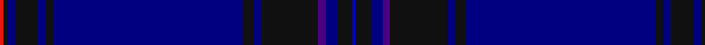

In pattern [BKBBKBKBKBKBKR](/stripes/bkbbkbkbkbkbkr/).

This was sourced from register-of-tartans.  It is a [14 stripe tartan](/stripes/stripes14/).

Original link https://www.tartanregister.gov.uk/tartanDetails.aspx?ref=10495

## Register references

External register numbers recorded for this tartan.

- Scottish Register of Tartans: [10495](https://www.tartanregister.gov.uk/tartanDetails.aspx?ref=10495)

## Thread count
R/2 K2 DB4 K12 DB4 K4 DB100 K6 DB4 K30 P4 DB6 K8 B/2

## Palette
Each colour and its ΔE from the base-6 reference it is a variant of.

| Colour | Shade | Base | ΔE (OKLab) |
|---|---|---|---|
| B | <code style="background-color:#0000CD;">#0000CD</code> `#0000CD` | B <code style="background-color:#2A418A;">#2A418A</code> | 0.14 |
| DB | <code style="background-color:#000080;">#000080</code> `#000080` | B <code style="background-color:#2A418A;">#2A418A</code> | 0.14 |
| K | <code style="background-color:#101010;">#101010</code> `#101010` | K <code style="background-color:#000000;">#000000</code> | 0.17 |
| P | <code style="background-color:#4B0082;">#4B0082</code> `#4B0082` | B <code style="background-color:#2A418A;">#2A418A</code> | 0.12 |
| R | <code style="background-color:#E3170D;">#E3170D</code> `#E3170D` | R <code style="background-color:#CC0000;">#CC0000</code> | 0.05 |

## Nearest tartans

The nearest existing variants by ΔTartan distance.

1. [Ulster Scots (Fashion)](/setts/s10/db84dp1db1k2db2k30dp7db2g3lo2~x2/) — ΔT 1.37
1. [Concours of Elegance](/setts/s11/db130k18m6k6m6k6b18db14b5db18lo4/) — ΔT 1.74
1. [Damson (Fashion)](/setts/s12/db48g4db6y2db2db2db2g10db6db2db3db2~x2/) — ΔT 1.86
1. [Orman (Midlothian) (Personal)](/setts/s9/k10db3k3db32dg1db1dg1db2n2~x2/) — ΔT 1.99
1. [Bank of Scotland (2000)](/setts/s10/b64db3dt4r5dt8dt12b3dt4b2lo1~x2/) — ΔT 2.06
1. [Canberra, City of District Tartan Tartan Number: 4449. Earliest known date: pre 2002 Count from a Stathmore Woollen sample. Designed by Peter Burrows and Stewart Smith with tech support from Strathmore. For the exclusive use by Messrs Scottish Flair, Queanbeyan, Australia. Colours represented; DB for the Canberra flag. Gold (yellow) and white for the stars on the Canberra flag. mb for the Canberra Bluebell. See products available Copyright © Blair Urquhart, Comrie, 2015](/setts/s10/k76db22k1lo3k1db3k1w2k1db10~x2/) — ΔT 2.06
1. [Scotland's Own (Fashion)](/setts/s12/db4y1db30k15dp4db2k2db2k10db4dp2db2~x2/) — ΔT 2.11
1. [Spirit of Scotland](/setts/s20/db96dp8db12b3db3b3db3dg20dp8k3dp14~x2/) — ΔT 2.19
1. [Marist School, The](/setts/s8/dt29b2dt1b1dt1b1db8ly1~x4/) — ΔT 2.24
1. [Royal Caledonian Curling Club](/setts/s15/dt72r2dt2r5dt4lo2dt4r5dt2dt2dt2dt15lb2dt3r2~x2/) — ΔT 2.28

## Neighbour map

Every grey dot is one of 14299 variants placed by the first two principal components of the ΔTartan feature space (44% of its variance). Red is this tartan; blue dots are its nearest — click one to open its page.

<svg viewBox="0 0 640 380" role="img" style="max-width:100%;height:auto;border:1px solid #e0e0e0;border-radius:4px;display:block" xmlns="http://www.w3.org/2000/svg"><image href="/nn/cloud.v1.png" width="640" height="380"/><a href="/setts/s10/db84dp1db1k2db2k30dp7db2g3lo2~x2/"><circle cx="527.6" cy="113.6" r="4" fill="#3465a4"><title>Ulster Scots (Fashion)</title></circle></a><a href="/setts/s11/db130k18m6k6m6k6b18db14b5db18lo4/"><circle cx="516.7" cy="133.0" r="4" fill="#3465a4"><title>Concours of Elegance</title></circle></a><a href="/setts/s12/db48g4db6y2db2db2db2g10db6db2db3db2~x2/"><circle cx="500.4" cy="157.0" r="4" fill="#3465a4"><title>Damson (Fashion)</title></circle></a><a href="/setts/s9/k10db3k3db32dg1db1dg1db2n2~x2/"><circle cx="582.7" cy="191.1" r="4" fill="#3465a4"><title>Orman (Midlothian) (Personal)</title></circle></a><a href="/setts/s10/b64db3dt4r5dt8dt12b3dt4b2lo1~x2/"><circle cx="479.0" cy="101.3" r="4" fill="#3465a4"><title>Bank of Scotland (2000)</title></circle></a><a href="/setts/s10/k76db22k1lo3k1db3k1w2k1db10~x2/"><circle cx="471.2" cy="103.5" r="4" fill="#3465a4"><title>Canberra, City of District Tartan Tartan Number: 4449. Earliest known date: pre 2002 Count from a Stathmore Woollen sample. Designed by Peter Burrows and Stewart Smith with tech support from Strathmore. For the exclusive use by Messrs Scottish Flair, Queanbeyan, Australia. Colours represented; DB for the Canberra flag. Gold (yellow) and white for the stars on the Canberra flag. mb for the Canberra Bluebell. See products available Copyright © Blair Urquhart, Comrie, 2015</title></circle></a><a href="/setts/s12/db4y1db30k15dp4db2k2db2k10db4dp2db2~x2/"><circle cx="447.0" cy="167.4" r="4" fill="#3465a4"><title>Scotland's Own (Fashion)</title></circle></a><a href="/setts/s20/db96dp8db12b3db3b3db3dg20dp8k3dp14~x2/"><circle cx="447.9" cy="124.6" r="4" fill="#3465a4"><title>Spirit of Scotland</title></circle></a><a href="/setts/s8/dt29b2dt1b1dt1b1db8ly1~x4/"><circle cx="530.4" cy="161.3" r="4" fill="#3465a4"><title>Marist School, The</title></circle></a><a href="/setts/s15/dt72r2dt2r5dt4lo2dt4r5dt2dt2dt2dt15lb2dt3r2~x2/"><circle cx="520.5" cy="92.7" r="4" fill="#3465a4"><title>Royal Caledonian Curling Club</title></circle></a><circle cx="521.6" cy="116.3" r="5" fill="#c00000"/></svg>

ID: /setts/s14/db1k4db3dp2k15db2k3db50k2db2k6db2k1r1~x2/
