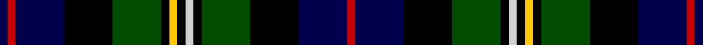

In pattern [BRBKGKYKWKGKBR](/stripes/brbkgkykwkgkbr/).

This was sourced from weddslist.  It is a [14 stripe tartan](/stripes/stripes14/).

Original link http://www.weddslist.com/cgi-bin/tartans/pg.pl?source=rb

## Register references

External register numbers recorded for this tartan.

- Scottish Register of Tartans: [1166](https://www.tartanregister.gov.uk/tartanDetails.aspx?ref=1166)
- Scottish Register of Tartans: [1758](https://www.tartanregister.gov.uk/tartanDetails.aspx?ref=1758)
- Scottish Register of Tartans: [2307](https://www.tartanregister.gov.uk/tartanDetails.aspx?ref=2307)
- Scottish Register of Tartans: [2540](https://www.tartanregister.gov.uk/tartanDetails.aspx?ref=2540)
- Scottish Register of Tartans: [2666](https://www.tartanregister.gov.uk/tartanDetails.aspx?ref=2666)
- Scottish Register of Tartans: [2862](https://www.tartanregister.gov.uk/tartanDetails.aspx?ref=2862)
- Scottish Register of Tartans: [3808](https://www.tartanregister.gov.uk/tartanDetails.aspx?ref=3808)
- Scottish Register of Tartans: [982](https://www.tartanregister.gov.uk/tartanDetails.aspx?ref=982)
- Scottish Tartans Authority (ITI): 218
- Scottish Tartans World Register: 1010
- Scottish Tartans World Register: 1042
- Scottish Tartans World Register: 127
- Scottish Tartans World Register: 1585
- Scottish Tartans World Register: 218
- Scottish Tartans World Register: 2218
- Scottish Tartans World Register: 737
- Scottish Tartans World Register: 897

## Thread count
DB/1 R1 DB6 K6 G6 K1 Y1 K1 N1 K1 G6 K6 DB6 R/1

## Palette
Each colour and its ΔE from the base-6 reference it is a variant of.

| Colour | Shade | Base | ΔE (OKLab) |
|---|---|---|---|
| DB | <code style="background-color:#00004C;">#00004C</code> `#00004C` | B <code style="background-color:#2A418A;">#2A418A</code> | 0.21 |
| G | <code style="background-color:#004C00;">#004C00</code> `#004C00` | G <code style="background-color:#006100;">#006100</code> | 0.07 |
| K | <code style="background-color:#000000;">#000000</code> `#000000` | K <code style="background-color:#000000;">#000000</code> | 0.00 |
| N | <code style="background-color:#D0D0D0;">#D0D0D0</code> `#D0D0D0` | W <code style="background-color:#F7F7F7;">#F7F7F7</code> | 0.12 |
| R | <code style="background-color:#C80000;">#C80000</code> `#C80000` | R <code style="background-color:#CC0000;">#CC0000</code> | 0.01 |
| Y | <code style="background-color:#FFC800;">#FFC800</code> `#FFC800` | Y <code style="background-color:#F2BF00;">#F2BF00</code> | 0.03 |

## Nearest tartans

The nearest existing variants by ΔTartan distance.

1. [Malcolm (a)](/setts/s14/db1r1db6k6dg6k1ly1k1b1k1dg6k6db6r1~x2/) — ΔT 0.62
1. [MacInnes](/setts/s13/r2dg6db12k3b3k3dg16k2dg2k2dg2k12ly2~x2/) — ΔT 0.89
1. [MacInnes](/setts/s13/r2dg6db12k3b3k3dg16k2dg2k2dg2k12ly2/) — ΔT 0.89
1. [Malcolm](/setts/s14/k1ly1k1g6k6db6r1db1r1db6k6g6k1t1~x4/) — ΔT 0.96
1. [Farquharson](/setts/s14/r2db4k1db1k1db1k8dg8ly2dg8k8db8k1r2/) — ΔT 0.97
1. [Malcolm](/setts/s15/db2r1db6k6g6k1t1k1ly1k1g6k6db6g1db2~x4/) — ΔT 1.00
1. [Farquharson](/setts/s14/r2db4k1db1k1db1k8dg8ly2dg8k8db8k1r2~x2/) — ΔT 1.03
1. [MacInnes](/setts/s13/r2dg6db12k3lb3k3dg16k2dg2k2dg2k12ly2/) — ΔT 1.04
1. [Scottish National](/setts/s15/db13w2db2r2db2k12g12k2g3k2g12k12db12k2r3~x2/) — ΔT 1.07
1. [Scotland's National (Fashion)](/setts/s15/dt12w2dt2r2dt2k10g12k2g4k2g12k10dt12k2r3~x2/) — ΔT 1.09

## Neighbour map

Every grey dot is one of 14299 variants placed by the first two principal components of the ΔTartan feature space (44% of its variance). Red is this tartan; blue dots are its nearest — click one to open its page.

<svg viewBox="0 0 640 380" role="img" style="max-width:100%;height:auto;border:1px solid #e0e0e0;border-radius:4px;display:block" xmlns="http://www.w3.org/2000/svg"><image href="/nn/cloud.v1.png" width="640" height="380"/><a href="/setts/s14/db1r1db6k6dg6k1ly1k1b1k1dg6k6db6r1~x2/"><circle cx="114.2" cy="184.0" r="4" fill="#3465a4"><title>Malcolm (a)</title></circle></a><a href="/setts/s13/r2dg6db12k3b3k3dg16k2dg2k2dg2k12ly2~x2/"><circle cx="149.5" cy="163.8" r="4" fill="#3465a4"><title>MacInnes</title></circle></a><a href="/setts/s13/r2dg6db12k3b3k3dg16k2dg2k2dg2k12ly2/"><circle cx="149.5" cy="163.8" r="4" fill="#3465a4"><title>MacInnes</title></circle></a><a href="/setts/s14/k1ly1k1g6k6db6r1db1r1db6k6g6k1t1~x4/"><circle cx="81.0" cy="162.9" r="4" fill="#3465a4"><title>Malcolm</title></circle></a><a href="/setts/s14/r2db4k1db1k1db1k8dg8ly2dg8k8db8k1r2/"><circle cx="121.8" cy="175.5" r="4" fill="#3465a4"><title>Farquharson</title></circle></a><a href="/setts/s15/db2r1db6k6g6k1t1k1ly1k1g6k6db6g1db2~x4/"><circle cx="83.2" cy="165.1" r="4" fill="#3465a4"><title>Malcolm</title></circle></a><a href="/setts/s14/r2db4k1db1k1db1k8dg8ly2dg8k8db8k1r2~x2/"><circle cx="136.3" cy="183.6" r="4" fill="#3465a4"><title>Farquharson</title></circle></a><a href="/setts/s13/r2dg6db12k3lb3k3dg16k2dg2k2dg2k12ly2/"><circle cx="124.7" cy="150.4" r="4" fill="#3465a4"><title>MacInnes</title></circle></a><a href="/setts/s15/db13w2db2r2db2k12g12k2g3k2g12k12db12k2r3~x2/"><circle cx="98.2" cy="177.1" r="4" fill="#3465a4"><title>Scottish National</title></circle></a><a href="/setts/s15/dt12w2dt2r2dt2k10g12k2g4k2g12k10dt12k2r3~x2/"><circle cx="111.9" cy="192.5" r="4" fill="#3465a4"><title>Scotland's National (Fashion)</title></circle></a><circle cx="97.0" cy="174.4" r="5" fill="#c00000"/></svg>

ID: /setts/s14/db1r1db6k6dg6k1ly1k1lb1k1dg6k6db6r1/
