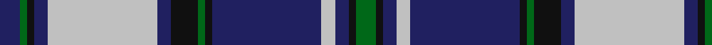

**Bands:** [BGKBWBKGKBWBKG](/stripes/bgkbwbkgkbwbkg/) · **Stripes:** [DB G K DB LB DB K G K DB LB DB K G](/stripes/stripes14/) DB G K DB LB DB K G K DB LB DB K G

This was sourced from tartans-authority.  It is a [14 band tartan](/bands/bands14/).

Original link http://www.tartansauthority.com/tartan-ferret/display/10870/

## Thread count
DB/6 G2 K2 DB4 N32 DB4 K8 G2 K2 DB32 N4 DB4 K2 G/6

## Palette
Each colour and its ΔE from the base-6 reference it is a variant of.

| Colour | Shade | Base | ΔE (OKLab) |
|---|---|---|---|
| DB | <code style="background-color:#202060;">#202060</code> `#202060` | B <code style="background-color:#2A418A;">#2A418A</code> | 0.11 |
| G | <code style="background-color:#006818;">#006818</code> `#006818` | G <code style="background-color:#006100;">#006100</code> | 0.02 |
| K | <code style="background-color:#101010;">#101010</code> `#101010` | K <code style="background-color:#000000;">#000000</code> | 0.17 |
| N | <code style="background-color:#C0C0C0;">#C0C0C0</code> `#C0C0C0` | W <code style="background-color:#F7F7F7;">#F7F7F7</code> | 0.17 |

## Nearest tartans

The nearest existing variants by ΔTartan distance.

1. [Carsaig](/setts/s12/lr12r3lr3db4lr16o3lr3o3lr3o16db52lr4/) — ΔT 0.49
1. [Lesotho](/setts/s13/w4k1db24k1dg12k1w12k1db12w4k1w1k2~x2/) — ΔT 0.82
1. [Anderson Blue](/setts/s15/t8k1o1k1t22o1k14o1w2o1w6k3o1w3o1~x2/) — ΔT 0.85
1. [Scottish Knights Templar St. A (Corp](/setts/s12/lb4r1db20k6lb5k4lb4k4lb3k2r1db2~x2/) — ΔT 1.00
1. [Scottish Knights Templar, of M.T.S. St Andrew](/setts/s10/w4r1db20k6w5k4w3k2r1db2~x2/) — ΔT 1.06
1. [Swedish](/setts/s13/ly7k1db22k2db1k2db4k2db1k2db4k18w5~x2/) — ΔT 1.10
1. [Angus Dress (Convergence 98)](/setts/s17/r2b1r1b1r1b14k14r1k3r1k14w14r1w1r1w1r2~x4/) — ΔT 1.11
1. [Home (Clans Originaux)](/setts/s14/g3b36k9r3k3r3k36r3k3r3k9b36g3b2~x2/) — ΔT 1.11
1. [Scottish Knights Templar International](/setts/s16/db2r1k2lb3k4lb5k6db20r3db20k6lb5k4lb3k2r1~x2/) — ΔT 1.15
1. [McKirgan/Mackirgan](/setts/s11/g2db2w1r2w1db3g1db12g18w1r2~x2/) — ΔT 1.23

## Neighbour map

Every grey dot is one of 14313 variants placed by the first two principal components of the ΔTartan feature space (44% of its variance). Red is this tartan; blue dots are its nearest — click one to open its page.

<svg viewBox="0 0 640 380" role="img" style="max-width:100%;height:auto;border:1px solid #e0e0e0;border-radius:4px;display:block" xmlns="http://www.w3.org/2000/svg"><image href="/nn/cloud.v1.png" width="640" height="380"/><a href="/setts/s12/lr12r3lr3db4lr16o3lr3o3lr3o16db52lr4/"><circle cx="254.0" cy="114.9" r="4" fill="#3465a4"><title>Carsaig</title></circle></a><a href="/setts/s13/w4k1db24k1dg12k1w12k1db12w4k1w1k2~x2/"><circle cx="249.0" cy="109.7" r="4" fill="#3465a4"><title>Lesotho</title></circle></a><a href="/setts/s15/t8k1o1k1t22o1k14o1w2o1w6k3o1w3o1~x2/"><circle cx="247.4" cy="95.3" r="4" fill="#3465a4"><title>Anderson Blue</title></circle></a><a href="/setts/s12/lb4r1db20k6lb5k4lb4k4lb3k2r1db2~x2/"><circle cx="212.3" cy="128.7" r="4" fill="#3465a4"><title>Scottish Knights Templar St. A (Corp</title></circle></a><a href="/setts/s10/w4r1db20k6w5k4w3k2r1db2~x2/"><circle cx="232.9" cy="126.5" r="4" fill="#3465a4"><title>Scottish Knights Templar, of M.T.S. St Andrew</title></circle></a><a href="/setts/s13/ly7k1db22k2db1k2db4k2db1k2db4k18w5~x2/"><circle cx="257.1" cy="121.5" r="4" fill="#3465a4"><title>Swedish</title></circle></a><a href="/setts/s17/r2b1r1b1r1b14k14r1k3r1k14w14r1w1r1w1r2~x4/"><circle cx="191.4" cy="100.9" r="4" fill="#3465a4"><title>Angus Dress (Convergence 98)</title></circle></a><a href="/setts/s14/g3b36k9r3k3r3k36r3k3r3k9b36g3b2~x2/"><circle cx="294.0" cy="132.6" r="4" fill="#3465a4"><title>Home (Clans Originaux)</title></circle></a><a href="/setts/s16/db2r1k2lb3k4lb5k6db20r3db20k6lb5k4lb3k2r1~x2/"><circle cx="258.1" cy="124.3" r="4" fill="#3465a4"><title>Scottish Knights Templar International</title></circle></a><a href="/setts/s11/g2db2w1r2w1db3g1db12g18w1r2~x2/"><circle cx="269.9" cy="132.6" r="4" fill="#3465a4"><title>McKirgan/Mackirgan</title></circle></a><circle cx="238.4" cy="116.8" r="5" fill="#c00000"/></svg>

ID: /setts/s14/db3g1k1db2lb16db2k4g1k1db16lb2db2k1g3~x2/
