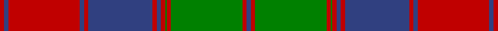

In pattern [BRGRGRBRBRBRBR](/stripes/brgrgrbrbrbrbr/).

This was sourced from weddslist.  It is a [14 stripe tartan](/stripes/stripes14/).

Original link http://www.weddslist.com/cgi-bin/tartans/pg.pl?source=sts

## Also known as

This cloth is also recorded under:

- Culloden, Unidentified

## Thread count
R/6 B6 R100 B6 R6 B90 R6 B6 R6 G2 R6 G100 R6 B/6

## Palette
Each colour and the base-6 reference it is a variant of.

| Colour | Shade | Base |
|---|---|---|
| B | <code style="background-color:#304080;">#304080</code> `oklch(39.4% 0.109 270.2)` <small>#304080</small> | B <code style="background-color:#2A418A;">#2A418A</code> |
| G | <code style="background-color:#008000;">#008000</code> `oklch(52.0% 0.177 142.5)` <small>#008000</small> | G <code style="background-color:#006100;">#006100</code> |
| R | <code style="background-color:#C00000;">#C00000</code> `oklch(50.7% 0.208 29.2)` <small>#C00000</small> | R <code style="background-color:#CC0000;">#CC0000</code> |

## Nearest tartans

The nearest existing variants by ΔTartan distance.

1. [Culloden Unidentified](/setts/s14/db3r3dg50r3dg1r3db3r3db45r3db3r50db3r3~x2/) — ΔT 0.57
1. [Fraser of Altyre](/setts/s14/r9db4r89db4r4db80r9db9r4db4r4g80r4db4/) — ΔT 1.23
1. [MacQuarrie 3](/setts/s13/g2r3g2r52g2r2db28r2g42r2g2r3g2~x2/) — ΔT 1.27
1. [MacQuarrie #3](/setts/s13/dg2r3dg2r52dg2r2db28r2dg42r2dg2r3dg2~x2/) — ΔT 1.30
1. [Not Specified](/setts/s26/r3g50r3g1r3t3r3t45r3t3r50t3r3t3r50t3r3t45r3t3r3g1r3g50r3t3~x2/) — ΔT 1.43
1. [Fraser of Altyre](/setts/s14/r4db2r45db2r2db40r4db4r2db2r2g40r2db2~x2/) — ΔT 1.45
1. [MacQuarrie 1815](/setts/s13/dg2r3dg2r52dg2r2db28r2dg42r2dg2r3dg2/) — ΔT 1.46
1. [Connaught (Lochcarron)](/setts/s10/g36t2m2t2m2t2m30dg1m1dg4~x2/) — ΔT 1.48
1. [Unidentified Coat](/setts/s14/dg6r2dg2r24t1db1r2db12r2db1t1r2dg24r2~x2/) — ΔT 1.51
1. [Crieff](/setts/s13/r2r6g4r70g4r2dp21r2g85r2g4r6r2/) — ΔT 1.52

## Neighbour map

Every grey dot is one of 14299 variants placed by the first two principal components of the ΔTartan feature space (44% of its variance). Red is this tartan; blue dots are its nearest — click one to open its page.

<svg viewBox="0 0 640 380" role="img" style="max-width:100%;height:auto;border:1px solid #e0e0e0;border-radius:4px;display:block" xmlns="http://www.w3.org/2000/svg"><image href="/nn/cloud.v1.png" width="640" height="380"/><a href="/setts/s14/db3r3dg50r3dg1r3db3r3db45r3db3r50db3r3~x2/"><circle cx="334.9" cy="93.0" r="4" fill="#3465a4"><title>Culloden Unidentified</title></circle></a><a href="/setts/s14/r9db4r89db4r4db80r9db9r4db4r4g80r4db4/"><circle cx="310.4" cy="124.7" r="4" fill="#3465a4"><title>Fraser of Altyre</title></circle></a><a href="/setts/s13/g2r3g2r52g2r2db28r2g42r2g2r3g2~x2/"><circle cx="342.5" cy="118.0" r="4" fill="#3465a4"><title>MacQuarrie 3</title></circle></a><a href="/setts/s13/dg2r3dg2r52dg2r2db28r2dg42r2dg2r3dg2~x2/"><circle cx="342.0" cy="114.9" r="4" fill="#3465a4"><title>MacQuarrie #3</title></circle></a><a href="/setts/s26/r3g50r3g1r3t3r3t45r3t3r50t3r3t3r50t3r3t45r3t3r3g1r3g50r3t3~x2/"><circle cx="327.2" cy="73.6" r="4" fill="#3465a4"><title>Not Specified</title></circle></a><a href="/setts/s14/r4db2r45db2r2db40r4db4r2db2r2g40r2db2~x2/"><circle cx="311.5" cy="123.0" r="4" fill="#3465a4"><title>Fraser of Altyre</title></circle></a><a href="/setts/s13/dg2r3dg2r52dg2r2db28r2dg42r2dg2r3dg2/"><circle cx="349.7" cy="126.0" r="4" fill="#3465a4"><title>MacQuarrie 1815</title></circle></a><a href="/setts/s10/g36t2m2t2m2t2m30dg1m1dg4~x2/"><circle cx="349.5" cy="108.7" r="4" fill="#3465a4"><title>Connaught (Lochcarron)</title></circle></a><a href="/setts/s14/dg6r2dg2r24t1db1r2db12r2db1t1r2dg24r2~x2/"><circle cx="298.1" cy="108.8" r="4" fill="#3465a4"><title>Unidentified Coat</title></circle></a><a href="/setts/s13/r2r6g4r70g4r2dp21r2g85r2g4r6r2/"><circle cx="377.4" cy="84.0" r="4" fill="#3465a4"><title>Crieff</title></circle></a><circle cx="334.4" cy="95.0" r="5" fill="#c00000"/></svg>

ID: /setts/s14/db3r3g50r3g1r3db3r3db45r3db3r50db3r3~x2/
