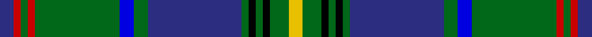

This page is one **sett** — a single exact thread-count. It belongs to the [tartan](/tartans/db6r3g3r3g36db6g6db40g3k3g3k3g8ly6/)
(the same proportion at any scale), whose colour order is pattern [BRGRGBGBGKGKGY](/stripes/brgrgbgbgkgkgy/).

Sourced from register-of-tartans.  It is a [14 stripe tartan](/stripes/stripes14/).

Original link https://www.tartanregister.gov.uk/tartanDetails.aspx?ref=3400

## Also known as

This cloth is also recorded under:

- Princess Beatrice Hunting

2 attestations — the source records this cloth was collapsed from (oldest owns this page)

<ul>
<li>01/01/1930 — Princess Beatrice Hunting (MacKinlay strip) (register-of-tartans, <a href="https://www.tartanregister.gov.uk/tartanDetails.aspx?ref=3400">record</a>)</li>
<li>1930s — Princess Beatrice Htg (Fashion) (tartans-authority, <a href="http://www.tartansauthority.com/tartan-ferret/display/5467/">record</a>)</li>
</ul>

## Register references

External register numbers recorded for this tartan.

- Scottish Register of Tartans: [3400](https://www.tartanregister.gov.uk/tartanDetails.aspx?ref=3400)
- Scottish Tartans Authority (ITI): 5467

## Thread count
DB/12 R6 G6 R6 G72 B12 G12 DB80 G6 K6 G6 K6 G16 Y/12

## Palette

Palette: <strong>Tartan Register</strong> <small style="color:#888">(5 of 6 colours)</small>
<table><thead><tr><th>Colour</th><th>Threads</th><th>Shade</th><th>Base</th><th>OKLCh</th></tr></thead><tbody><tr><td>DB/</td><td style="text-align:right;font-variant-numeric:tabular-nums">12</td><td><code style="background-color:#2C2C80;">#2C2C80</code> <small style="color:#888">#2C2C80</small></td><td>B <code style="background-color:#2A418A;">#2A418A</code></td><td><small style="color:#888">oklch(35.0% 0.138 276.6)</small></td></tr><tr><td>R</td><td style="text-align:right;font-variant-numeric:tabular-nums">6</td><td><code style="background-color:#C80000;">#C80000</code> <small style="color:#888">#C80000</small></td><td>R <code style="background-color:#CC0000;">#CC0000</code></td><td><small style="color:#888">oklch(52.3% 0.215 29.2)</small></td></tr><tr><td>G</td><td style="text-align:right;font-variant-numeric:tabular-nums">6</td><td><code style="background-color:#006818;">#006818</code> <small style="color:#888">#006818</small></td><td>G <code style="background-color:#006100;">#006100</code></td><td><small style="color:#888">oklch(45.0% 0.142 145.0)</small></td></tr><tr><td>R</td><td style="text-align:right;font-variant-numeric:tabular-nums">6</td><td><code style="background-color:#C80000;">#C80000</code> <small style="color:#888">#C80000</small></td><td>R <code style="background-color:#CC0000;">#CC0000</code></td><td><small style="color:#888">oklch(52.3% 0.215 29.2)</small></td></tr><tr><td>G</td><td style="text-align:right;font-variant-numeric:tabular-nums">72</td><td><code style="background-color:#006818;">#006818</code> <small style="color:#888">#006818</small></td><td>G <code style="background-color:#006100;">#006100</code></td><td><small style="color:#888">oklch(45.0% 0.142 145.0)</small></td></tr><tr><td>B</td><td style="text-align:right;font-variant-numeric:tabular-nums">12</td><td><code style="background-color:#0000E0;">#0000E0</code> <small style="color:#888">#0000E0</small></td><td>B <code style="background-color:#2A418A;">#2A418A</code></td><td><small style="color:#888">oklch(41.0% 0.284 264.1)</small></td></tr><tr><td>G</td><td style="text-align:right;font-variant-numeric:tabular-nums">12</td><td><code style="background-color:#006818;">#006818</code> <small style="color:#888">#006818</small></td><td>G <code style="background-color:#006100;">#006100</code></td><td><small style="color:#888">oklch(45.0% 0.142 145.0)</small></td></tr><tr><td>DB</td><td style="text-align:right;font-variant-numeric:tabular-nums">80</td><td><code style="background-color:#2C2C80;">#2C2C80</code> <small style="color:#888">#2C2C80</small></td><td>B <code style="background-color:#2A418A;">#2A418A</code></td><td><small style="color:#888">oklch(35.0% 0.138 276.6)</small></td></tr><tr><td>G</td><td style="text-align:right;font-variant-numeric:tabular-nums">6</td><td><code style="background-color:#006818;">#006818</code> <small style="color:#888">#006818</small></td><td>G <code style="background-color:#006100;">#006100</code></td><td><small style="color:#888">oklch(45.0% 0.142 145.0)</small></td></tr><tr><td>K</td><td style="text-align:right;font-variant-numeric:tabular-nums">6</td><td><code style="background-color:#000000;">#000000</code> <small style="color:#888">#000000</small></td><td>K <code style="background-color:#000000;">#000000</code></td><td><small style="color:#888">oklch(0.0% 0.000 0.0)</small></td></tr><tr><td>G</td><td style="text-align:right;font-variant-numeric:tabular-nums">6</td><td><code style="background-color:#006818;">#006818</code> <small style="color:#888">#006818</small></td><td>G <code style="background-color:#006100;">#006100</code></td><td><small style="color:#888">oklch(45.0% 0.142 145.0)</small></td></tr><tr><td>K</td><td style="text-align:right;font-variant-numeric:tabular-nums">6</td><td><code style="background-color:#000000;">#000000</code> <small style="color:#888">#000000</small></td><td>K <code style="background-color:#000000;">#000000</code></td><td><small style="color:#888">oklch(0.0% 0.000 0.0)</small></td></tr><tr><td>G</td><td style="text-align:right;font-variant-numeric:tabular-nums">16</td><td><code style="background-color:#006818;">#006818</code> <small style="color:#888">#006818</small></td><td>G <code style="background-color:#006100;">#006100</code></td><td><small style="color:#888">oklch(45.0% 0.142 145.0)</small></td></tr><tr><td>Y/</td><td style="text-align:right;font-variant-numeric:tabular-nums">12</td><td><code style="background-color:#E8C000;">#E8C000</code> <small style="color:#888">#E8C000</small></td><td>Y <code style="background-color:#F2BF00;">#F2BF00</code></td><td><small style="color:#888">oklch(81.9% 0.168 93.7)</small></td></tr></tbody></table>

## Nearest tartans

The nearest existing variants by ΔTartan distance, with this tartan at the top so the swatches line up against it.

ΔTartan

Tartan

Sett

—

<a href="/ttd/edit/#slug=db6r3g3r3g36db6g6db40g3k3g3k3g8ly6~x2">Princess Beatrice Hunting (MacKinlay strip)</a> <a class="nn-out" href="/setts/s14/db6r3g3r3g36db6g6db40g3k3g3k3g8ly6~x2/" title="open its dictionary page">↗</a>

0.57

<a href="/ttd/edit/#slug=db10r5g5r5g60db13g10db67g5k5g5k5g13ly10">Beatrice Princess.. (Hunting) Royal Family Tartan Tartan Number: 545. Earliest known date: pre 2003 Reduced by 1/6th to display. See products available Copyright © Blair Urquhart, Comrie, 2015</a> <a class="nn-out" href="/setts/s14/db10r5g5r5g60db13g10db67g5k5g5k5g13ly10/" title="open its dictionary page">↗</a>

0.84

<a href="/ttd/edit/#slug=t29db3k10lo2k2t2k2g10r5k3r2t2~x2">Stuart/Stewart Blue</a> <a class="nn-out" href="/setts/s12/t29db3k10lo2k2t2k2g10r5k3r2t2~x2/" title="open its dictionary page">↗</a>

0.91

<a href="/ttd/edit/#slug=lr3dg3r2dg16k2db24k2dg16r2dg3ly3~x2">Loch Tay</a> <a class="nn-out" href="/setts/s11/lr3dg3r2dg16k2db24k2dg16r2dg3ly3~x2/" title="open its dictionary page">↗</a>

0.95

<a href="/ttd/edit/#slug=n2db16t2db3t2db3t8g30db3ly2r2~x2">San Diego Tartan Day (Corporate)</a> <a class="nn-out" href="/setts/s11/n2db16t2db3t2db3t8g30db3ly2r2~x2/" title="open its dictionary page">↗</a>

1.01

<a href="/ttd/edit/#slug=db18w1db1w1db4r4k1g12dy1g1dy1g1dy1~x4">Roach (2015)</a> <a class="nn-out" href="/setts/s13/db18w1db1w1db4r4k1g12dy1g1dy1g1dy1~x4/" title="open its dictionary page">↗</a>

1.02

<a href="/ttd/edit/#slug=r8g2k2lo2k2ly2k2g18db2g2db29k3~x2">Cats Winter (Fashion)</a> <a class="nn-out" href="/setts/s12/r8g2k2lo2k2ly2k2g18db2g2db29k3~x2/" title="open its dictionary page">↗</a>

1.07

<a href="/ttd/edit/#slug=db10g5db5g60db13g10db67g5k5g5k5g13ly10">Princess Beatrice Hunting</a> <a class="nn-out" href="/setts/s13/db10g5db5g60db13g10db67g5k5g5k5g13ly10/" title="open its dictionary page">↗</a>

1.09

<a href="/ttd/edit/#slug=r2dg32ly2dg2k3db2ly2db28w2db2w2~x2">Pringle Personal Tartan Tartan Number: 5447. Earliest known date: c.1998 Dalgleish of Selkirk designed and wove this circa 1998 as a personal tartan for someone of the name, Pringle. See products available Copyright © Blair Urquhart, Comrie, 2015</a> <a class="nn-out" href="/setts/s11/r2dg32ly2dg2k3db2ly2db28w2db2w2~x2/" title="open its dictionary page">↗</a>

1.09

<a href="/ttd/edit/#slug=o5w2g30db6g4db3g4db24g4dy5r3~x2">Wells (1970) (Name)</a> <a class="nn-out" href="/setts/s11/o5w2g30db6g4db3g4db24g4dy5r3~x2/" title="open its dictionary page">↗</a>

1.13

<a href="/ttd/edit/#slug=r2k6g2k2g14k1ly2k1b5r1b5k1w2k1g14k1b2~x2">Duncan of Sketraw</a> <a class="nn-out" href="/setts/s17/r2k6g2k2g14k1ly2k1b5r1b5k1w2k1g14k1b2~x2/" title="open its dictionary page">↗</a>

## Neighbour map

Every grey dot is one of 14299 variants placed by the first two principal components of the ΔTartan feature space (44% of its variance). Red is this tartan; blue dots are its nearest — click one to open its page.

<svg viewBox="0 0 640 380" role="img" style="max-width:100%;height:auto;border:1px solid #e0e0e0;border-radius:4px;display:block" xmlns="http://www.w3.org/2000/svg"><image href="/nn/cloud.v1.png" width="640" height="380"/><a href="/setts/s14/db10r5g5r5g60db13g10db67g5k5g5k5g13ly10/"><circle cx="223.2" cy="118.0" r="4" fill="#3465a4"><title>Beatrice Princess.. (Hunting) Royal Family Tartan Tartan Number: 545. Earliest known date: pre 2003 Reduced by 1/6th to display. See products available Copyright © Blair Urquhart, Comrie, 2015</title></circle></a><a href="/setts/s12/t29db3k10lo2k2t2k2g10r5k3r2t2~x2/"><circle cx="208.1" cy="110.5" r="4" fill="#3465a4"><title>Stuart/Stewart Blue</title></circle></a><a href="/setts/s11/lr3dg3r2dg16k2db24k2dg16r2dg3ly3~x2/"><circle cx="228.2" cy="137.6" r="4" fill="#3465a4"><title>Loch Tay</title></circle></a><a href="/setts/s11/n2db16t2db3t2db3t8g30db3ly2r2~x2/"><circle cx="224.6" cy="126.9" r="4" fill="#3465a4"><title>San Diego Tartan Day (Corporate)</title></circle></a><a href="/setts/s13/db18w1db1w1db4r4k1g12dy1g1dy1g1dy1~x4/"><circle cx="266.9" cy="100.4" r="4" fill="#3465a4"><title>Roach (2015)</title></circle></a><a href="/setts/s12/r8g2k2lo2k2ly2k2g18db2g2db29k3~x2/"><circle cx="214.8" cy="111.8" r="4" fill="#3465a4"><title>Cats Winter (Fashion)</title></circle></a><a href="/setts/s13/db10g5db5g60db13g10db67g5k5g5k5g13ly10/"><circle cx="253.7" cy="143.2" r="4" fill="#3465a4"><title>Princess Beatrice Hunting</title></circle></a><a href="/setts/s11/r2dg32ly2dg2k3db2ly2db28w2db2w2~x2/"><circle cx="239.2" cy="103.6" r="4" fill="#3465a4"><title>Pringle Personal Tartan Tartan Number: 5447. Earliest known date: c.1998 Dalgleish of Selkirk designed and wove this circa 1998 as a personal tartan for someone of the name, Pringle. See products available Copyright © Blair Urquhart, Comrie, 2015</title></circle></a><a href="/setts/s11/o5w2g30db6g4db3g4db24g4dy5r3~x2/"><circle cx="254.3" cy="139.7" r="4" fill="#3465a4"><title>Wells (1970) (Name)</title></circle></a><a href="/setts/s17/r2k6g2k2g14k1ly2k1b5r1b5k1w2k1g14k1b2~x2/"><circle cx="210.3" cy="109.9" r="4" fill="#3465a4"><title>Duncan of Sketraw</title></circle></a><circle cx="227.4" cy="112.3" r="5" fill="#c00000"/></svg>

ID: /setts/s14/db6r3g3r3g36db6g6db40g3k3g3k3g8ly6~x2/
