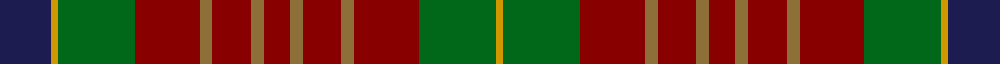

This page is one **sett** — a single exact thread-count. It belongs to the [tartan](/tartans/db8dy1g12dr10lt2dr6lt2dr4/)
(the same proportion at any scale), whose colour order is pattern [BYGRGRGRGRGRGY](/stripes/bygrgrgrgrgrgy/).

Sourced from register-of-tartans.  It is a [14 stripe tartan](/stripes/stripes14/).

Original link https://www.tartanregister.gov.uk/tartanDetails.aspx?ref=5393

## Also known as

This cloth is also recorded under:

- Indiana "Cardinal"

## Register references

External register numbers recorded for this tartan.

- Scottish Register of Tartans: [5393](https://www.tartanregister.gov.uk/tartanDetails.aspx?ref=5393)
- Scottish Tartans Authority (ITI): 5251

## Thread count
DB/32 DY4 G48 DR40 LT8 DR24 LT8 DR16 LT8 DR24 LT8 DR40 G48 DY/4

## Palette
Each colour and the base-6 reference it is a variant of.

| Colour | Shade | Base |
|---|---|---|
| DB | <code style="background-color:#1C1C50;">#1C1C50</code> `oklch(26.2% 0.093 277.9)` <small>#1C1C50</small> | B <code style="background-color:#2A418A;">#2A418A</code> |
| DG | <code style="background-color:#003820;">#003820</code> `oklch(30.0% 0.070 158.3)` <small>#003820</small> | G <code style="background-color:#006100;">#006100</code> |
| DR | <code style="background-color:#880000;">#880000</code> `oklch(39.4% 0.162 29.2)` <small>#880000</small> | R <code style="background-color:#CC0000;">#CC0000</code> |
| DY | <code style="background-color:#D09800;">#D09800</code> `oklch(71.4% 0.147 82.1)` <small>#D09800</small> | Y <code style="background-color:#F2BF00;">#F2BF00</code> |
| G | <code style="background-color:#006818;">#006818</code> `oklch(45.0% 0.142 145.0)` <small>#006818</small> | G <code style="background-color:#006100;">#006100</code> |
| LR | <code style="background-color:#EC34C4;">#EC34C4</code> `oklch(65.8% 0.255 338.8)` <small>#EC34C4</small> | R <code style="background-color:#CC0000;">#CC0000</code> |
| LT | <code style="background-color:#8C7038;">#8C7038</code> `oklch(56.0% 0.082 83.0)` <small>#8C7038</small> | G <code style="background-color:#006100;">#006100</code> |

## Nearest tartans

The nearest existing variants by ΔTartan distance, with this tartan at the top so the swatches line up against it.

ΔTartan

Tartan

Sett

—

<a href="/ttd/edit/#slug=db8lo1g12r10y2r6y2r4~x4">Indiana 'Cardinal'</a> <a class="nn-out" href="/setts/s14/db8lo1g12r10y2r6y2r4~x4/" title="open its dictionary page">↗</a>

1.22

<a href="/ttd/edit/#slug=r8k5r8g27r8w2r3g3r3w2r8o27r8o3r3~x2">McCall (Name)</a> <a class="nn-out" href="/setts/s15/r8k5r8g27r8w2r3g3r3w2r8o27r8o3r3~x2/" title="open its dictionary page">↗</a>

1.22

<a href="/ttd/edit/#slug=n2r3dg2db2r6dg16r2db4dg2r16dg8n2r4lr2~x2">MacKinnon</a> <a class="nn-out" href="/setts/s14/n2r3dg2db2r6dg16r2db4dg2r16dg8n2r4lr2~x2/" title="open its dictionary page">↗</a>

1.22

<a href="/ttd/edit/#slug=n2r3dg2db2r6dg16r2db4dg2r16dg8n2r4lr2">MacKinnon</a> <a class="nn-out" href="/setts/s14/n2r3dg2db2r6dg16r2db4dg2r16dg8n2r4lr2/" title="open its dictionary page">↗</a>

1.22

<a href="/ttd/edit/#slug=db8lo1g12r10y2r6y2r4~x4">Indiana &quot;Cardinal&quot; (District)</a> <a class="nn-out" href="/setts/s8/db8lo1g12r10y2r6y2r4~x4/" title="open its dictionary page">↗</a>

1.23

<a href="/ttd/edit/#slug=g14r1g14r7lb1r7lb1r7k5dp3lb1~x4">Hynde (Sir John) (Artefact)</a> <a class="nn-out" href="/setts/s11/g14r1g14r7lb1r7lb1r7k5dp3lb1~x4/" title="open its dictionary page">↗</a>

1.26

<a href="/ttd/edit/#slug=r6k4r8g16r6lb2r2g2r2lb2r6g18dp6g2dp1~x2">MacCall Family Tartan Tartan Number: 2238. Earliest known date: 2000 Originally designed for a wedding in the McCall family in Aberdeen, and permission was given for anyone of the name to wear it. It was designed by John C McCall &amp; M McCall who are related to Nancy McCall the former owner of McCall's of Aberdeen (01224 405300). MacCall Chieftain is a Peter J.D. MacCall of Birkenshaw who is believed to be elderly and living with a daughter in Lockerbie (October 2002). See products available Copyright © Blair Urquhart, Comrie, 2015</a> <a class="nn-out" href="/setts/s15/r6k4r8g16r6lb2r2g2r2lb2r6g18dp6g2dp1~x2/" title="open its dictionary page">↗</a>

1.34

<a href="/ttd/edit/#slug=r30y4dt8y4r30g30lo3g4lo3g30~x2">Hutcheson</a> <a class="nn-out" href="/setts/s10/r30y4dt8y4r30g30lo3g4lo3g30~x2/" title="open its dictionary page">↗</a>

1.35

<a href="/ttd/edit/#slug=g16dy1g2dy1g2dy12m12dy1ly2dy1m12dy12g12dy1w2~x2">Prince Edward Island District Tartan Tartan Number: 918. Earliest known date: 1964 The warmth and glow of the fertile soil, The green field and tree, The yellow and the brown of Autumn, The white of surf or a summer snow, Rust, green, yellow and white, Yes! That's our Island Tartan. See products available Copyright © Blair Urquhart, Comrie, 2015</a> <a class="nn-out" href="/setts/s15/g16dy1g2dy1g2dy12m12dy1ly2dy1m12dy12g12dy1w2~x2/" title="open its dictionary page">↗</a>

1.39

<a href="/setts/s8/db6w1y6dy12r2~x4/">Vass (Personal)</a>

1.39

<a href="/ttd/edit/#slug=y14lo1y1lo1y2k3y3k3do3do1do9lo1~x4">Glen Nevis #2 (Personal)</a> <a class="nn-out" href="/setts/s12/y14lo1y1lo1y2k3y3k3do3do1do9lo1~x4/" title="open its dictionary page">↗</a>

## Neighbour map

Every grey dot is one of 14299 variants placed by the first two principal components of the ΔTartan feature space (44% of its variance). Red is this tartan; blue dots are its nearest — click one to open its page.

<svg viewBox="0 0 640 380" role="img" style="max-width:100%;height:auto;border:1px solid #e0e0e0;border-radius:4px;display:block" xmlns="http://www.w3.org/2000/svg"><image href="/nn/cloud.v1.png" width="640" height="380"/><a href="/setts/s15/r8k5r8g27r8w2r3g3r3w2r8o27r8o3r3~x2/"><circle cx="247.6" cy="144.9" r="4" fill="#3465a4"><title>McCall (Name)</title></circle></a><a href="/setts/s14/n2r3dg2db2r6dg16r2db4dg2r16dg8n2r4lr2~x2/"><circle cx="241.3" cy="169.2" r="4" fill="#3465a4"><title>MacKinnon</title></circle></a><a href="/setts/s14/n2r3dg2db2r6dg16r2db4dg2r16dg8n2r4lr2/"><circle cx="241.3" cy="169.2" r="4" fill="#3465a4"><title>MacKinnon</title></circle></a><a href="/setts/s8/db8lo1g12r10y2r6y2r4~x4/"><circle cx="236.8" cy="205.4" r="4" fill="#3465a4"><title>Indiana &quot;Cardinal&quot; (District)</title></circle></a><a href="/setts/s11/g14r1g14r7lb1r7lb1r7k5dp3lb1~x4/"><circle cx="251.2" cy="167.0" r="4" fill="#3465a4"><title>Hynde (Sir John) (Artefact)</title></circle></a><a href="/setts/s15/r6k4r8g16r6lb2r2g2r2lb2r6g18dp6g2dp1~x2/"><circle cx="260.6" cy="141.0" r="4" fill="#3465a4"><title>MacCall Family Tartan Tartan Number: 2238. Earliest known date: 2000 Originally designed for a wedding in the McCall family in Aberdeen, and permission was given for anyone of the name to wear it. It was designed by John C McCall &amp; M McCall who are related to Nancy McCall the former owner of McCall's of Aberdeen (01224 405300). MacCall Chieftain is a Peter J.D. MacCall of Birkenshaw who is believed to be elderly and living with a daughter in Lockerbie (October 2002). See products available Copyright © Blair Urquhart, Comrie, 2015</title></circle></a><a href="/setts/s10/r30y4dt8y4r30g30lo3g4lo3g30~x2/"><circle cx="256.9" cy="182.5" r="4" fill="#3465a4"><title>Hutcheson</title></circle></a><a href="/setts/s15/g16dy1g2dy1g2dy12m12dy1ly2dy1m12dy12g12dy1w2~x2/"><circle cx="233.2" cy="150.7" r="4" fill="#3465a4"><title>Prince Edward Island District Tartan Tartan Number: 918. Earliest known date: 1964 The warmth and glow of the fertile soil, The green field and tree, The yellow and the brown of Autumn, The white of surf or a summer snow, Rust, green, yellow and white, Yes! That's our Island Tartan. See products available Copyright © Blair Urquhart, Comrie, 2015</title></circle></a><a href="/setts/s8/db6w1y6dy12r2~x4/"><circle cx="293.2" cy="211.4" r="4" fill="#3465a4"><title>Vass (Personal)</title></circle></a><a href="/setts/s12/y14lo1y1lo1y2k3y3k3do3do1do9lo1~x4/"><circle cx="275.4" cy="146.5" r="4" fill="#3465a4"><title>Glen Nevis #2 (Personal)</title></circle></a><circle cx="246.8" cy="180.4" r="5" fill="#c00000"/></svg>

ID: /setts/s14/db8lo1g12r10y2r6y2r4~x4/
