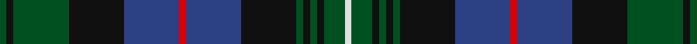

In pattern [GKGKBRBKGKGKGW](/stripes/gkgkbrbkgkgkgw/).

This was sourced from register-of-tartans.  It is a [14 stripe tartan](/stripes/stripes14/).

Original link https://www.tartanregister.gov.uk/tartanDetails.aspx?ref=4429

## Register references

External register numbers recorded for this tartan.

- Scottish Register of Tartans: [4429](https://www.tartanregister.gov.uk/tartanDetails.aspx?ref=4429)
- Scottish Tartans World Register: 806

## Thread count
G/2 K2 G16 K16 B16 R2 B16 K16 G2 K2 G2 K2 G6 LN/2

## Palette
Each colour and the base-6 reference it is a variant of.

| Colour | Shade | Base |
|---|---|---|
| B | <code style="background-color:#2C4084;">#2C4084</code> `oklch(39.4% 0.117 268.3)` <small>#2C4084</small> | B <code style="background-color:#2A418A;">#2A418A</code> |
| G | <code style="background-color:#005020;">#005020</code> `oklch(37.7% 0.105 149.6)` <small>#005020</small> | G <code style="background-color:#006100;">#006100</code> |
| K | <code style="background-color:#101010;">#101010</code> `oklch(17.3% 0.000 89.9)` <small>#101010</small> | K <code style="background-color:#000000;">#000000</code> |
| LN | <code style="background-color:#E0E0E0;">#E0E0E0</code> `oklch(90.7% 0.000 89.9)` <small>#E0E0E0</small> | W <code style="background-color:#F7F7F7;">#F7F7F7</code> |
| R | <code style="background-color:#DC0000;">#DC0000</code> `oklch(56.2% 0.230 29.2)` <small>#DC0000</small> | R <code style="background-color:#CC0000;">#CC0000</code> |

## Nearest tartans

The nearest existing variants by ΔTartan distance, with this tartan at the top so the swatches line up against it.

ΔTartan

Tartan

Sett

—

<a href="/ttd/edit/#slug=dg1k1dg8k8db8r1db8k8dg1k1dg1k1dg3w1~x2">Urquhart (Brydone)</a> <a class="nn-out" href="/setts/s14/dg1k1dg8k8db8r1db8k8dg1k1dg1k1dg3w1~x2/" title="open its dictionary page">↗</a>

0.37

<a href="/ttd/edit/#slug=db17k3db3k3db3k17g17k2w3k2g17k17db17k2r3~x2">Cumbernauld District Tartan Tartan Number: 1566. Earliest known date: 1987 The Cumbernauld tartan is the same as the MacKenzie, except for a change in the colour scheme. Ancient green was incorporated with modern blue, black and red to represent a new thriving community, proud of its heritage. Cumbernauld is one of Scotlands new towns. See products available Copyright © Blair Urquhart, Comrie, 2015</a> <a class="nn-out" href="/setts/s15/db17k3db3k3db3k17g17k2w3k2g17k17db17k2r3~x2/" title="open its dictionary page">↗</a>

0.57

<a href="/ttd/edit/#slug=db6k1db1k1db1k7dg6ly1db1lb1db1ly1dg6k7db7k1db1~x4">Polaris Corporate Tartan Tartan Number: 222. Earliest known date: 1964 Designed for the Officers and men of the American Submarine base at the Holy Loch - making the Polaris submarine the first ship in history to have its own tartan. The idea came from Captain Walter F Schlech, Commander of the submarine squadron. The arrangement of stripes between the cornflower yellows is blue-sky-blue (Dalgliesh). It was previously recorded as green-blue-green (STS). The sindex card created by Davidson c1964 is Black-Royal Blue-Black. The sky blue version was recently confirmed as the correct one by R. E. Trygstad, LCDR USN (Retired), who has in his possession an original scarf with the sky blue colours. See products available Copyright © Blair Urquhart, Comrie, 2015</a> <a class="nn-out" href="/setts/s17/db6k1db1k1db1k7dg6ly1db1lb1db1ly1dg6k7db7k1db1~x4/" title="open its dictionary page">↗</a>

0.59

<a href="/ttd/edit/#slug=dg2k1db9k9dg9k1w1k2w1k1dg9k9db9k1r2~x4">Stephenson Htg (Name)</a> <a class="nn-out" href="/setts/s15/dg2k1db9k9dg9k1w1k2w1k1dg9k9db9k1r2~x4/" title="open its dictionary page">↗</a>

0.59

<a href="/ttd/edit/#slug=dt17k3dt3k3dt3k17g17k2w2k2g17k17dt17k2r3~x2">Cumbernauld</a> <a class="nn-out" href="/setts/s15/dt17k3dt3k3dt3k17g17k2w2k2g17k17dt17k2r3~x2/" title="open its dictionary page">↗</a>

0.69

<a href="/ttd/edit/#slug=db28k4db4k4db4k28g27k3ly5k3g27k28db27k3r5~x2">Baillie (William Wilson)</a> <a class="nn-out" href="/setts/s15/db28k4db4k4db4k28g27k3ly5k3g27k28db27k3r5~x2/" title="open its dictionary page">↗</a>

0.73

<a href="/ttd/edit/#slug=db9k1db1k1db1k7dg8ly2dg8k7db8k1r2~x2">MacLeod of Gesto</a> <a class="nn-out" href="/setts/s13/db9k1db1k1db1k7dg8ly2dg8k7db8k1r2~x2/" title="open its dictionary page">↗</a>

0.77

<a href="/ttd/edit/#slug=dt30k5dt5k5dt5k31dg31k3w7k3dg31k31dt31k3r7">78th Regiment (Highlanders) (Mil.)</a> <a class="nn-out" href="/setts/s15/dt30k5dt5k5dt5k31dg31k3w7k3dg31k31dt31k3r7/" title="open its dictionary page">↗</a>

0.84

<a href="/ttd/edit/#slug=w2k1dg12k12db12k1db1k1db12k12dg12k1ly2~x2">Campbell of Loudoun</a> <a class="nn-out" href="/setts/s13/w2k1dg12k12db12k1db1k1db12k12dg12k1ly2~x2/" title="open its dictionary page">↗</a>

0.89

<a href="/ttd/edit/#slug=db18k5dg3r3dg6k2ly2k2dg6r3dg3k10db5k10">MacClellan</a> <a class="nn-out" href="/setts/s14/db18k5dg3r3dg6k2ly2k2dg6r3dg3k10db5k10/" title="open its dictionary page">↗</a>

0.89

<a href="/ttd/edit/#slug=ly3k18k3k3k3k3k18n3k3n3k3n12w2n12k9n12k2w2~x2">Van Ingelgem (Personal)</a> <a class="nn-out" href="/setts/s18/ly3k18k3k3k3k3k18n3k3n3k3n12w2n12k9n12k2w2~x2/" title="open its dictionary page">↗</a>

## Neighbour map

Every grey dot is one of 14299 variants placed by the first two principal components of the ΔTartan feature space (44% of its variance). Red is this tartan; blue dots are its nearest — click one to open its page.

<svg viewBox="0 0 640 380" role="img" style="max-width:100%;height:auto;border:1px solid #e0e0e0;border-radius:4px;display:block" xmlns="http://www.w3.org/2000/svg"><image href="/nn/cloud.v1.png" width="640" height="380"/><a href="/setts/s15/db17k3db3k3db3k17g17k2w3k2g17k17db17k2r3~x2/"><circle cx="187.1" cy="188.5" r="4" fill="#3465a4"><title>Cumbernauld District Tartan Tartan Number: 1566. Earliest known date: 1987 The Cumbernauld tartan is the same as the MacKenzie, except for a change in the colour scheme. Ancient green was incorporated with modern blue, black and red to represent a new thriving community, proud of its heritage. Cumbernauld is one of Scotlands new towns. See products available Copyright © Blair Urquhart, Comrie, 2015</title></circle></a><a href="/setts/s17/db6k1db1k1db1k7dg6ly1db1lb1db1ly1dg6k7db7k1db1~x4/"><circle cx="186.8" cy="189.6" r="4" fill="#3465a4"><title>Polaris Corporate Tartan Tartan Number: 222. Earliest known date: 1964 Designed for the Officers and men of the American Submarine base at the Holy Loch - making the Polaris submarine the first ship in history to have its own tartan. The idea came from Captain Walter F Schlech, Commander of the submarine squadron. The arrangement of stripes between the cornflower yellows is blue-sky-blue (Dalgliesh). It was previously recorded as green-blue-green (STS). The sindex card created by Davidson c1964 is Black-Royal Blue-Black. The sky blue version was recently confirmed as the correct one by R. E. Trygstad, LCDR USN (Retired), who has in his possession an original scarf with the sky blue colours. See products available Copyright © Blair Urquhart, Comrie, 2015</title></circle></a><a href="/setts/s15/dg2k1db9k9dg9k1w1k2w1k1dg9k9db9k1r2~x4/"><circle cx="190.6" cy="186.7" r="4" fill="#3465a4"><title>Stephenson Htg (Name)</title></circle></a><a href="/setts/s15/dt17k3dt3k3dt3k17g17k2w2k2g17k17dt17k2r3~x2/"><circle cx="195.2" cy="192.5" r="4" fill="#3465a4"><title>Cumbernauld</title></circle></a><a href="/setts/s15/db28k4db4k4db4k28g27k3ly5k3g27k28db27k3r5~x2/"><circle cx="181.3" cy="175.5" r="4" fill="#3465a4"><title>Baillie (William Wilson)</title></circle></a><a href="/setts/s13/db9k1db1k1db1k7dg8ly2dg8k7db8k1r2~x2/"><circle cx="166.1" cy="193.2" r="4" fill="#3465a4"><title>MacLeod of Gesto</title></circle></a><a href="/setts/s15/dt30k5dt5k5dt5k31dg31k3w7k3dg31k31dt31k3r7/"><circle cx="182.5" cy="176.8" r="4" fill="#3465a4"><title>78th Regiment (Highlanders) (Mil.)</title></circle></a><a href="/setts/s13/w2k1dg12k12db12k1db1k1db12k12dg12k1ly2~x2/"><circle cx="186.7" cy="175.9" r="4" fill="#3465a4"><title>Campbell of Loudoun</title></circle></a><a href="/setts/s14/db18k5dg3r3dg6k2ly2k2dg6r3dg3k10db5k10/"><circle cx="168.8" cy="184.9" r="4" fill="#3465a4"><title>MacClellan</title></circle></a><a href="/setts/s18/ly3k18k3k3k3k3k18n3k3n3k3n12w2n12k9n12k2w2~x2/"><circle cx="179.3" cy="171.4" r="4" fill="#3465a4"><title>Van Ingelgem (Personal)</title></circle></a><circle cx="200.3" cy="190.9" r="5" fill="#c00000"/></svg>

ID: /setts/s14/dg1k1dg8k8db8r1db8k8dg1k1dg1k1dg3w1~x2/
