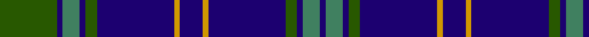

In pattern [BGBGBYBYBGBGBG](/stripes/bgbgbybybgbgbg/).

This was sourced from register-of-tartans.  It is a [14 stripe tartan](/stripes/stripes14/).

Original link https://www.tartanregister.gov.uk/tartanDetails.aspx?ref=1997

## Register references

External register numbers recorded for this tartan.

- Scottish Register of Tartans: [1997](https://www.tartanregister.gov.uk/tartanDetails.aspx?ref=1997)
- Scottish Tartans Authority (ITI): 5362

## Thread count
G/40 DB4 Ga12 DB4 G8 DB54 DY4 DB16 DY4 DB54 G8 DB4 Ga12 DB/4

## Palette
Each colour and its ΔE from the base-6 reference it is a variant of.

| Colour | Shade | Base | ΔE (OKLab) |
|---|---|---|---|
| DB | <code style="background-color:#1C0070;">#1C0070</code> `#1C0070` | B <code style="background-color:#2A418A;">#2A418A</code> | 0.14 |
| DY | <code style="background-color:#D09800;">#D09800</code> `#D09800` | Y <code style="background-color:#F2BF00;">#F2BF00</code> | 0.12 |
| G | <code style="background-color:#285800;">#285800</code> `#285800` | G <code style="background-color:#006100;">#006100</code> | 0.03 |
| Ga | <code style="background-color:#408060;">#408060</code> `#408060` | G <code style="background-color:#006100;">#006100</code> | 0.14 |

## Nearest tartans

The nearest existing variants by ΔTartan distance.

1. [Wheadon](/setts/s10/db15g7ly3g7db40g7ly3g7db15r5~x2/) — ΔT 1.09
1. [Jenkins (Welsh Name)](/setts/s11/g8db3g2db4dt2db5g7db4g4db37lo6/) — ΔT 1.19
1. [Jenkins Welsh Name Tartan Tartan Number: 5757. Earliest known date: 2002 The tartan for this Welsh surname and its variations, Jenks, Jenkin, Jankin, Seincyn, is actually woven in Wales at the Cambrian Woollen Mill, weaving on the same site since 1830. This tartan differs from many traditional patterns in that the warp and weft differ, giving the finished worsted wool cloth more of a predominant stripe, vertically noticeable in the finished Kilt, or Cilt in Wales. See products available Copyright © Blair Urquhart, Comrie, 2015](/setts/s11/g8db3g2db4lo2db5g7db4g4db37r6/) — ΔT 1.21
1. [Rhys of Wales](/setts/s18/db46db17db5db7db7lo15db3lo3db6lo3db3lo15db7db7db5db17db46w4/) — ΔT 1.23
1. [Dublin Lie-ins (Corporate)](/setts/s11/dt8k3dt26k11t3dt8r4dt8t3k2w3~x2/) — ΔT 1.26
1. [MacArthur Fox Green (Personal)](/setts/s10/r4dt4k2dt31k10ly3dt5k11dt6k3~x2/) — ΔT 1.27
1. [Blanton](/setts/s13/b24k2b2k2b2k10g5dp3g5k10b11k2b4~x2/) — ΔT 1.28
1. [Glasgow, University of Corporate Tartan Tartan Number: 2680. Earliest known date: 2002 The official livery and promotional university tartan (STS). See products available Copyright © Blair Urquhart, Comrie, 2015](/setts/s14/k2db22g4k7lo2k2w2db2~x2/) — ΔT 1.28
1. [Orlando, City of](/setts/s16/db12k1g16db1g1db14g3db14r2~x4/) — ΔT 1.29
1. [Kells Irish Pubs (Corporate)](/setts/s12/k17o2k3g2k3g2k24b8g4b4g3b8~x2/) — ΔT 1.30

## Neighbour map

Every grey dot is one of 14299 variants placed by the first two principal components of the ΔTartan feature space (44% of its variance). Red is this tartan; blue dots are its nearest — click one to open its page.

<svg viewBox="0 0 640 380" role="img" style="max-width:100%;height:auto;border:1px solid #e0e0e0;border-radius:4px;display:block" xmlns="http://www.w3.org/2000/svg"><image href="/nn/cloud.v1.png" width="640" height="380"/><a href="/setts/s10/db15g7ly3g7db40g7ly3g7db15r5~x2/"><circle cx="374.6" cy="186.0" r="4" fill="#3465a4"><title>Wheadon</title></circle></a><a href="/setts/s11/g8db3g2db4dt2db5g7db4g4db37lo6/"><circle cx="423.6" cy="162.7" r="4" fill="#3465a4"><title>Jenkins (Welsh Name)</title></circle></a><a href="/setts/s11/g8db3g2db4lo2db5g7db4g4db37r6/"><circle cx="423.8" cy="159.8" r="4" fill="#3465a4"><title>Jenkins Welsh Name Tartan Tartan Number: 5757. Earliest known date: 2002 The tartan for this Welsh surname and its variations, Jenks, Jenkin, Jankin, Seincyn, is actually woven in Wales at the Cambrian Woollen Mill, weaving on the same site since 1830. This tartan differs from many traditional patterns in that the warp and weft differ, giving the finished worsted wool cloth more of a predominant stripe, vertically noticeable in the finished Kilt, or Cilt in Wales. See products available Copyright © Blair Urquhart, Comrie, 2015</title></circle></a><a href="/setts/s18/db46db17db5db7db7lo15db3lo3db6lo3db3lo15db7db7db5db17db46w4/"><circle cx="305.8" cy="150.7" r="4" fill="#3465a4"><title>Rhys of Wales</title></circle></a><a href="/setts/s11/dt8k3dt26k11t3dt8r4dt8t3k2w3~x2/"><circle cx="350.8" cy="182.6" r="4" fill="#3465a4"><title>Dublin Lie-ins (Corporate)</title></circle></a><a href="/setts/s10/r4dt4k2dt31k10ly3dt5k11dt6k3~x2/"><circle cx="375.9" cy="189.9" r="4" fill="#3465a4"><title>MacArthur Fox Green (Personal)</title></circle></a><a href="/setts/s13/b24k2b2k2b2k10g5dp3g5k10b11k2b4~x2/"><circle cx="282.6" cy="175.9" r="4" fill="#3465a4"><title>Blanton</title></circle></a><a href="/setts/s14/k2db22g4k7lo2k2w2db2~x2/"><circle cx="288.0" cy="144.8" r="4" fill="#3465a4"><title>Glasgow, University of Corporate Tartan Tartan Number: 2680. Earliest known date: 2002 The official livery and promotional university tartan (STS). See products available Copyright © Blair Urquhart, Comrie, 2015</title></circle></a><a href="/setts/s16/db12k1g16db1g1db14g3db14r2~x4/"><circle cx="389.0" cy="182.2" r="4" fill="#3465a4"><title>Orlando, City of</title></circle></a><a href="/setts/s12/k17o2k3g2k3g2k24b8g4b4g3b8~x2/"><circle cx="325.0" cy="180.4" r="4" fill="#3465a4"><title>Kells Irish Pubs (Corporate)</title></circle></a><circle cx="358.1" cy="167.0" r="5" fill="#c00000"/></svg>

ID: /setts/s14/dg20db2g6db2dg4db27lo2db8~x2/
