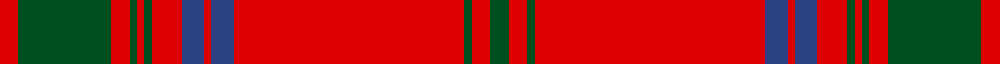

This page is one **sett** — a single exact thread-count. It belongs to the [tartan](/tartans/r5g25r5g2r2g2r8b6r2b6r62g2r5g5/)
(the same proportion at any scale), whose colour order is pattern [GRGRBRBRGRGRGR](/stripes/grgrbrbrgrgrgr/).

Sourced from register-of-tartans.  It is a [14 stripe tartan](/stripes/stripes14/).

Original link https://www.tartanregister.gov.uk/tartanDetails.aspx?ref=3558

## Also known as

This cloth is also recorded under:

- Ross #7

## Register references

External register numbers recorded for this tartan.

- Scottish Register of Tartans: [3558](https://www.tartanregister.gov.uk/tartanDetails.aspx?ref=3558)
- Scottish Tartans World Register: 901

## Thread count
R/10 G50 R10 G4 R4 G4 R16 B12 R4 B12 R124 G4 R10 G/10

## Palette
Each colour and the base-6 reference it is a variant of.

| Colour | Shade | Base |
|---|---|---|
| B | <code style="background-color:#2C4084;">#2C4084</code> `oklch(39.4% 0.117 268.3)` <small>#2C4084</small> | B <code style="background-color:#2A418A;">#2A418A</code> |
| G | <code style="background-color:#005020;">#005020</code> `oklch(37.7% 0.105 149.6)` <small>#005020</small> | G <code style="background-color:#006100;">#006100</code> |
| R | <code style="background-color:#DC0000;">#DC0000</code> `oklch(56.2% 0.230 29.2)` <small>#DC0000</small> | R <code style="background-color:#CC0000;">#CC0000</code> |

## Nearest tartans

The nearest existing variants by ΔTartan distance, with this tartan at the top so the swatches line up against it.

ΔTartan

Tartan

Sett

—

<a href="/ttd/edit/#slug=dg5r5dg2r62db6r2db6r8dg2r2dg2r5dg25r5~x2">Ross #7</a> <a class="nn-out" href="/setts/s14/dg5r5dg2r62db6r2db6r8dg2r2dg2r5dg25r5~x2/" title="open its dictionary page">↗</a>

0.32

<a href="/ttd/edit/#slug=r3dg12r2dg1r1dg1r4db3r1db3r28db1r3db2~x2">Ross #2</a> <a class="nn-out" href="/setts/s14/r3dg12r2dg1r1dg1r4db3r1db3r28db1r3db2~x2/" title="open its dictionary page">↗</a>

0.61

<a href="/ttd/edit/#slug=r3g12r2g1r1g1r4db3r1db3r28db1r3db2~x2">Ross 5</a> <a class="nn-out" href="/setts/s14/r3g12r2g1r1g1r4db3r1db3r28db1r3db2~x2/" title="open its dictionary page">↗</a>

0.67

<a href="/ttd/edit/#slug=r5g25r5g2r2g2r8db6r2db6r62g2r5g5~x2">Ross 4</a> <a class="nn-out" href="/setts/s14/r5g25r5g2r2g2r8db6r2db6r62g2r5g5~x2/" title="open its dictionary page">↗</a>

0.89

<a href="/ttd/edit/#slug=dg19r7dg7r7dg7r14db3r3dg19r3db3r66db7r14~x2">MacGillivray #3</a> <a class="nn-out" href="/setts/s14/dg19r7dg7r7dg7r14db3r3dg19r3db3r66db7r14~x2/" title="open its dictionary page">↗</a>

0.95

<a href="/ttd/edit/#slug=dp2r1dp1r31dp8r2dp8r3g1r2g1r3g5r2~x2">Ross, Old</a> <a class="nn-out" href="/setts/s14/dp2r1dp1r31dp8r2dp8r3g1r2g1r3g5r2~x2/" title="open its dictionary page">↗</a>

0.98

<a href="/ttd/edit/#slug=w2r32dg2r3dg2r4dg17r4dg16r4dg2r3dg2r32w1r1w2~x2">Rothesay</a> <a class="nn-out" href="/setts/s17/w2r32dg2r3dg2r4dg17r4dg16r4dg2r3dg2r32w1r1w2~x2/" title="open its dictionary page">↗</a>

1.07

<a href="/ttd/edit/#slug=w8r83g7r5g7r7g28r7g28r7g7r5g7r83w4r4w8">Rothesay (Red)</a> <a class="nn-out" href="/setts/s17/w8r83g7r5g7r7g28r7g28r7g7r5g7r83w4r4w8/" title="open its dictionary page">↗</a>

1.19

<a href="/ttd/edit/#slug=r24g4r2g2r2g2r12g24r1k1r24k1r1k1r6~x2">MacDonell of Keppoch</a> <a class="nn-out" href="/setts/s15/r24g4r2g2r2g2r12g24r1k1r24k1r1k1r6~x2/" title="open its dictionary page">↗</a>

1.19

<a href="/ttd/edit/#slug=g19r7g7r7g7r14db3r3g19r3db3r66db7r14~x2">MacGillivray</a> <a class="nn-out" href="/setts/s14/g19r7g7r7g7r14db3r3g19r3db3r66db7r14~x2/" title="open its dictionary page">↗</a>

1.22

<a href="/ttd/edit/#slug=r40w2db1r3dg31r3db1w2r3db8r3w2db1r34dg4r4dg4~x2">Dalziel #1</a> <a class="nn-out" href="/setts/s17/r40w2db1r3dg31r3db1w2r3db8r3w2db1r34dg4r4dg4~x2/" title="open its dictionary page">↗</a>

## Neighbour map

Every grey dot is one of 14299 variants placed by the first two principal components of the ΔTartan feature space (44% of its variance). Red is this tartan; blue dots are its nearest — click one to open its page.

<svg viewBox="0 0 640 380" role="img" style="max-width:100%;height:auto;border:1px solid #e0e0e0;border-radius:4px;display:block" xmlns="http://www.w3.org/2000/svg"><image href="/nn/cloud.v1.png" width="640" height="380"/><a href="/setts/s14/r3dg12r2dg1r1dg1r4db3r1db3r28db1r3db2~x2/"><circle cx="461.7" cy="105.4" r="4" fill="#3465a4"><title>Ross #2</title></circle></a><a href="/setts/s14/r3g12r2g1r1g1r4db3r1db3r28db1r3db2~x2/"><circle cx="469.2" cy="113.6" r="4" fill="#3465a4"><title>Ross 5</title></circle></a><a href="/setts/s14/r5g25r5g2r2g2r8db6r2db6r62g2r5g5~x2/"><circle cx="482.5" cy="107.2" r="4" fill="#3465a4"><title>Ross 4</title></circle></a><a href="/setts/s14/dg19r7dg7r7dg7r14db3r3dg19r3db3r66db7r14~x2/"><circle cx="439.3" cy="129.0" r="4" fill="#3465a4"><title>MacGillivray #3</title></circle></a><a href="/setts/s14/dp2r1dp1r31dp8r2dp8r3g1r2g1r3g5r2~x2/"><circle cx="471.6" cy="106.6" r="4" fill="#3465a4"><title>Ross, Old</title></circle></a><a href="/setts/s17/w2r32dg2r3dg2r4dg17r4dg16r4dg2r3dg2r32w1r1w2~x2/"><circle cx="452.6" cy="101.2" r="4" fill="#3465a4"><title>Rothesay</title></circle></a><a href="/setts/s17/w8r83g7r5g7r7g28r7g28r7g7r5g7r83w4r4w8/"><circle cx="441.5" cy="108.4" r="4" fill="#3465a4"><title>Rothesay (Red)</title></circle></a><a href="/setts/s15/r24g4r2g2r2g2r12g24r1k1r24k1r1k1r6~x2/"><circle cx="468.2" cy="125.1" r="4" fill="#3465a4"><title>MacDonell of Keppoch</title></circle></a><a href="/setts/s14/g19r7g7r7g7r14db3r3g19r3db3r66db7r14~x2/"><circle cx="445.6" cy="136.6" r="4" fill="#3465a4"><title>MacGillivray</title></circle></a><a href="/setts/s17/r40w2db1r3dg31r3db1w2r3db8r3w2db1r34dg4r4dg4~x2/"><circle cx="419.4" cy="66.5" r="4" fill="#3465a4"><title>Dalziel #1</title></circle></a><circle cx="475.8" cy="99.4" r="5" fill="#c00000"/></svg>

ID: /setts/s14/dg5r5dg2r62db6r2db6r8dg2r2dg2r5dg25r5~x2/
